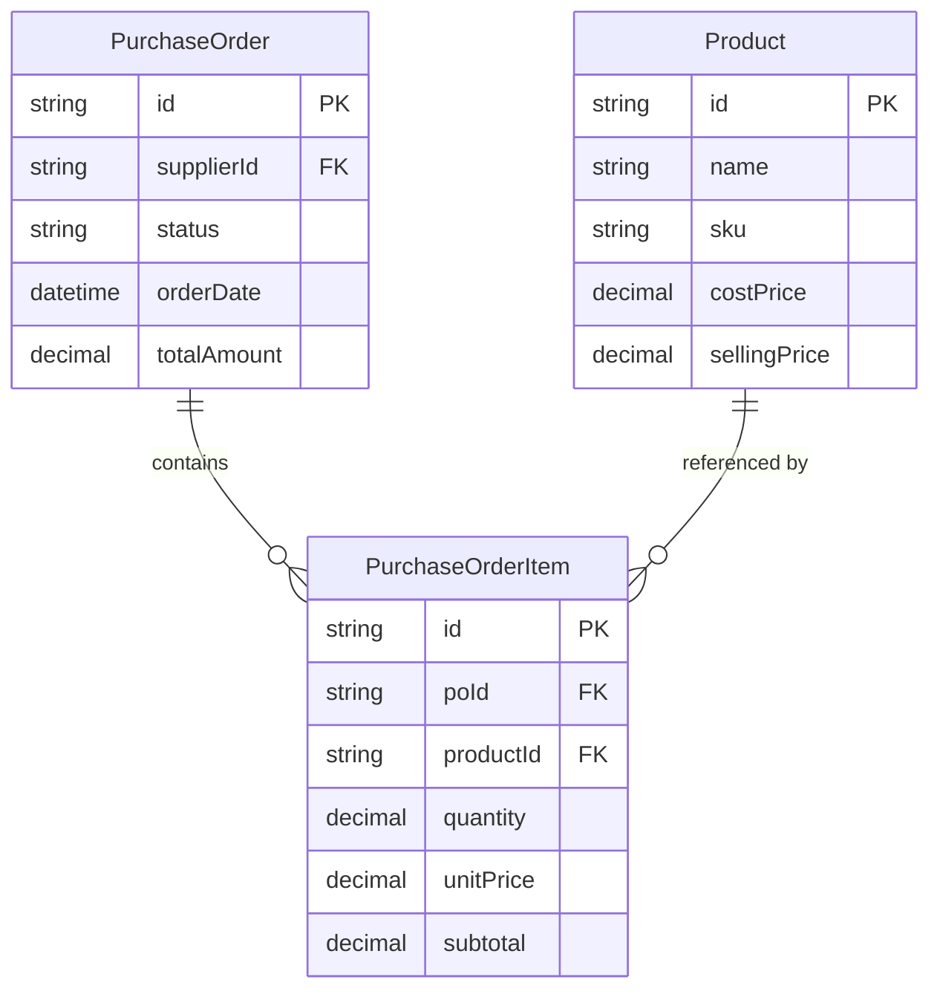
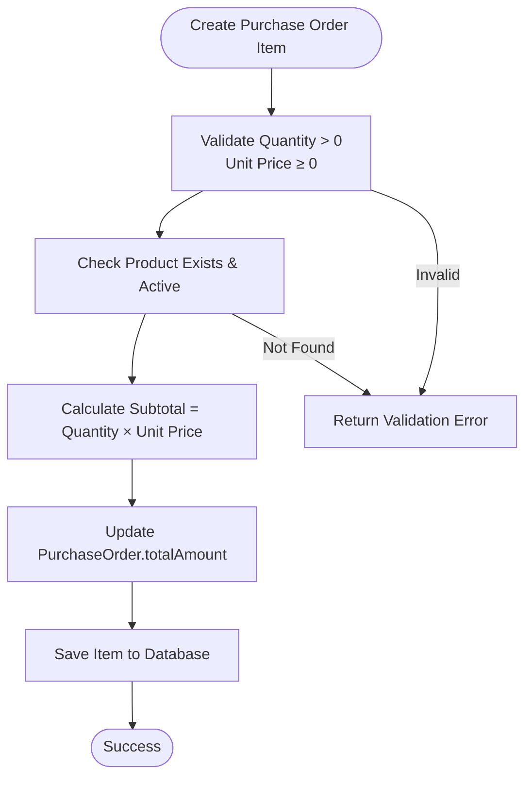
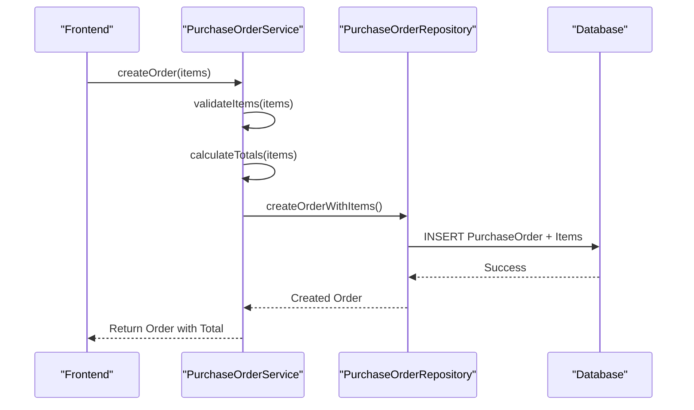

# Purchase Order Item Model

<cite>
**Referenced Files in This Document**  
- [prisma/migrations/20251113094445_init/migration.sql](file://prisma/migrations/20251113094445_init/migration.sql)
- [services/purchase-order.service.ts](file://services/purchase-order.service.ts)
- [repositories/purchase-order.repository.ts](file://repositories/purchase-order.repository.ts)
- [lib/validations/purchase-order.validation.ts](file://lib/validations/purchase-order.validation.ts)
- [types/purchase-order.types.ts](file://types/purchase-order.types.ts)
</cite>

## Table of Contents
1. [Introduction](#introduction)
2. [Field Definitions](#field-definitions)
3. [Data Relationships](#data-relationships)
4. [Indexes and Performance](#indexes-and-performance)
5. [Business Rules and Validation](#business-rules-and-validation)
6. [Query Examples](#query-examples)
7. [Service Logic Integration](#service-logic-integration)
8. [Conclusion](#conclusion)

## Introduction
The `PurchaseOrderItem` entity represents individual line items within a purchase order, capturing detailed procurement data such as product, quantity, pricing, and cost calculations. This model plays a critical role in inventory procurement, financial tracking, and supplier management workflows. It is tightly integrated with both the `PurchaseOrder` and `Product` entities to ensure data consistency and enable comprehensive reporting.

**Section sources**
- [prisma/migrations/20251113094445_init/migration.sql](file://prisma/migrations/20251113094445_init/migration.sql#L1-L100)

## Field Definitions
The `PurchaseOrderItem` model includes the following fields:

- **id**: Unique identifier for the purchase order line item.
- **poId**: Foreign key referencing the parent `PurchaseOrder`. Ensures referential integrity and enables cascade deletion.
- **productId**: Identifier linking to the `Product` catalog. Used for inventory updates and cost analysis.
- **quantity**: Decimal field (`@db.Decimal(10,2)`) representing the ordered quantity. Supports fractional units (e.g., 1.5 kg).
- **unitPrice**: Decimal field (`@db.Decimal(10,2)`) storing the price per unit at time of order. Critical for landed cost calculation.
- **subtotal**: Computed field (`@db.Decimal(10,2)`) representing `quantity × unitPrice`. Stored for auditability and reporting performance.

These fields collectively capture the economic details of each product line in a purchase order and contribute to the `totalAmount` aggregation in the parent `PurchaseOrder`.

**Section sources**
- [prisma/migrations/20251113094445_init/migration.sql](file://prisma/migrations/20251113094445_init/migration.sql#L50-L80)

## Data Relationships
The `PurchaseOrderItem` entity maintains two primary relationships:

1. **One-to-Many with PurchaseOrder**: Each purchase order can have multiple items. The foreign key `poId` enforces this relationship with cascade delete behavior—when a purchase order is deleted, all associated items are automatically removed.
2. **Many-to-One with Product**: Multiple purchase order items can reference the same product. This enables historical price tracking and procurement analytics by product.



**Diagram sources**
- [prisma/migrations/20251113094445_init/migration.sql](file://prisma/migrations/20251113094445_init/migration.sql#L30-L90)

**Section sources**
- [prisma/migrations/20251113094445_init/migration.sql](file://prisma/migrations/20251113094445_init/migration.sql#L30-L90)

## Indexes and Performance
To optimize query performance, the following database indexes are defined:

- **Index on poId**: Accelerates retrieval of all items for a specific purchase order, commonly used in order detail views and supplier invoices.
- **Index on productId**: Enables efficient analysis of procurement history by product, supporting inventory forecasting and supplier performance reports.

These indexes ensure fast lookups and aggregations, especially during purchase analysis and financial reporting operations.

**Section sources**
- [prisma/migrations/20251113094445_init/migration.sql](file://prisma/migrations/20251113094445_init/migration.sql#L70-L85)

## Business Rules and Validation
The system enforces several business rules when creating or updating purchase order items:

- **Quantity Constraints**: Must be greater than zero. Validated via `purchase-order.validation.ts`.
- **Price Validation**: Unit price must not be negative. Ensures data integrity in cost calculations.
- **Product Availability**: Product must exist in the catalog and be active for procurement.
- **Decimal Precision**: All monetary and quantity fields use `Decimal(10,2)` to prevent floating-point inaccuracies.

Validation is implemented in the service layer and enforced through Prisma constraints at the database level.



**Diagram sources**
- [lib/validations/purchase-order.validation.ts](file://lib/validations/purchase-order.validation.ts#L15-L40)
- [services/purchase-order.service.ts](file://services/purchase-order.service.ts#L50-L100)

**Section sources**
- [lib/validations/purchase-order.validation.ts](file://lib/validations/purchase-order.validation.ts#L10-L50)
- [services/purchase-order.service.ts](file://services/purchase-order.service.ts#L45-L110)

## Query Examples
Common queries involving `PurchaseOrderItem` include:

- **Procurement Analysis by Product**:
  ```sql
  SELECT p.name, SUM(poi.quantity) as total_qty, AVG(poi.unitPrice) as avg_cost
  FROM PurchaseOrderItem poi
  JOIN Product p ON poi.productId = p.id
  GROUP BY p.id, p.name;
  ```

- **Landed Cost Calculation**:
  ```sql
  SELECT po.id, SUM(poi.subtotal) as item_cost, 
         (SUM(poi.subtotal) + po.shippingCost) as landed_cost
  FROM PurchaseOrder po
  JOIN PurchaseOrderItem poi ON po.id = poi.poId
  GROUP BY po.id;
  ```

These queries support inventory valuation, supplier negotiation, and margin analysis.

**Section sources**
- [repositories/purchase-order.repository.ts](file://repositories/purchase-order.repository.ts#L20-L60)

## Service Logic Integration
The `purchase-order.service.ts` handles critical workflows involving `PurchaseOrderItem`:

- **Item Validation**: Before creation, validates quantity, price, and product existence.
- **Total Amount Update**: Aggregates subtotals from all items to update the parent purchase order’s `totalAmount`.
- **Inventory Update on Receipt**: When a purchase order is marked as received, the system updates inventory levels based on quantities in `PurchaseOrderItem`.

This integration ensures that procurement data directly influences inventory availability and financial records.



**Diagram sources**
- [services/purchase-order.service.ts](file://services/purchase-order.service.ts#L30-L120)
- [repositories/purchase-order.repository.ts](file://repositories/purchase-order.repository.ts#L10-L70)

**Section sources**
- [services/purchase-order.service.ts](file://services/purchase-order.service.ts#L25-L130)
- [repositories/purchase-order.repository.ts](file://repositories/purchase-order.repository.ts#L5-L75)

## Conclusion
The `PurchaseOrderItem` model is a foundational component of the procurement system, enabling accurate tracking of purchase details, robust reporting, and seamless integration with inventory and financial processes. Its design emphasizes data integrity, performance, and business rule enforcement, making it essential for reliable supply chain operations.