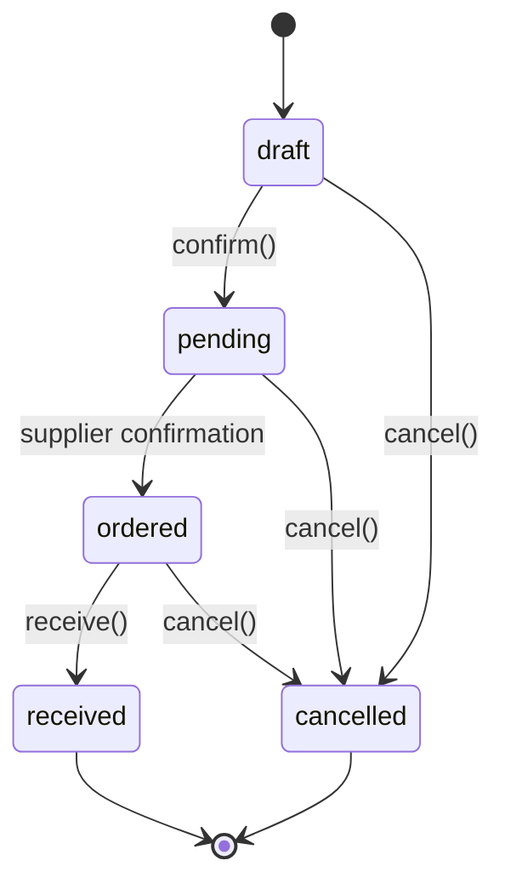
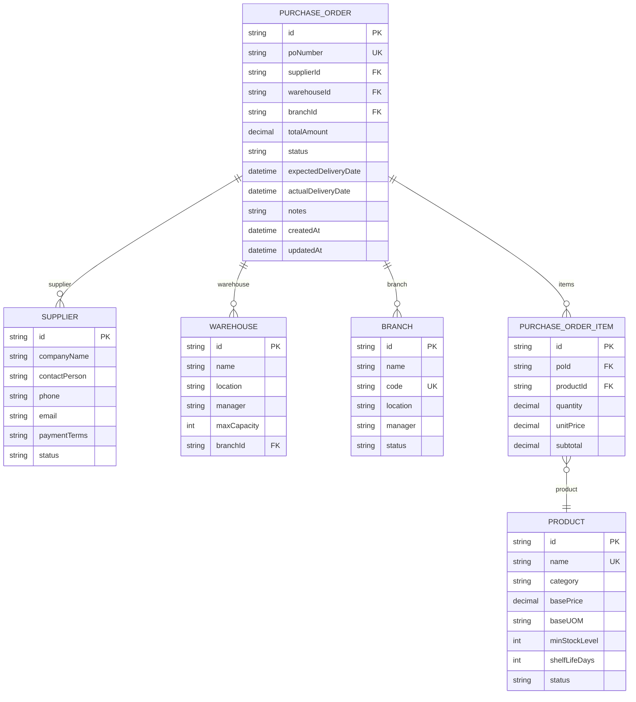
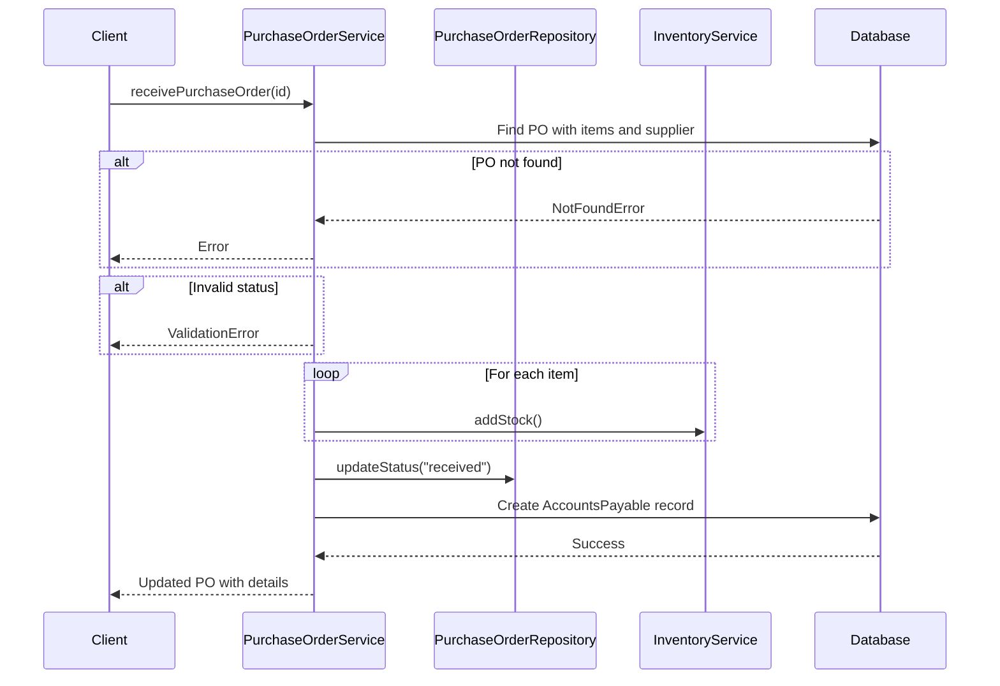

# Purchase Order Model

<cite>
**Referenced Files in This Document**   
- [schema.prisma](file://prisma/schema.prisma#L166-L192)
- [purchase-order.service.ts](file://services/purchase-order.service.ts)
- [purchase-order.repository.ts](file://repositories/purchase-order.repository.ts)
- [purchase-order.types.ts](file://types/purchase-order.types.ts)
- [purchase-order.validation.ts](file://lib/validations/purchase-order.validation.ts)
</cite>

## Table of Contents
1. [Introduction](#introduction)
2. [Field Definitions](#field-definitions)
3. [Procurement Lifecycle and Status Transitions](#procurement-lifecycle-and-status-transitions)
4. [Indexes and Query Optimization](#indexes-and-query-optimization)
5. [Entity Relationships](#entity-relationships)
6. [Query Examples](#query-examples)
7. [Service Methods](#service-methods)
8. [Business Rules](#business-rules)
9. [Conclusion](#conclusion)

## Introduction
The PurchaseOrder entity is central to the procurement workflow within the inventory management system. It represents a formal request to a supplier for goods, tracking the entire lifecycle from creation to receipt or cancellation. This document provides comprehensive documentation of the data model, including field definitions, status transitions, indexing strategy, relationships, and business logic governing purchase order processing.

**Section sources**
- [schema.prisma](file://prisma/schema.prisma#L166-L192)

## Field Definitions
The PurchaseOrder model contains the following fields, each serving a specific role in procurement tracking:

- **id**: Unique identifier using UUID, primary key for the entity
- **poNumber**: Unique purchase order number generated in format `PO-YYYYMMDD-XXXX`, ensures no duplicates
- **supplierId**: Foreign key linking to the Supplier entity, identifies the vendor
- **warehouseId**: Foreign key linking to the Warehouse entity, specifies delivery destination
- **branchId**: Foreign key linking to the Branch entity, indicates organizational unit
- **totalAmount**: Decimal value with precision (10,2), stores total monetary value of the order
- **status**: Current state of the purchase order, one of: "draft", "pending", "ordered", "received", "cancelled"
- **expectedDeliveryDate**: Scheduled date for goods delivery
- **actualDeliveryDate**: Nullable timestamp recording when goods were actually received
- **notes**: Optional text field for additional information or special instructions
- **createdAt**: Timestamp of record creation
- **updatedAt**: Timestamp automatically updated on modifications

**Section sources**
- [schema.prisma](file://prisma/schema.prisma#L168-L179)
- [purchase-order.types.ts](file://types/purchase-order.types.ts#L3)

## Procurement Lifecycle and Status Transitions
The purchase order progresses through a defined lifecycle represented by its status field. The valid statuses are: "draft", "pending", "ordered", "received", and "cancelled".

- **draft**: Initial state when a PO is created but not yet confirmed
- **pending**: PO has been submitted to the supplier but not yet shipped
- **ordered**: Supplier has acknowledged and processed the order
- **received**: Goods have been delivered and inventory updated
- **cancelled**: Order was terminated before completion

Status transitions are governed by business rules:
- Only "draft" and "pending" orders can be edited
- Orders can only be cancelled if not already "received" or "cancelled"
- Receiving an order changes status to "received" and sets actualDeliveryDate
- Cancellation requires a reason which is appended to the notes field



**Diagram sources**
- [purchase-order.service.ts](file://services/purchase-order.service.ts#L237-L269)
- [purchase-order.types.ts](file://types/purchase-order.types.ts#L3)

**Section sources**
- [purchase-order.service.ts](file://services/purchase-order.service.ts#L237-L269)
- [purchase-order.types.ts](file://types/purchase-order.types.ts#L3)

## Indexes and Query Optimization
To ensure efficient querying across common access patterns, the PurchaseOrder model includes several database indexes:

- **supplierId**: Optimizes supplier-specific order retrieval
- **warehouseId**: Accelerates queries filtering by warehouse
- **branchId**: Enables fast branch-level reporting
- **status**: Critical for workflow management and status-based filtering
- **poNumber**: Unique index supporting lookup by PO number
- **createdAt**: Facilitates time-based queries and chronological sorting

These indexes support key operational queries such as tracking pending orders, analyzing delivery performance, and generating procurement reports.

**Section sources**
- [schema.prisma](file://prisma/schema.prisma#L186-L191)

## Entity Relationships
The PurchaseOrder entity maintains relationships with multiple core entities in the system:



**Diagram sources**
- [schema.prisma](file://prisma/schema.prisma#L181-L184)
- [purchase-order.types.ts](file://types/purchase-order.types.ts#L33-L44)

**Section sources**
- [schema.prisma](file://prisma/schema.prisma#L181-L184)
- [purchase-order.types.ts](file://types/purchase-order.types.ts#L33-L44)

## Query Examples
Common queries for purchase order tracking and analysis include:

- **Pending Orders**: Retrieve all active orders not yet received
```sql
SELECT * FROM PurchaseOrder 
WHERE status IN ('pending', 'ordered') 
ORDER BY expectedDeliveryDate ASC;
```

- **Delivery Performance Analysis**: Compare expected vs actual delivery dates
```sql
SELECT 
  poNumber,
  expectedDeliveryDate,
  actualDeliveryDate,
  supplier.companyName
FROM PurchaseOrder 
WHERE actualDeliveryDate IS NOT NULL
ORDER BY DATEDIFF(actualDeliveryDate, expectedDeliveryDate) DESC;
```

- **Pending Orders by Warehouse**: Find all unreceived orders for a specific warehouse
```sql
SELECT * FROM PurchaseOrder 
WHERE warehouseId = 'WH-001' 
  AND status IN ('pending', 'ordered')
  AND expectedDeliveryDate <= NOW();
```

**Section sources**
- [purchase-order.repository.ts](file://repositories/purchase-order.repository.ts#L11-L61)
- [purchase-order.service.ts](file://services/purchase-order.service.ts#L77-L90)

## Service Methods
The purchase-order.service.ts file implements key operations for managing purchase orders:

- **createPurchaseOrder()**: Validates input, calculates total amount, generates PO number, and creates the order
- **receivePurchaseOrder()**: Updates status to "received", records actual delivery date, creates inventory batches via inventory service, and generates an Accounts Payable record
- **cancelPurchaseOrder()**: Changes status to "cancelled", appends cancellation reason to notes, and prevents further processing

These methods enforce business rules and maintain data consistency across related entities.



**Diagram sources**
- [purchase-order.service.ts](file://services/purchase-order.service.ts#L274-L371)
- [purchase-order.repository.ts](file://repositories/purchase-order.repository.ts)

**Section sources**
- [purchase-order.service.ts](file://services/purchase-order.service.ts#L274-L371)
- [purchase-order.repository.ts](file://repositories/purchase-order.repository.ts)

## Business Rules
Key business rules govern purchase order management:

- **Order Creation**: Requires active supplier and products; validates item quantities and prices
- **Status Management**: Only "draft" and "pending" orders can be modified; "received" and "cancelled" states are final
- **Inventory Synchronization**: Upon receiving, inventory levels are updated through the inventory service which creates new stock batches
- **Accounts Payable Integration**: Receiving a PO automatically creates an AP record with due date calculated based on supplier payment terms
- **Cancellation Policy**: Cancellation requires a reason which is preserved in the notes field along with original notes

Validation is enforced at both the service layer and through Zod schemas in `purchase-order.validation.ts`, ensuring data integrity.

**Section sources**
- [purchase-order.service.ts](file://services/purchase-order.service.ts#L95-L153)
- [purchase-order.validation.ts](file://lib/validations/purchase-order.validation.ts)

## Conclusion
The PurchaseOrder entity serves as the backbone of the procurement workflow, integrating with suppliers, warehouses, branches, and inventory systems. Its well-defined status lifecycle, comprehensive indexing, and robust service layer implementation ensure reliable tracking and processing of purchase orders. The model supports critical business operations including inventory replenishment, financial accounting through AP integration, and performance analysis of supplier delivery times.