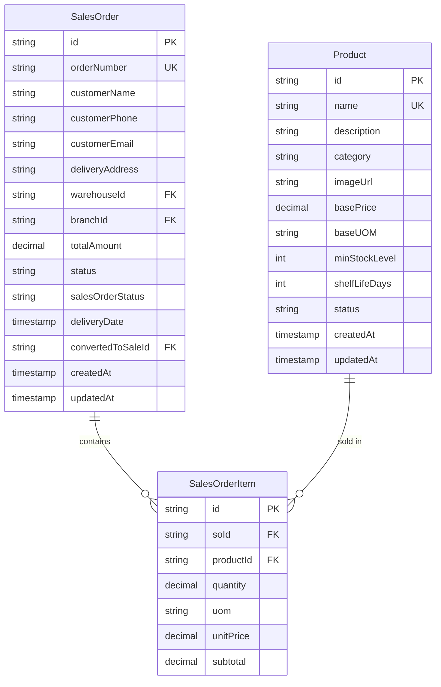
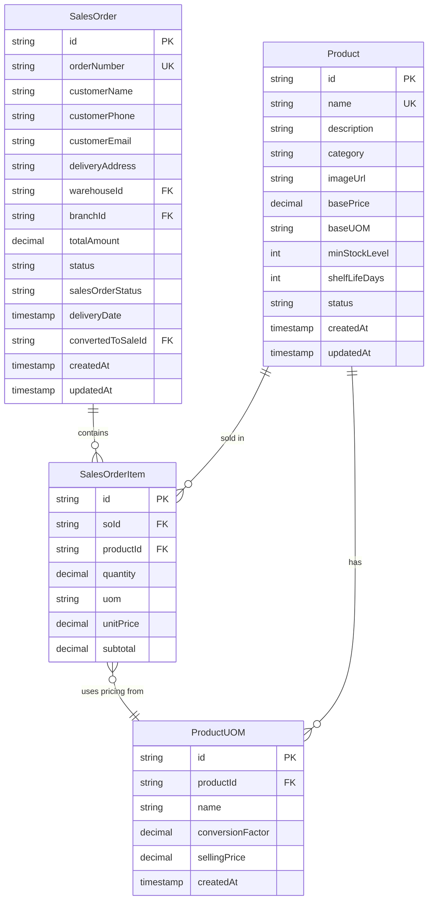

# Sales Order Item Model

<cite>
**Referenced Files in This Document**   
- [sales-order.repository.ts](file://repositories/sales-order.repository.ts)
- [sales-order.service.ts](file://services/sales-order.service.ts)
- [types/sales-order.types.ts](file://types/sales-order.types.ts)
- [prisma/migrations/20251113094445_init/migration.sql](file://prisma/migrations/20251113094445_init/migration.sql)
- [specs/inventory-pro-system/design.md](file://specs/inventory-pro-system/design.md)
- [services/inventory.service.ts](file://services/inventory.service.ts)
- [services/product.service.ts](file://services/product.service.ts)
</cite>

## Table of Contents
1. [Introduction](#introduction)
2. [Field Definitions](#field-definitions)
3. [Database Indexes](#database-indexes)
4. [Relationships](#relationships)
5. [UOM Conversion and Inventory Deduction](#uom-conversion-and-inventory-deduction)
6. [Query Examples](#query-examples)
7. [Business Rules](#business-rules)
8. [Data Model Diagram](#data-model-diagram)

## Introduction
The SalesOrderItem entity represents individual line items within a sales order, capturing product details, quantities, pricing, and unit of measure (UOM) information. This model enables flexible sales operations by supporting different units of measurement than the inventory base units, allowing businesses to sell products in customer-friendly units while maintaining accurate inventory tracking. The model is tightly integrated with the SalesOrder and Product entities, ensuring data consistency and enabling comprehensive sales analysis.

**Section sources**
- [prisma/migrations/20251113094445_init/migration.sql](file://prisma/migrations/20251113094445_init/migration.sql#L158-L168)
- [types/sales-order.types.ts](file://types/sales-order.types.ts#L6-L12)

## Field Definitions
The SalesOrderItem model contains the following fields:

- **id**: Unique identifier for the sales order item (Primary Key)
- **soId**: Foreign key reference to the parent SalesOrder (Indexed)
- **productId**: Foreign key reference to the Product being sold (Indexed)
- **quantity**: Quantity of the product ordered, stored as DECIMAL(10,2) to support fractional units
- **uom**: Unit of Measure used for this sale, which may differ from the product's base UOM
- **unitPrice**: Price per unit in the specified UOM, stored as DECIMAL(10,2) for monetary precision
- **subtotal**: Calculated subtotal (quantity × unitPrice), stored as DECIMAL(10,2)

The quantity, unitPrice, and subtotal fields use the DECIMAL(10,2) data type to ensure precise financial calculations and avoid floating-point rounding errors. The uom field enables selling products in different units than their inventory base units, providing flexibility for customer transactions.

**Section sources**
- [prisma/migrations/20251113094445_init/migration.sql](file://prisma/migrations/20251113094445_init/migration.sql#L159-L165)
- [types/sales-order.types.ts](file://types/sales-order.types.ts#L7-L11)

## Database Indexes
The SalesOrderItem table includes performance-optimized indexes on key fields:

- **SalesOrderItem_soId_idx**: Index on the soId field to optimize queries that retrieve all items for a specific sales order
- **SalesOrderItem_productId_idx**: Index on the productId field to support product-centric queries and sales analysis by product

These indexes ensure efficient data retrieval for common operations such as displaying order details, generating sales reports, and analyzing product performance. The indexing strategy supports both order-based and product-based access patterns, enabling fast query performance for various business intelligence scenarios.

**Section sources**
- [prisma/migrations/20251113094445_init/migration.sql](file://prisma/migrations/20251113094445_init/migration.sql#L387-L390)

## Relationships
The SalesOrderItem entity maintains critical relationships with other core entities in the system:

- **SalesOrder (Parent)**: One-to-many relationship where each SalesOrder can have multiple SalesOrderItems. Implemented with a foreign key constraint on soId with cascade delete, ensuring that when a sales order is deleted, all associated items are automatically removed.
- **Product**: Many-to-one relationship where each SalesOrderItem references a specific Product. This link enables access to product details, pricing information, and inventory data.

These relationships ensure data integrity and enable comprehensive order processing, from creation to fulfillment. The cascade delete behavior on the SalesOrder relationship maintains referential integrity while simplifying order management operations.



**Diagram sources**
- [prisma/migrations/20251113094445_init/migration.sql](file://prisma/migrations/20251113094445_init/migration.sql#L500-L504)
- [types/sales-order.types.ts](file://types/sales-order.types.ts#L44-L53)

## UOM Conversion and Inventory Deduction
The system handles UOM conversion and inventory deduction through coordinated service layer logic. When a sales order is created or updated, the sales-order.service.ts processes the items by validating stock availability and calculating prices based on the specified UOM. The inventory.service.ts contains the convertToBaseUOM method that transforms quantities from sales UOM to inventory base UOM using conversion factors defined in the ProductUOM table.

During order processing, the system:
1. Validates that sufficient stock is available in the warehouse
2. Converts the ordered quantity from the sales UOM to the base UOM for inventory tracking
3. Deducts inventory using FIFO (First-In, First-Out) methodology based on batch expiry dates
4. Records stock movements with appropriate references

This process ensures accurate inventory management while allowing flexible sales in various units. The UOM conversion logic is centralized in the inventory service, promoting consistency across different modules that handle inventory transactions.

**Section sources**
- [services/sales-order.service.ts](file://services/sales-order.service.ts#L51-L78)
- [services/inventory.service.ts](file://services/inventory.service.ts#L655-L782)
- [specs/inventory-pro-system/design.md](file://specs/inventory-pro-system/design.md#L753-L782)

## Query Examples
The SalesOrderItem model supports various analytical queries for business intelligence:

**Sales Analysis by Product:**
```sql
SELECT 
    p.name as product_name,
    SUM(soi.quantity) as total_quantity_sold,
    SUM(soi.subtotal) as total_revenue
FROM SalesOrderItem soi
JOIN Product p ON soi.productId = p.id
WHERE soi.createdAt >= '2025-01-01'
GROUP BY p.id, p.name
ORDER BY total_revenue DESC;
```

**UOM Performance Analysis:**
```sql
SELECT 
    soi.uom,
    COUNT(*) as order_count,
    AVG(soi.quantity) as avg_quantity_per_order,
    AVG(soi.unitPrice) as avg_price
FROM SalesOrderItem soi
WHERE soi.createdAt >= '2025-01-01'
GROUP BY soi.uom
ORDER BY order_count DESC;
```

These queries enable business insights into product performance and customer preferences for different units of measure, helping optimize pricing strategies and inventory planning.

**Section sources**
- [sales-order.repository.ts](file://repositories/sales-order.repository.ts#L10-L239)
- [sales-order.service.ts](file://services/sales-order.service.ts#L83-L287)

## Business Rules
The system enforces several critical business rules around pricing consistency and UOM validation:

- **Pricing Consistency**: Unit prices are automatically calculated based on the product's UOM-specific selling price, preventing manual price entry that could lead to inconsistencies. The sales-order.service.ts retrieves the correct selling price for the specified UOM from the ProductUOM table.
- **UOM Validation**: The system validates that the specified UOM is defined for the product by checking against the ProductUOM records. Invalid UOM values are rejected during order creation or modification.
- **Stock Validation**: Before confirming a sales order, the system verifies that sufficient inventory is available in the selected warehouse, converting quantities to base UOM for accurate stock level checks.
- **Editable Status**: Sales orders can only be modified when in 'draft' or 'pending' status, preventing changes to confirmed or cancelled orders.

These business rules ensure data integrity, prevent pricing errors, and maintain accurate inventory levels across all transactions.

**Section sources**
- [sales-order.service.ts](file://services/sales-order.service.ts#L132-L149)
- [inventory.service.ts](file://services/inventory.service.ts#L592-L782)
- [sales-order.service.ts](file://services/sales-order.service.ts#L178-L182)

## Data Model Diagram
The following entity relationship diagram illustrates the SalesOrderItem model and its connections to related entities:



**Diagram sources**
- [prisma/migrations/20251113094445_init/migration.sql](file://prisma/migrations/20251113094445_init/migration.sql)
- [specs/inventory-pro-system/design.md](file://specs/inventory-pro-system/design.md#L146-L442)