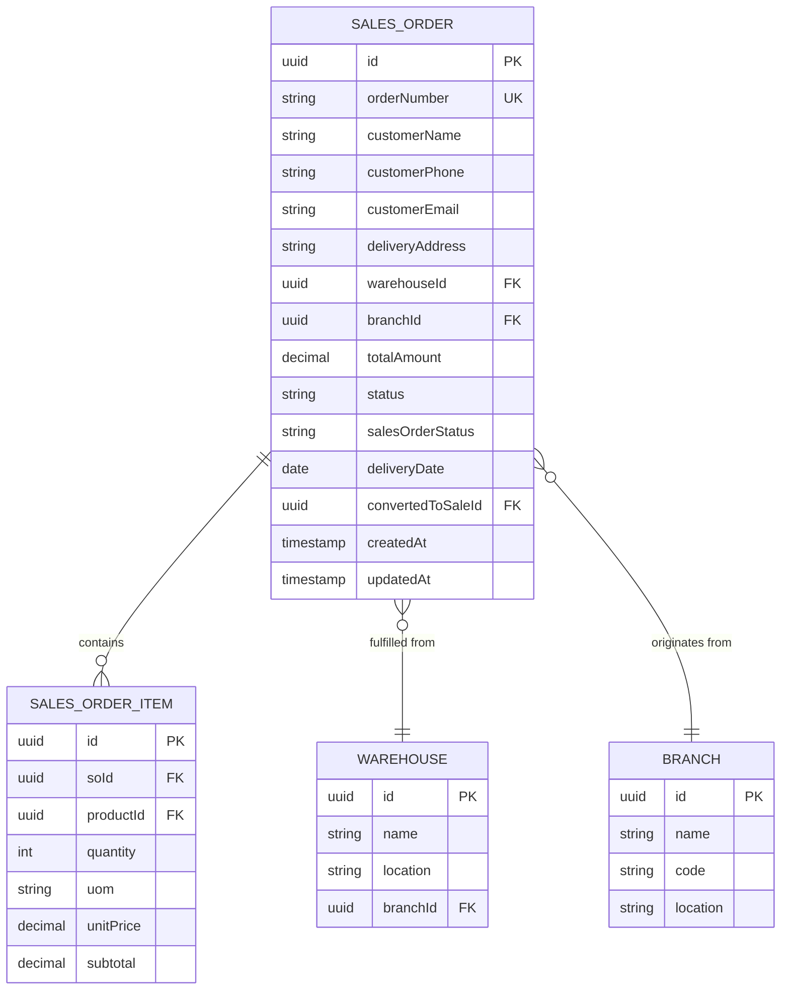

# Sales Order Model

<cite>
**Referenced Files in This Document**   
- [sales-order.types.ts](file://types/sales-order.types.ts)
- [sales-order.validation.ts](file://lib/validations/sales-order.validation.ts)
- [sales-order.service.ts](file://services/sales-order.service.ts)
- [sales-order.repository.ts](file://repositories/sales-order.repository.ts)
- [seed.ts](file://prisma/seed.ts)
</cite>

## Table of Contents
1. [Introduction](#introduction)
2. [Field Definitions](#field-definitions)
3. [Dual Status System](#dual-status-system)
4. [Indexes and Query Optimization](#indexes-and-query-optimization)
5. [Relationships with Other Entities](#relationships-with-other-entities)
6. [Query Examples for Business Workflows](#query-examples-for-business-workflows)
7. [Sales Order Service Methods](#sales-order-service-methods)
8. [Business Rules and Constraints](#business-rules-and-constraints)
9. [Data Model Diagram](#data-model-diagram)

## Introduction
The SalesOrder entity is a core component of the sales workflow management system, designed to track customer orders from creation through fulfillment and conversion into point-of-sale (POS) transactions. It supports both draft and confirmed orders, manages inventory reservation, and enables delivery scheduling. The model incorporates a dual status system to independently track order processing state and fulfillment/conversion state, enabling granular control over the sales pipeline. This documentation provides a comprehensive overview of the data model, its constraints, relationships, and business logic.

## Field Definitions

The SalesOrder entity contains the following fields:

- **id**: Unique identifier for the sales order (UUID)
- **orderNumber**: Human-readable order number with format `SO-YYYYMMDD-XXXX` (@unique constraint ensures global uniqueness)
- **customerName**: Full name of the customer (required, minimum 1 character)
- **customerPhone**: Contact number in Philippine format (e.g., 09XXXXXXXXX or +639XXXXXXXXX) (required, validated via regex)
- **customerEmail**: Customer email address (required, validated format)
- **deliveryAddress**: Full delivery location (required)
- **warehouseId**: Reference to the warehouse fulfilling the order (foreign key to Warehouse entity, UUID)
- **branchId**: Reference to the originating sales branch (foreign key to Branch entity, UUID)
- **totalAmount**: Sum of all item subtotals, stored as decimal with precision (10,2)
- **status**: Primary order lifecycle state with values: "draft", "pending", "fulfilled", "cancelled"
- **salesOrderStatus**: Conversion tracking state with values: "pending", "in-progress", "delivered" (Note: code shows "pending" | "converted", likely "in-progress" and "delivered" are intermediate states)
- **deliveryDate**: Scheduled date for order fulfillment
- **convertedToSaleId**: Reference to the POS sale record once order is converted (UUID, nullable)
- **createdAt**: Timestamp of record creation
- **updatedAt**: Timestamp of last modification

**Section sources**
- [sales-order.types.ts](file://types/sales-order.types.ts#L3-L64)
- [sales-order.validation.ts](file://lib/validations/sales-order.validation.ts#L11-L38)

## Dual Status System

The SalesOrder model implements a dual status system to decouple order processing from fulfillment and cash conversion:

1. **status** (`SalesOrderStatus`): Tracks the operational lifecycle of the order:
   - `draft`: Order is being prepared, can be edited freely
   - `pending`: Order is confirmed and awaiting fulfillment
   - `converted`: Order has been successfully processed as a POS sale
   - `cancelled`: Order has been voided and will not be fulfilled

2. **salesOrderStatus** (`SalesOrderConversionStatus`): Tracks the fulfillment and conversion pipeline:
   - `pending`: Awaiting conversion to POS transaction
   - `converted`: Successfully converted to a POS sale (linked via `convertedToSaleId`)

This design allows the system to distinguish between orders that are operationally active (`status = pending`) versus those that have completed the cash conversion process (`salesOrderStatus = converted`). The service layer enforces business rules preventing cancellation of converted orders.

**Section sources**
- [sales-order.types.ts](file://types/sales-order.types.ts#L3-L5)
- [sales-order.service.ts](file://services/sales-order.service.ts#L235-L257)
- [sales-order.service.ts](file://services/sales-order.service.ts#L262-L269)

## Indexes and Query Optimization

The SalesOrder model is optimized for common business queries through the following indexing strategy:

- **warehouseId**: Enables fast lookup of orders assigned to a specific warehouse for inventory allocation
- **branchId**: Supports branch-level reporting and order management
- **status**: Critical for filtering active vs. cancelled orders in dashboards and workflows
- **salesOrderStatus**: Essential for identifying orders ready for POS conversion
- **orderNumber**: Unique index supporting direct order lookup by human-readable number
- **createdAt**: Optimizes time-based queries for reporting and audit trails

These indexes support key workflows such as daily order processing, delivery scheduling, and sales pipeline analysis.

**Section sources**
- [sales-order.repository.ts](file://repositories/sales-order.repository.ts#L10-L65)
- [sales-order.repository.ts](file://repositories/sales-order.repository.ts#L90-L111)

## Relationships with Other Entities

The SalesOrder entity maintains the following relationships:

- **Warehouse**: One-to-many relationship via `warehouseId`. Determines inventory source for order fulfillment.
- **Branch**: One-to-many relationship via `branchId`. Identifies the sales origin and organizational unit.
- **SalesOrderItem**: One-to-many relationship representing line items. Each item references a Product and includes quantity, unit of measure (UOM), pricing, and subtotal.

These relationships enable comprehensive order context, including product details, pricing, and fulfillment logistics.

**Section sources**
- [sales-order.repository.ts](file://repositories/sales-order.repository.ts#L57-L63)
- [sales-order.repository.ts](file://repositories/sales-order.repository.ts#L72-L76)
- [seed.ts](file://prisma/seed.ts#L9-L63)

## Query Examples for Business Workflows

The repository and service layers support the following key business queries:

### Sales Pipeline Analysis
Retrieve all active orders (draft or pending) for a specific branch:
```typescript
const activeOrders = await salesOrderService.getAllSalesOrders({
  branchId: "branch-123",
  status: "pending"
});
```

### Delivery Scheduling
Find all pending orders sorted by delivery date:
```typescript
const deliverySchedule = await salesOrderRepository.findPendingOrders("branch-123");
// Returns orders ordered by deliveryDate ascending
```

### Pending Orders for POS Conversion
Get all orders ready for conversion to POS sale:
```typescript
const pendingConversions = await salesOrderService.getPendingSalesOrders();
// Filters by status = 'pending' AND salesOrderStatus = 'pending'
```

### Conversion Rate Reporting
Calculate order-to-cash conversion efficiency:
```typescript
const conversionRate = await salesOrderService.getConversionRate("branch-123");
// Returns percentage of orders converted to POS sales
```

**Section sources**
- [sales-order.service.ts](file://services/sales-order.service.ts#L83-L103)
- [sales-order.repository.ts](file://repositories/sales-order.repository.ts#L89-L112)
- [sales-order.service.ts](file://services/sales-order.service.ts#L274-L284)

## Sales Order Service Methods

The `SalesOrderService` class provides the following key methods:

- **createSalesOrder()**: Validates input, generates unique order number, checks stock availability, calculates total, and creates the order with line items
- **updateSalesOrder()**: Allows modifications only for draft or pending orders; revalidates stock and pricing when items change
- **cancelSalesOrder()**: Transitions order to cancelled status if not already converted
- **markAsConverted()**: Updates salesOrderStatus to "converted" and links to POS sale record
- **getPendingSalesOrders()**: Retrieves orders eligible for POS conversion
- **validateStockAvailability()**: Checks inventory levels before order creation/update

These methods enforce business rules around order lifecycle, inventory reservation, and data integrity.

**Section sources**
- [sales-order.service.ts](file://services/sales-order.service.ts#L108-L163)
- [sales-order.service.ts](file://services/sales-order.service.ts#L168-L230)
- [sales-order.service.ts](file://services/sales-order.service.ts#L235-L257)
- [sales-order.service.ts](file://services/sales-order.service.ts#L262-L269)

## Business Rules and Constraints

Key business rules enforced by the SalesOrder model:

1. **Order-to-Cash Conversion**: Orders must remain in `pending` status until converted via POS. Once `convertedToSaleId` is set, the order cannot be cancelled.
2. **Inventory Reservation**: Stock availability is validated at order creation/update time using base UOM conversion.
3. **Unique Order Numbers**: Generated in `SO-YYYYMMDD-XXXX` format with daily sequence to prevent duplicates.
4. **Edit Restrictions**: Only draft and pending orders can be modified; fulfilled or cancelled orders are immutable.
5. **Data Validation**: All customer contact information is validated for format and completeness.
6. **Branch-Warehouse Alignment**: Orders are created within branch context with fulfillment from associated warehouse.

These rules ensure data consistency, prevent revenue leakage, and support audit compliance.

**Section sources**
- [sales-order.service.ts](file://services/sales-order.service.ts#L129-L131)
- [sales-order.service.ts](file://services/sales-order.service.ts#L178-L183)
- [sales-order.service.ts](file://services/sales-order.service.ts#L242-L253)
- [sales-order.validation.ts](file://lib/validations/sales-order.validation.ts#L11-L38)

## Data Model Diagram



**Diagram sources**
- [sales-order.types.ts](file://types/sales-order.types.ts#L1-L64)
- [seed.ts](file://prisma/seed.ts#L8-L63)
- [sales-order.repository.ts](file://repositories/sales-order.repository.ts#L1-L239)