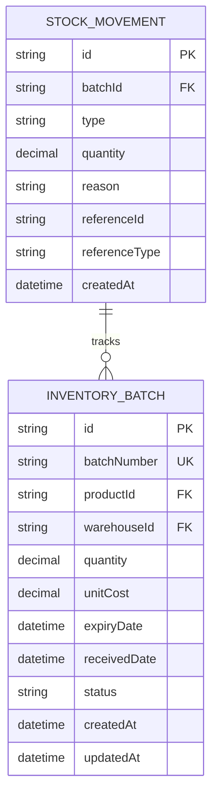
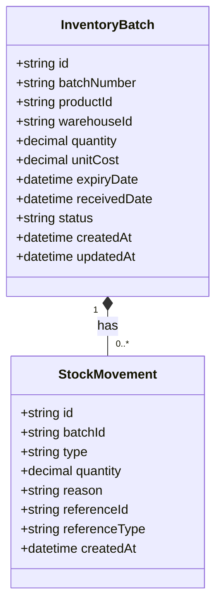
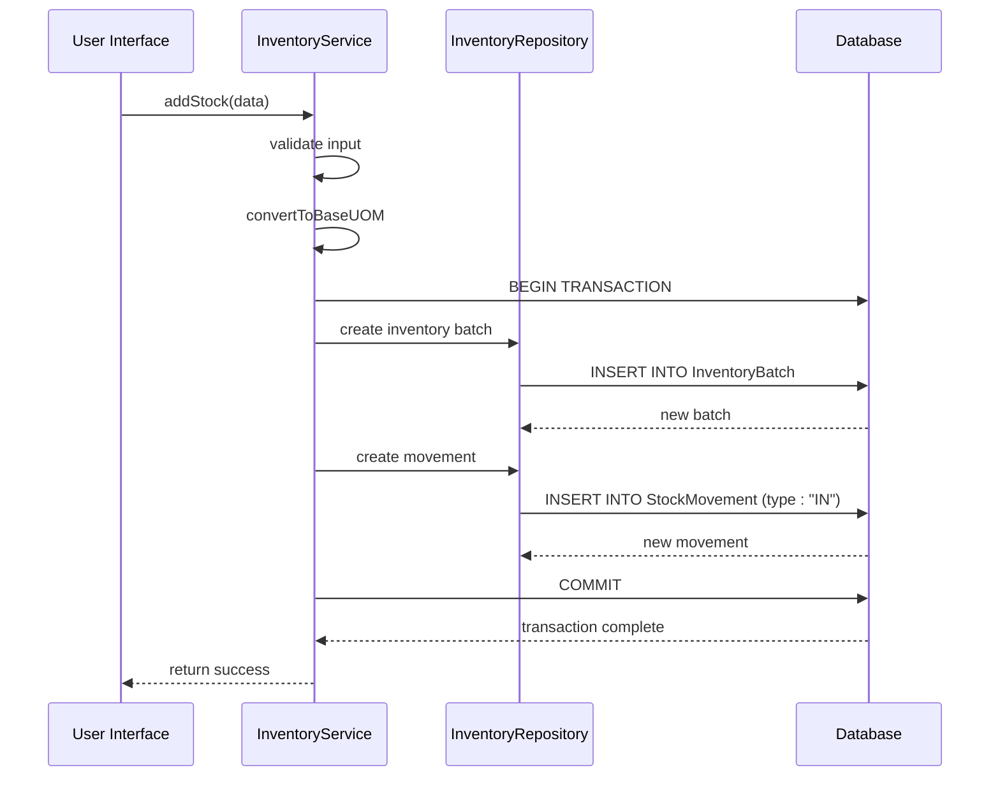

# Stock Movement Model

<cite>
**Referenced Files in This Document**   
- [schema.prisma](file://prisma/schema.prisma#L129-L145)
- [inventory.types.ts](file://types/inventory.types.ts#L4-L82)
- [inventory.service.ts](file://services/inventory.service.ts#L115-L383)
- [inventory.repository.ts](file://repositories/inventory.repository.ts#L155-L263)
- [route.ts](file://app/api/inventory/movements/route.ts#L1-L42)
- [page.tsx](file://app/(dashboard)/inventory/movements/page.tsx#L30-L294)
</cite>

## Table of Contents
1. [Introduction](#introduction)
2. [Field Definitions](#field-definitions)
3. [Audit Trail and Business Rules](#audit-trail-and-business-rules)
4. [Indexing and Performance](#indexing-and-performance)
5. [Relationship with InventoryBatch](#relationship-with-inventorybatch)
6. [Query Examples](#query-examples)
7. [Service Methods](#service-methods)
8. [User Interface](#user-interface)

## Introduction
The StockMovement entity serves as the foundation for comprehensive inventory transaction tracking within the system. It provides a complete audit trail of all inventory changes, capturing critical information about stock additions, deductions, transfers, and adjustments. This model enables full traceability of inventory movements across the organization, supporting operational transparency, financial accuracy, and compliance requirements. The model is designed to record every change to inventory levels with detailed context, including the type of movement, quantity involved, business reason, and reference to originating transactions.

**Section sources**
- [schema.prisma](file://prisma/schema.prisma#L129-L145)
- [inventory.types.ts](file://types/inventory.types.ts#L4-L82)

## Field Definitions
The StockMovement model contains the following fields that capture essential information about each inventory transaction:

- **id**: Unique identifier for the stock movement record, generated using UUID for global uniqueness
- **batchId**: Foreign key reference to the InventoryBatch being affected by this movement
- **type**: Movement type indicating the nature of the transaction, with allowed values of "IN" (stock addition), "OUT" (stock deduction), "TRANSFER" (movement between warehouses), and "ADJUSTMENT" (inventory correction)
- **quantity**: Decimal value representing the amount of stock moved, stored with precision of @db.Decimal(10,2) to support fractional quantities and accurate financial calculations
- **reason**: Optional text field providing additional context or explanation for the movement, particularly important for adjustments and corrections
- **referenceId**: Optional identifier linking the movement to its originating transaction (e.g., purchase order ID, sales order ID)
- **referenceType**: Optional classification of the reference, with allowed values of "PO" (Purchase Order), "SO" (Sales Order), and "POS" (Point of Sale transaction)
- **createdAt**: Timestamp automatically set when the movement is recorded, establishing the chronological order of inventory changes

**Section sources**
- [schema.prisma](file://prisma/schema.prisma#L131-L139)
- [inventory.types.ts](file://types/inventory.types.ts#L4-L76)

## Audit Trail and Business Rules
The StockMovement model provides a complete audit trail for all inventory changes through several key mechanisms. Every inventory transaction is recorded as a movement, creating an immutable history of stock changes that can be used for reconciliation, financial reporting, and operational analysis. The model enforces business rules through validation in the service layer, ensuring data integrity and consistency.

Movement type validation ensures that only approved transaction types are recorded, preventing invalid or unauthorized inventory changes. The system validates that "IN" movements are associated with stock additions (e.g., from purchase order receipts), "OUT" movements correspond to stock deductions (e.g., sales or consumption), "TRANSFER" movements represent inter-warehouse movements, and "ADJUSTMENT" movements are properly documented with reasons.

Audit trail integrity is maintained through the use of database transactions when recording movements. When inventory levels change, the corresponding stock movement is created within the same transaction, ensuring atomicity and preventing discrepancies between inventory balances and movement records. This approach guarantees that the sum of all movements for a batch always equals the current quantity, providing mathematical verification of inventory accuracy.

**Section sources**
- [inventory.service.ts](file://services/inventory.service.ts#L115-L383)
- [inventory.repository.ts](file://repositories/inventory.repository.ts#L155-L263)

## Indexing and Performance
The StockMovement model includes strategic database indexes to optimize query performance for common inventory reporting and analysis scenarios. These indexes are defined in the Prisma schema and leverage the underlying database's indexing capabilities:

- **batchId index**: Accelerates queries that retrieve all movements for a specific inventory batch, enabling efficient batch history tracing and reconciliation
- **(referenceId, referenceType) composite index**: Optimizes queries that find all movements associated with a particular transaction (e.g., all movements from a specific purchase order), supporting transaction-level inventory verification
- **createdAt index**: Enhances performance for time-based queries, such as generating daily movement reports, identifying recent transactions, or analyzing inventory trends over time

These indexes ensure that inventory movement queries perform efficiently even as the volume of transactions grows, supporting responsive user interfaces and timely reporting capabilities.

**Diagram sources**
- [schema.prisma](file://prisma/schema.prisma#L129-L145)
- [inventory.types.ts](file://types/inventory.types.ts#L4-L82)

**Section sources**
- [schema.prisma](file://prisma/schema.prisma#L142-L144)

## Relationship with InventoryBatch
The StockMovement entity has a one-to-many relationship with the InventoryBatch entity, where each inventory batch can have multiple stock movements associated with it. This relationship is established through the batchId foreign key field, which references the primary key of the InventoryBatch table.

This design enables comprehensive tracking of each batch's lifecycle from creation to depletion. When a new inventory batch is created (e.g., through a purchase order receipt), an "IN" movement is recorded with the received quantity. Subsequent deductions from the batch (e.g., through sales or transfers) generate "OUT" movements, each reducing the available quantity. The current quantity of the batch is calculated as the initial quantity plus all "IN" movements minus all "OUT" movements, providing a mathematical verification of inventory accuracy.

The relationship supports batch-level inventory analysis, allowing users to trace the complete history of any inventory batch, understand its movement patterns, and verify the accuracy of inventory records. This is particularly important for products with expiration dates, where the system uses First-Expiry-First-Out (FEFO) logic to ensure older batches are consumed first.

**Diagram sources**
- [schema.prisma](file://prisma/schema.prisma#L103-L119)
- [schema.prisma](file://prisma/schema.prisma#L130-L145)

**Section sources**
- [schema.prisma](file://prisma/schema.prisma#L140-L141)
- [inventory.types.ts](file://types/inventory.types.ts#L97-L109)

## Query Examples
The StockMovement model supports various queries for generating inventory reports, tracing stock history, and reconciling inventory. These queries leverage the model's fields and indexes to provide actionable insights:

- **Inventory movement reports**: Retrieve movements within a specific date range, filtered by movement type, warehouse, or product category to analyze inventory flow patterns
- **Stock history tracing**: Query all movements for a specific inventory batch to understand its complete lifecycle, including when it was received, how much was consumed, and when it was transferred
- **Inventory reconciliation**: Compare the calculated quantity (sum of all movements) with the current batch quantity to verify inventory accuracy and identify discrepancies
- **Transaction verification**: Find all movements associated with a specific purchase order or sales order to confirm that inventory changes align with documented transactions
- **Adjustment analysis**: Query all "ADJUSTMENT" movements with their reasons to review inventory corrections and identify potential process improvements

These queries are typically executed through the inventory service layer, which provides a clean API for accessing movement data with appropriate filtering and sorting options.

**Section sources**
- [inventory.service.ts](file://services/inventory.service.ts#L406-L408)
- [inventory.repository.ts](file://repositories/inventory.repository.ts#L155-L218)

## Service Methods
The inventory service provides several methods that create stock movements during various inventory operations. These methods ensure that every inventory change is properly recorded with the appropriate movement type, quantity, and context:

- **addStock**: Creates an "IN" movement when adding stock to inventory, typically from purchase order receipts or manual additions
- **deductStock**: Creates an "OUT" movement when removing stock from inventory, following First-Expiry-First-Out (FEFO) logic to consume older batches first
- **transferStock**: Creates paired "OUT" and "IN" movements when transferring stock between warehouses, with "TRANSFER" as the referenceType
- **adjustInventory**: Creates "ADJUSTMENT" movements when correcting inventory discrepancies, requiring a reason to document the cause

These service methods wrap movement creation in database transactions with the corresponding inventory updates, ensuring atomicity and audit trail integrity. They also validate business rules, such as preventing negative inventory levels and ensuring proper authorization for adjustments.

**Diagram sources**
- [inventory.service.ts](file://services/inventory.service.ts#L115-L177)
- [inventory.repository.ts](file://repositories/inventory.repository.ts#L252-L263)

**Section sources**
- [inventory.service.ts](file://services/inventory.service.ts#L115-L383)
- [inventory.repository.ts](file://repositories/inventory.repository.ts#L252-L263)

## User Interface
The user interface for stock movements provides a comprehensive view of all inventory transactions, allowing users to filter, sort, and analyze movement data. The interface displays key information including the movement date and time, type, product, warehouse, quantity, reason, and reference to originating transactions.

Users can filter movements by product, warehouse, movement type, reference type, and date range to focus on specific inventory activities. The interface visually distinguishes different movement types using color-coded badges, making it easy to identify patterns and trends. Reference links allow users to navigate directly to related transactions (e.g., purchase orders, sales orders) for additional context.

The interface also supports exporting movement data to CSV format for offline analysis and reporting. This functionality enables users to generate custom reports, perform detailed analysis, and share inventory movement data with stakeholders who may not have direct system access.

**Section sources**
- [page.tsx](file://app/(dashboard)/inventory/movements/page.tsx#L30-L294)
- [route.ts](file://app/api/inventory/movements/route.ts#L1-L42)