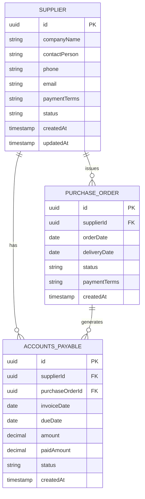

# Supplier Model

<cite>
**Referenced Files in This Document**   
- [supplier.types.ts](file://types/supplier.types.ts)
- [supplier.validation.ts](file://lib/validations/supplier.validation.ts)
- [supplier.repository.ts](file://repositories/supplier.repository.ts)
- [supplier.service.ts](file://services/supplier.service.ts)
- [ap.service.ts](file://services/ap.service.ts)
- [purchase-order.repository.ts](file://repositories/purchase-order.repository.ts)
- [ap.repository.ts](file://repositories/ap.repository.ts)
- [supplier-dialog.tsx](file://components/suppliers/supplier-dialog.tsx)
- [supplier-table.tsx](file://components/suppliers/supplier-table.tsx)
- [route.ts](file://app/api/suppliers/route.ts)
- [migration.sql](file://prisma/migrations/20251113094445_init/migration.sql)
</cite>

## Table of Contents
1. [Introduction](#introduction)
2. [Core Fields and Data Definitions](#core-fields-and-data-definitions)
3. [Payment Terms and Financial Integration](#payment-terms-and-financial-integration)
4. [Indexes and Query Performance](#indexes-and-query-performance)
5. [Relationships with PurchaseOrder and AccountsPayable](#relationships-with-purchaseorder-and-accountspayable)
6. [Supplier Validation Rules](#supplier-validation-rules)
7. [Business Rules for Status and Payment Terms](#business-rules-for-status-and-payment-terms)
8. [Integration with AP Aging and Purchase Orders](#integration-with-ap-aging-and-purchase-orders)
9. [Query Examples for Supplier Analysis](#query-examples-for-supplier-analysis)
10. [Data Model Diagram](#data-model-diagram)

## Introduction
The Supplier entity is a central component in the vendor management system, designed to store and manage all critical information about vendors. It supports procurement, accounts payable workflows, and financial planning through structured data fields, validation rules, and integration with downstream systems such as purchase orders and AP aging reports. This document details the data model, business logic, and system integrations for the Supplier entity.

## Core Fields and Data Definitions
The Supplier model includes the following core fields:

- **id**: Unique identifier for the supplier (UUID)
- **companyName**: Legal or trading name of the supplier (string, required)
- **contactPerson**: Primary contact representative (string, optional)
- **phone**: Contact phone number (string, optional, validated format)
- **email**: Business email address (string, optional, email format validation)
- **paymentTerms**: Payment condition defining due period ("Net 15", "Net 30", "Net 60", "COD") (enum, required)
- **status**: Operational status of the supplier ("Active", "Inactive", "On Hold") (enum, required, default: "Active")
- **createdAt**: Timestamp of record creation (datetime, auto-generated)
- **updatedAt**: Timestamp of last modification (datetime, auto-updated)

These fields are defined in the type system and enforced at both API and database levels.

**Section sources**
- [supplier.types.ts](file://types/supplier.types.ts#L5-L25)
- [migration.sql](file://prisma/migrations/20251113094445_init/migration.sql#L15-L45)

## Payment Terms and Financial Integration
The `paymentTerms` field directly influences financial operations, particularly in Accounts Payable (AP) due date calculations. Supported values are:
- **Net 15**: Payment due 15 days after invoice date
- **Net 30**: Payment due 30 days after invoice date
- **Net 60**: Payment due 60 days after invoice date
- **COD**: Cash on Delivery – payment required at time of delivery

When an invoice is recorded in the AP system, the due date is automatically calculated by adding the term period to the invoice date. For example, an invoice dated 2025-04-01 with "Net 30" results in a due date of 2025-05-01.

This field is critical for cash flow forecasting and financial planning, enabling the finance team to anticipate outgoing payments and manage liquidity.

**Section sources**
- [ap.service.ts](file://services/ap.service.ts#L30-L60)
- [supplier.types.ts](file://types/supplier.types.ts#L18-L22)

## Indexes and Query Performance
To optimize query performance, two database indexes are implemented:
- **Index on status**: Accelerates filtering of suppliers by operational status (e.g., fetching all "Active" suppliers)
- **Index on companyName**: Enables fast text-based searches for supplier lookup and autocomplete features

These indexes ensure responsive performance in supplier management interfaces, especially when dealing with large vendor databases.

**Section sources**
- [migration.sql](file://prisma/migrations/20251113094445_init/migration.sql#L40-L45)
- [supplier.repository.ts](file://repositories/supplier.repository.ts#L15-L30)

## Relationships with PurchaseOrder and AccountsPayable
The Supplier entity maintains the following relationships:
- **One-to-Many with PurchaseOrder**: Each supplier can have multiple purchase orders issued to them
- **One-to-Many with AccountsPayable**: Each supplier can have multiple outstanding invoices in AP

These relationships are enforced via foreign key constraints in the database. When a supplier is deactivated, new purchase orders and invoices cannot be created, but historical data remains intact for auditing and reporting.

**Section sources**
- [purchase-order.repository.ts](file://repositories/purchase-order.repository.ts#L10-L25)
- [ap.repository.ts](file://repositories/ap.repository.ts#L12-L28)
- [migration.sql](file://prisma/migrations/20251113094445_init/migration.sql#L50-L70)

## Supplier Validation Rules
Supplier data is validated using a dedicated validation schema that ensures data integrity:
- **companyName**: Required, minimum 2 characters
- **email**: Must be a valid email format if provided
- **phone**: Must follow a standard phone number pattern if provided
- **paymentTerms**: Must be one of the allowed enum values
- **status**: Must be a valid status value

Validation occurs at both the frontend (via `supplier-dialog.tsx`) and backend (via `supplier.validation.ts`) to prevent invalid data entry.

**Section sources**
- [supplier.validation.ts](file://lib/validations/supplier.validation.ts#L5-L40)
- [supplier-dialog.tsx](file://components/suppliers/supplier-dialog.tsx#L20-L50)

## Business Rules for Status and Payment Terms
Key business rules govern supplier management:
- **Status Management**: Only "Active" suppliers can be selected when creating new purchase orders. Status changes require audit logging.
- **Payment Term Enforcement**: Payment terms cannot be modified on existing purchase orders once issued. Changes apply only to future orders.
- **Inactive Suppliers**: Cannot be reactivated without manager approval (enforced in `supplier.service.ts`).

These rules ensure consistency and compliance in procurement and financial operations.

**Section sources**
- [supplier.service.ts](file://services/supplier.service.ts#L45-L90)
- [purchase-order.service.ts](file://services/purchase-order.service.ts#L60-L75)

## Integration with AP Aging and Purchase Orders
The Supplier model integrates tightly with:
- **Purchase Orders**: When a new PO is created, the supplier’s payment terms are copied to ensure correct due date calculation.
- **AP Aging Report**: The aging report groups unpaid invoices by supplier and uses payment terms to categorize obligations into buckets (e.g., "Current", "1-30 Days", "31-60 Days").

This integration enables accurate financial reporting and vendor performance tracking.

**Section sources**
- [ap.service.ts](file://services/ap.service.ts#L80-L120)
- [report.service.ts](file://services/report.service.ts#L100-L140)
- [purchase-order.service.ts](file://services/purchase-order.service.ts#L25-L40)

## Query Examples for Supplier Analysis
Common queries used in vendor management:

- **Find all active suppliers with Net 30 terms**:
```sql
SELECT * FROM Supplier 
WHERE status = 'Active' AND paymentTerms = 'Net 30';
```

- **Supplier performance analysis (on-time delivery rate)**:
```sql
SELECT 
    s.companyName,
    COUNT(po.id) as totalOrders,
    AVG(CASE WHEN po.deliveredOnTime THEN 1 ELSE 0 END) as onTimeRate
FROM Supplier s
JOIN PurchaseOrder po ON s.id = po.supplierId
GROUP BY s.id, s.companyName
ORDER BY onTimeRate DESC;
```

- **Suppliers by payment term for cash flow planning**:
```sql
SELECT paymentTerms, COUNT(*) as supplierCount
FROM Supplier
WHERE status = 'Active'
GROUP BY paymentTerms;
```

**Section sources**
- [supplier.repository.ts](file://repositories/supplier.repository.ts#L35-L70)
- [report.service.ts](file://services/report.service.ts#L110-L130)

## Data Model Diagram


**Diagram sources**
- [migration.sql](file://prisma/migrations/20251113094445_init/migration.sql#L15-L70)
- [supplier.types.ts](file://types/supplier.types.ts#L5-L25)