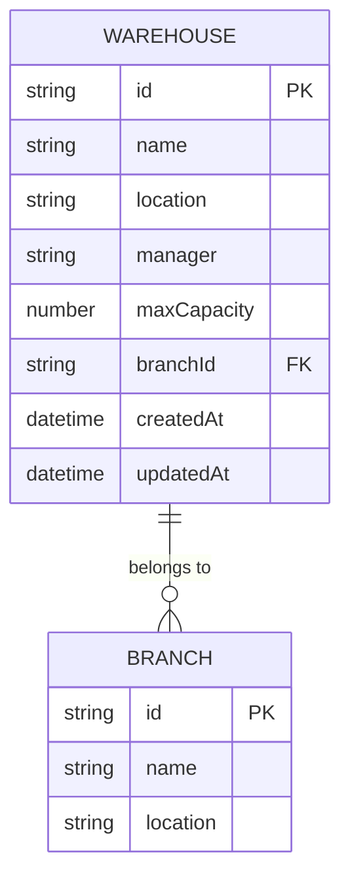
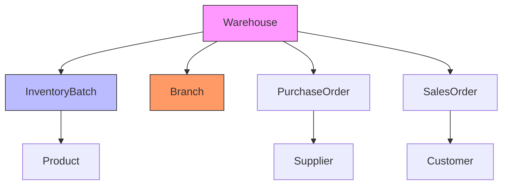
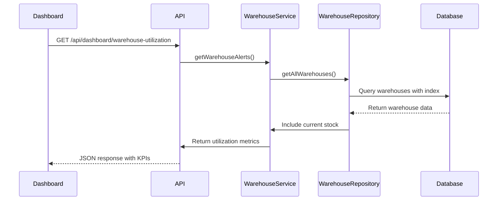

# Warehouse Model

<cite>
**Referenced Files in This Document**   
- [warehouse.service.ts](file://services/warehouse.service.ts)
- [warehouse.repository.ts](file://repositories/warehouse.repository.ts)
- [warehouse.types.ts](file://types/warehouse.types.ts)
- [warehouse.validation.ts](file://lib/validations/warehouse.validation.ts)
- [warehouses/route.ts](file://app/api/warehouses/route.ts)
- [warehouses/[id]/route.ts](file://app/api/warehouses/[id]/route.ts)
- [warehouse-dialog.tsx](file://components/warehouses/warehouse-dialog.tsx)
- [use-warehouses.ts](file://hooks/use-warehouses.ts)
- [dashboard.service.ts](file://services/dashboard.service.ts)
</cite>

## Table of Contents
1. [Introduction](#introduction)
2. [Field Definitions](#field-definitions)
3. [Capacity Management](#capacity-management)
4. [Database Indexing and Querying](#database-indexing-and-querying)
5. [Relationships](#relationships)
6. [Business Rules and Validation](#business-rules-and-validation)
7. [Integration with Dashboard KPIs](#integration-with-dashboard-kpis)
8. [Query Examples](#query-examples)

## Introduction
The Warehouse entity serves as a central component in the inventory storage management system, representing physical storage locations within branch operations. This model enables comprehensive tracking of inventory capacity, utilization, and location-based management. The warehouse system integrates with multiple business processes including inventory management, purchase fulfillment, and sales order processing. The model is designed to support capacity planning, utilization monitoring, and efficient querying through proper indexing and relationship management.

## Field Definitions
The Warehouse model contains the following fields that define its core attributes:

- **id**: Unique identifier for the warehouse (string)
- **name**: Descriptive name of the warehouse location (string)
- **location**: Physical address or location details (string)
- **manager**: Name of the personnel responsible for warehouse operations (string)
- **maxCapacity**: Maximum storage capacity in base units of measure (number)
- **branchId**: Foreign key linking the warehouse to a specific branch (string)
- **createdAt**: Timestamp of warehouse creation (datetime)
- **updatedAt**: Timestamp of last modification (datetime)

**Section sources**
- [warehouse.types.ts](file://types/warehouse.types.ts#L2-L8)
- [warehouse.types.ts](file://types/warehouse.types.ts#L10-L16)
- [warehouse.repository.ts](file://repositories/warehouse.repository.ts#L33-L46)
- [warehouse.repository.ts](file://repositories/warehouse.repository.ts#L48-L56)

## Capacity Management
The maxCapacity field plays a critical role in warehouse utilization monitoring and capacity planning. The system calculates utilization percentage by comparing current stock levels against maximum capacity, enabling proactive management of storage resources.

The WarehouseService provides methods to calculate utilization:
```typescript
calculateUtilization(currentStock: number, maxCapacity: number): number
```

Utilization is expressed as a percentage (0-100%) and triggers alert levels based on thresholds:
- **Normal** (0-59%): Adequate capacity available
- **Warning** (60-79%): Capacity approaching limits
- **Critical** (80-100%): Urgent need for capacity expansion or inventory redistribution

This capacity monitoring enables organizations to prevent overstocking situations, plan for warehouse expansion, and optimize inventory distribution across multiple storage locations.

**Section sources**
- [warehouse.service.ts](file://services/warehouse.service.ts#L12-L37)
- [warehouse.service.ts](file://services/warehouse.service.ts#L195-L221)
- [warehouse.types.ts](file://types/warehouse.types.ts#L18-L22)

## Database Indexing and Querying
The warehouse model implements efficient querying through database indexing. The @@index([branchId]) directive creates an index on the branchId field, significantly improving query performance when retrieving warehouses by branch.

This index is particularly valuable for:
- Filtering warehouses by specific branch locations
- Generating branch-specific inventory reports
- Displaying warehouse lists within branch contexts
- Optimizing capacity utilization analysis by branch

The indexed field enables fast lookups and sorting operations, reducing database query times and improving overall system performance, especially as the number of warehouses grows.



**Diagram sources**
- [warehouse.repository.ts](file://repositories/warehouse.repository.ts#L4-L113)
- [warehouse.types.ts](file://types/warehouse.types.ts#L2-L8)

## Relationships
The Warehouse entity maintains several critical relationships within the inventory management system:

### InventoryBatch Relationship
Each warehouse serves as the physical storage location for InventoryBatch records. The one-to-many relationship allows tracking of all stock items stored within a specific warehouse. The current stock level is calculated by aggregating active inventory batches associated with the warehouse.

### Branch Relationship
Warehouses are organizationally linked to branches through a foreign key relationship (branchId). This hierarchical structure enables multi-branch operations where each branch may have one or more dedicated warehouses.

### PurchaseOrder and SalesOrder Relationships
Warehouses function as fulfillment locations for both purchase orders (receiving inventory) and sales orders (picking and shipping inventory). This integration ensures proper inventory allocation and tracking throughout the supply chain.



**Diagram sources**
- [warehouse.repository.ts](file://repositories/warehouse.repository.ts#L100-L113)
- [warehouse.service.ts](file://services/warehouse.service.ts#L43-L43)
- [warehouse.service.ts](file://services/warehouse.service.ts#L90-L90)

## Business Rules and Validation
The warehouse system enforces several business rules to maintain data integrity and operational efficiency:

### Capacity Validation Rules
- Maximum capacity must be greater than zero
- Capacity reductions cannot result in current stock exceeding the new capacity limit
- Warehouse deletion is prohibited when inventory exists in the warehouse

### Branch-Warehouse Association Rules
- Each warehouse must be associated with exactly one branch
- Warehouse creation requires valid branchId reference
- Branch filtering is supported through indexed queries

### Validation Implementation
The system implements validation at multiple levels:
- Input validation using Zod schemas
- Business logic validation in service layer
- Database constraint enforcement

When updating warehouse capacity, the system checks if the proposed capacity would be exceeded by existing inventory, preventing invalid configurations that could disrupt operations.

**Section sources**
- [warehouse.service.ts](file://services/warehouse.service.ts#L109-L125)
- [warehouse.service.ts](file://services/warehouse.service.ts#L130-L165)
- [warehouse.service.ts](file://services/warehouse.service.ts#L170-L189)
- [warehouse.validation.ts](file://lib/validations/warehouse.validation.ts#L12-L12)

## Integration with Dashboard KPIs
The warehouse model integrates directly with the dashboard's warehouse utilization KPIs through several mechanisms:

### Utilization Data Aggregation
The WarehouseService calculates real-time utilization metrics by combining warehouse capacity data with current inventory levels from the InventoryBatch table. This data is exposed through API endpoints that feed the dashboard visualizations.

### Alert System Integration
The getWarehouseAlerts method identifies warehouses with utilization exceeding 60% (warning) or 80% (critical) thresholds. These alerts are displayed in the dashboard's alert system, enabling proactive capacity management.

### Branch Comparison Features
The system supports branch-level warehouse analysis through the getWarehousesByBranch method, allowing comparative analysis of utilization patterns across different branches.

### API Endpoints for Dashboard
- GET /api/warehouses - Retrieves all warehouses with utilization data
- GET /api/warehouses?branchId={id} - Retrieves warehouses for specific branch
- GET /api/dashboard/warehouse-utilization - Provides summarized utilization KPIs



**Diagram sources**
- [warehouse.service.ts](file://services/warehouse.service.ts#L39-L39)
- [warehouse.service.ts](file://services/warehouse.service.ts#L195-L221)
- [dashboard.service.ts](file://services/dashboard.service.ts#L244-L308)
- [warehouses/route.ts](file://app/api/warehouses/route.ts#L10-L12)

## Query Examples
The following examples demonstrate common queries for warehouse management:

### Warehouse Capacity Utilization Query
```typescript
// Get all warehouses with utilization data
const warehouses = await warehouseService.getAllWarehouses();
// Returns: { id, name, location, maxCapacity, currentStock, utilization, alertLevel }
```

### Find Warehouses by Branch
```typescript
// Get warehouses for specific branch
const branchWarehouses = await warehouseService.getWarehousesByBranch('branch-123');
```

### Check Capacity for Inventory Addition
```typescript
// Validate if warehouse can accept additional stock
await warehouseService.validateCapacity('warehouse-456', 500);
// Throws error if capacity would be exceeded
```

### Retrieve Warehouse with Product Distribution
```typescript
// Get detailed warehouse information including product distribution
const warehouseDetails = await warehouseService.getWarehouseById('warehouse-789');
// Includes: productDistribution array with productId, productName, quantity
```

These queries leverage the indexed branchId field and pre-calculated utilization metrics to provide responsive performance even with large datasets.

**Section sources**
- [warehouse.service.ts](file://services/warehouse.service.ts#L43-L43)
- [warehouse.service.ts](file://services/warehouse.service.ts#L90-L90)
- [warehouse.service.ts](file://services/warehouse.service.ts#L71-L71)
- [warehouse.service.ts](file://services/warehouse.service.ts#L63-L63)