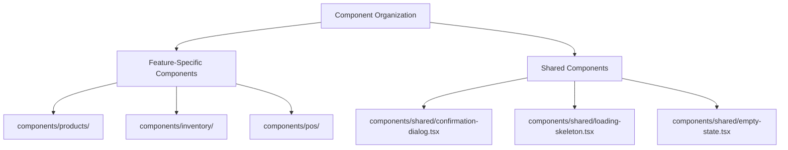
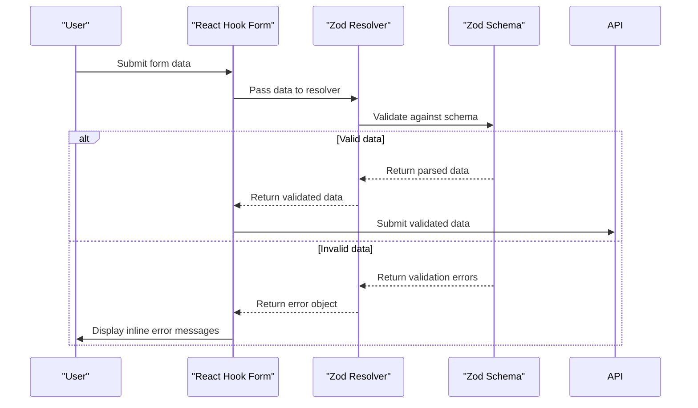
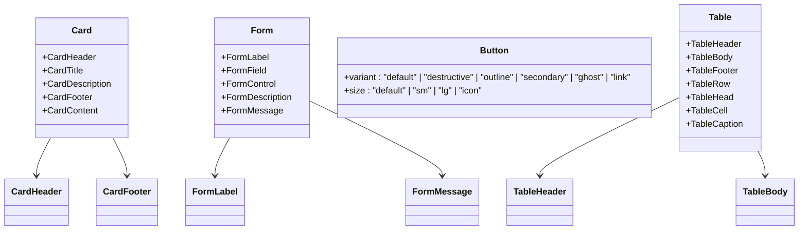
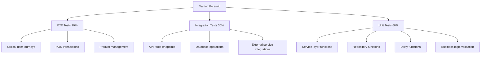
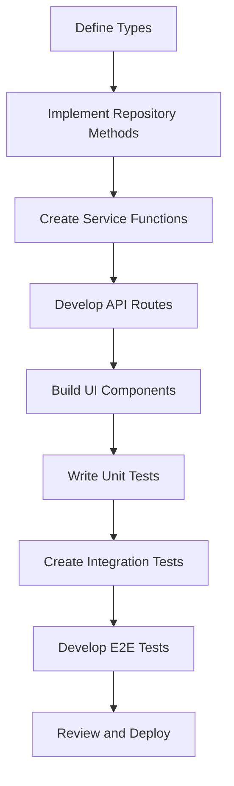
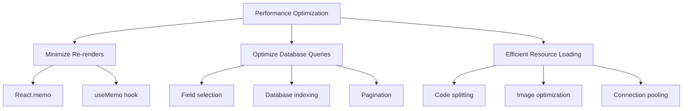
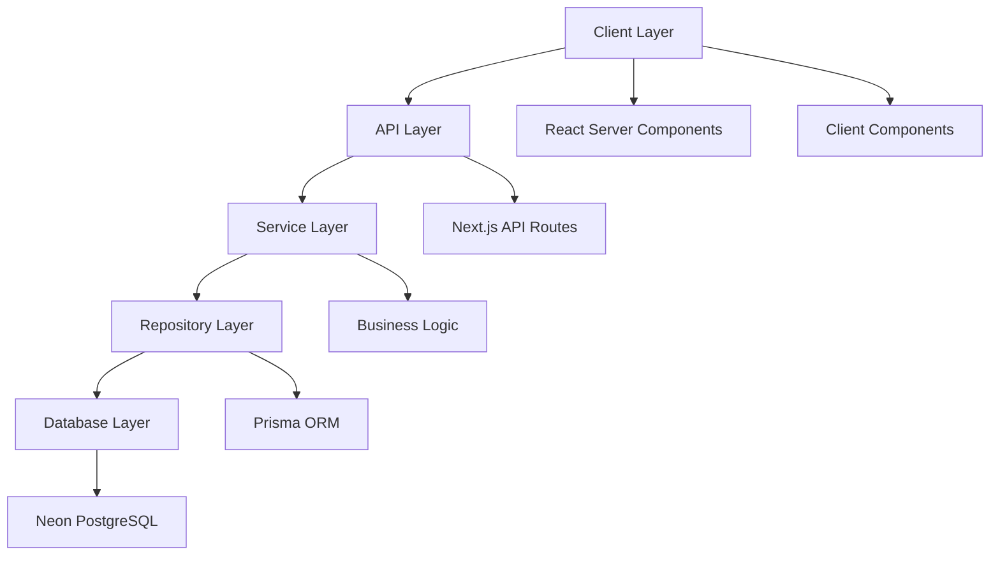

# Development Guidelines

<cite>
**Referenced Files in This Document**   
- [IMPLEMENTATION-GUIDE.md](file://IMPLEMENTATION-GUIDE.md)
- [TESTING-AND-OPTIMIZATION-GUIDE.md](file://TESTING-AND-OPTIMIZATION-GUIDE.md)
- [specs/inventory-pro-system/requirements.md](file://specs/inventory-pro-system/requirements.md)
- [specs/inventory-pro-system/design.md](file://specs/inventory-pro-system/design.md)
- [steer/tech.md](file://steer/tech.md)
- [lib/validations/branch.validation.ts](file://lib/validations/branch.validation.ts)
- [components/branches/branch-dialog.tsx](file://components/branches/branch-dialog.tsx)
- [components/ui/form.tsx](file://components/ui/form.tsx)
- [components/ui/card.tsx](file://components/ui/card.tsx)
- [components/shared/README.md](file://components/shared/README.md)
- [components/shared/examples.tsx](file://components/shared/examples.tsx)
- [QUICK-START-GUIDE.md](file://QUICK-START-GUIDE.md)
- [TASK-1-COMPLETION.md](file://TASK-1-COMPLETION.md)
- [components.json](file://components.json)
</cite>

## Table of Contents
1. [Introduction](#introduction)
2. [Coding Standards](#coding-standards)
3. [Form Validation Strategy](#form-validation-strategy)
4. [UI Component Development Guidelines](#ui-component-development-guidelines)
5. [Testing Strategy](#testing-strategy)
6. [Feature Implementation Process](#feature-implementation-process)
7. [Performance Optimization](#performance-optimization)
8. [Architectural Patterns](#architectural-patterns)

## Introduction
This document provides comprehensive development guidelines for contributing to the InventoryPro system, a comprehensive inventory management and Point of Sale (POS) system designed for soft drinks wholesale delivery companies in the Philippines. The guidelines cover coding standards, component patterns, validation strategies, testing approaches, and performance optimization techniques to ensure consistency and maintainability across the codebase. The system is built with Next.js 15, React 19, TypeScript, Prisma ORM, and Tailwind CSS v4, following a modular architecture with clear separation of concerns.

**Section sources**
- [steer/tech.md](file://steer/tech.md#L1-L68)
- [specs/inventory-pro-system/requirements.md](file://specs/inventory-pro-system/requirements.md#L1-L384)

## Coding Standards
The codebase follows strict TypeScript best practices and React component patterns to ensure type safety, maintainability, and consistency. All components should be implemented as functional components using React Hooks, with proper typing and documentation. The project enforces a consistent file naming convention where component files use PascalCase (e.g., ProductTable.tsx) and utility files use camelCase (e.g., api-error.ts). TypeScript interfaces and types are defined in the `types/` directory with clear naming that reflects their purpose (e.g., `ProductFormData`, `InventoryBatch`). The codebase uses ESLint and Prettier for consistent code formatting and style enforcement.

All React components should be organized in the `components/` directory with a clear hierarchy that groups related components by feature (e.g., `components/products/`, `components/inventory/`). Shared components that can be reused across multiple features are placed in `components/shared/`. The project uses React Server Components by default for data fetching, with Client Components explicitly marked with 'use client' only when interactivity or hooks are required. This approach optimizes performance by minimizing client-side JavaScript bundle size.

**Diagram sources**
- [components/branches/branch-dialog.tsx](file://components/branches/branch-dialog.tsx#L1-L253)
- [components/shared/README.md](file://components/shared/README.md#L84-L134)

**Section sources**
- [steer/tech.md](file://steer/tech.md#L48-L54)
- [QUICK-START-GUIDE.md](file://QUICK-START-GUIDE.md#L220-L233)

## Form Validation Strategy
The form validation strategy uses Zod schemas defined in the `lib/validations/` directory to provide type-safe validation for all forms in the application. Each form has a corresponding Zod schema that defines the validation rules for its fields, with error messages provided for each validation rule. The schemas are then integrated with React Hook Form using the `@hookform/resolvers/zod` resolver to provide seamless validation and type inference. This approach ensures that form data is validated both at the type level and runtime, preventing invalid data from being submitted to the server.

For example, the branch creation form uses the `branchSchema` defined in `lib/validations/branch.validation.ts`, which validates that required fields like name, code, location, manager, and phone are present and properly formatted. The phone number field uses a regex pattern to ensure it contains only valid characters for Philippine phone numbers. The schema also defines default values and optional fields, such as the status field which defaults to 'active'. When a form is submitted, the validation occurs automatically through the `zodResolver`, and any validation errors are displayed inline below the corresponding input fields using the `FormMessage` component.

**Diagram sources**
- [lib/validations/branch.validation.ts](file://lib/validations/branch.validation.ts#L1-L16)
- [components/branches/branch-dialog.tsx](file://components/branches/branch-dialog.tsx#L52-L61)

**Section sources**
- [lib/validations/branch.validation.ts](file://lib/validations/branch.validation.ts#L1-L16)
- [components/branches/branch-dialog.tsx](file://components/branches/branch-dialog.tsx#L52-L107)

## UI Component Development Guidelines
UI component development follows the shadcn/ui component library exclusively to ensure consistency across the application. The `components.json` configuration file defines the aliases and settings for the component library, including the color scheme (slate), CSS variables, and import aliases. All UI components are built using the primitives provided by shadcn/ui, such as Button, Card, Input, Label, Table, and Dialog, with custom styling applied only through Tailwind CSS classes. This approach ensures that all components have a consistent look and feel while maintaining accessibility and responsiveness.

The project implements a comprehensive design system with specific guidelines for colors, typography, spacing, and component styles. The color palette is limited to five primary colors for semantic purposes: primary (blue), secondary, success (green), warning (yellow/orange), and danger/destructive (red). Spacing follows a scale based on 4px increments (4, 8, 12, 16, 24, 32, 48, 64), and typography uses a maximum of three font sizes for body text: small (14px), base (16px), and large (18px). Components follow consistent patterns, such as form layouts with labels above inputs and helper text below, button styles with primary, secondary, outline, and ghost variants, and card layouts with header, body, and footer sections.

**Diagram sources**
- [components/ui/card.tsx](file://components/ui/card.tsx#L1-L79)
- [components/ui/form.tsx](file://components/ui/form.tsx#L1-L179)
- [components.json](file://components.json#L1-L20)

**Section sources**
- [TASK-1-COMPLETION.md](file://TASK-1-COMPLETION.md#L89-L131)
- [specs/inventory-pro-system/requirements.md](file://specs/inventory-pro-system/requirements.md#L335-L368)

## Testing Strategy
The testing strategy follows a testing pyramid approach with 60% unit tests, 30% integration tests, and 10% end-to-end (E2E) tests. Unit tests focus on business logic in the service and repository layers, as well as utility functions in the `lib/` directory. Integration tests verify API route endpoints and database operations, ensuring that components work together correctly. E2E tests validate critical user journeys such as POS transactions, product management workflows, and sales order processing, using Playwright to simulate real user interactions across multiple browsers.

The project uses Vitest as the test runner with a comprehensive configuration that supports watch mode, interactive UI, and coverage reporting. Tests are organized in the `tests/` directory with subdirectories for unit, integration, and E2E tests. The testing strategy emphasizes mocking external dependencies such as the database and APIs to ensure fast and reliable tests. Test coverage goals are set at 90%+ for services, 85%+ for repositories, 80%+ for API routes, and 70%+ for components, with an overall target of 80%+ coverage across the codebase.

**Diagram sources**
- [TESTING-AND-OPTIMIZATION-GUIDE.md](file://TESTING-AND-OPTIMIZATION-GUIDE.md#L11-L21)
- [TESTING-AND-OPTIMIZATION-GUIDE.md](file://TESTING-AND-OPTIMIZATION-GUIDE.md#L23-L50)

**Section sources**
- [TESTING-AND-OPTIMIZATION-GUIDE.md](file://TESTING-AND-OPTIMIZATION-GUIDE.md#L1-L76)
- [specs/inventory-pro-system/design.md](file://specs/inventory-pro-system/design.md#L1280-L1352)

## Feature Implementation Process
The process for adding new features follows a consistent pattern across the codebase, starting with the creation of corresponding types, repository methods, service functions, API routes, and UI components. New features should begin by defining TypeScript interfaces in the `types/` directory to establish the data structure and contracts. Repository methods are then implemented in the `repositories/` directory to handle data access operations using Prisma ORM. Service functions in the `services/` directory contain the business logic and orchestrate calls to the repository layer.

API routes are created in the `app/api/` directory using Next.js App Router, with handlers that call the appropriate service functions and return JSON responses. The routes follow a consistent pattern with error handling and response formatting. UI components are developed in the `components/` directory, following existing patterns for tables, dialogs, and forms. The implementation should reuse existing components from `components/shared/` such as confirmation dialogs, loading skeletons, and empty states to maintain consistency.

When implementing new features, developers should follow the patterns established in completed modules such as Products, Inventory, and POS. The `IMPLEMENTATION-GUIDE.md` provides detailed templates and examples for common implementation tasks, including API route creation, payment recording, and list page development. Features should be tested incrementally, with unit tests for business logic, integration tests for API endpoints, and E2E tests for critical user journeys.

**Diagram sources**
- [IMPLEMENTATION-GUIDE.md](file://IMPLEMENTATION-GUIDE.md#L138-L209)
- [IMPLEMENTATION-GUIDE.md](file://IMPLEMENTATION-GUIDE.md#L307-L383)

**Section sources**
- [IMPLEMENTATION-GUIDE.md](file://IMPLEMENTATION-GUIDE.md#L1-L435)
- [QUICK-START-GUIDE.md](file://QUICK-START-GUIDE.md#L220-L233)

## Performance Optimization
Performance optimization focuses on minimizing re-renders, efficient database queries, and optimal resource loading. The application uses React Query for client-side caching and data fetching, with a stale time of 5 minutes and cache time of 10 minutes to balance freshness and performance. Database queries are optimized by using the `select` option to limit returned fields, implementing proper indexing on frequently queried fields, and using pagination for large data lists. The `revalidate` option in Next.js is used to control server-side rendering frequency, with a default revalidation interval of 60 seconds.

To minimize re-renders, components use React.memo for memoization, and expensive computations are wrapped in useMemo hooks. The application implements code splitting to lazy load heavy components such as reports and charts, using Next.js dynamic imports with skeleton loaders for a smooth user experience. Image optimization is achieved through the Next.js Image component, which automatically handles lazy loading, responsive sizing, and format optimization. Connection pooling is configured in Prisma to optimize database performance, with appropriate logging levels for development and production environments.

**Diagram sources**
- [steer/tech.md](file://steer/tech.md#L61-L68)
- [specs/inventory-pro-system/design.md](file://specs/inventory-pro-system/design.md#L1544-L1665)

**Section sources**
- [steer/tech.md](file://steer/tech.md#L61-L68)
- [specs/inventory-pro-system/design.md](file://specs/inventory-pro-system/design.md#L1544-L1665)

## Architectural Patterns
The application follows a modular architecture with clear separation of concerns, implementing a repository pattern for data access and a service layer for business logic. The architecture is based on Next.js 15 with App Router and React Server Components, which allows for server-side rendering by default and client-side interactivity only when needed. The data flow follows a consistent pattern where API routes call service functions, which in turn call repository methods to interact with the database through Prisma ORM.

The component organization follows a feature-based structure, with each major module (Products, Inventory, POS, etc.) having its own directory in both the `app/` and `components/` directories. Shared components and utilities are placed in dedicated directories to promote reusability. The application uses React Context for global state management, particularly for branch selection and UI state, with local storage to persist user preferences. The error handling system uses custom error classes such as ValidationError, NotFoundError, and DatabaseError to provide meaningful feedback to users and developers.

**Diagram sources**
- [specs/inventory-pro-system/design.md](file://specs/inventory-pro-system/design.md#L38-L81)
- [steer/tech.md](file://steer/tech.md#L46-L54)

**Section sources**
- [specs/inventory-pro-system/design.md](file://specs/inventory-pro-system/design.md#L1-L800)
- [steer/tech.md](file://steer/tech.md#L1-L68)