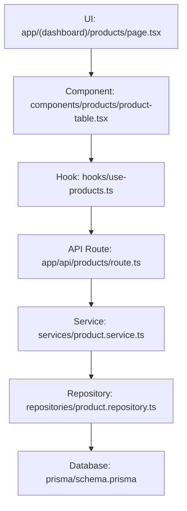

# Directory Structure Breakdown

<cite>
**Referenced Files in This Document**   
- [app/page.tsx](file://app/page.tsx)
- [app/api/products/route.ts](file://app/api/products/route.ts)
- [components/products/product-table.tsx](file://components/products/product-table.tsx)
- [services/product.service.ts](file://services/product.service.ts)
- [repositories/product.repository.ts](file://repositories/product.repository.ts)
- [types/product.types.ts](file://types/product.types.ts)
- [hooks/use-products.ts](file://hooks/use-products.ts)
- [lib/validations/product.validation.ts](file://lib/validations/product.validation.ts)
</cite>

## Table of Contents
1. [Introduction](#introduction)
2. [Top-Level Directory Overview](#top-level-directory-overview)
3. [App Directory: Next.js App Router Structure](#app-directory-nextjs-app-router-structure)
4. [Components Directory: Reusable UI Organization](#components-directory-reusable-ui-organization)
5. [Feature-Based Cross-Cutting Organization](#feature-based-cross-cutting-organization)
6. [Contexts and State Management](#contexts-and-state-management)
7. [Hooks: Custom React Hooks](#hooks-custom-react-hooks)
8. [Lib: Utilities and Validations](#lib-utilities-and-validations)
9. [Prisma: Database Schema and Migrations](#prisma-database-schema-and-migrations)
10. [Repositories: Data Access Layer](#repositories-data-access-layer)
11. [Services: Business Logic Layer](#services-business-logic-layer)
12. [Types: TypeScript Interfaces](#types-typescript-interfaces)
13. [Specs: Requirements and Design Documentation](#specs-requirements-and-design-documentation)
14. [Conclusion](#conclusion)

## Introduction
This document provides a comprehensive breakdown of the project's directory structure, focusing on its organizational architecture. The structure follows a feature-based, layered approach that separates concerns across presentation, business logic, data access, and type definitions. Each top-level directory serves a distinct purpose, enabling maintainability, scalability, and clear navigation patterns throughout the codebase.

## Top-Level Directory Overview
The project is organized into several key directories:
- `app/`: Contains all UI pages and API routes using the Next.js App Router
- `components/`: Houses reusable UI elements grouped by feature
- `contexts/`: Manages global application state
- `hooks/`: Encapsulates custom React hooks for logic reuse
- `lib/`: Stores utility functions and validation schemas
- `prisma/`: Manages database schema and migration files
- `repositories/`: Implements data access logic
- `services/`: Contains business logic and service orchestration
- `specs/`: Holds requirements and design documentation
- `types/`: Defines TypeScript interfaces and types

This modular structure supports separation of concerns while maintaining feature cohesion through parallel organization.

## App Directory: Next.js App Router Structure
The `app/` directory leverages the Next.js App Router to organize both user interface pages and API endpoints. It uses a nested folder structure to represent application routes, with special conventions for layout management and route grouping.

The root `app/page.tsx` serves as the entry point and redirects users to `/dashboard`, establishing the default landing experience:
```typescript
export default function Home() {
  redirect('/dashboard');
}
```

UI pages are located under feature-specific subdirectories such as `(dashboard)/products/page.tsx`, while API routes reside in `app/api/`. Each API route file (e.g., `app/api/products/route.ts`) exports HTTP method handlers (`GET`, `POST`) that interface with services to handle requests. For example, the products API route uses `productService` to fetch or create products and returns structured JSON responses.

This unified routing system allows colocating frontend pages and backend endpoints under a single directory, simplifying navigation and reducing cognitive load when tracing functionality across the stack.

**Section sources**
- [app/page.tsx](file://app/page.tsx#L1-L6)
- [app/api/products/route.ts](file://app/api/products/route.ts#L1-L62)

## Components Directory: Reusable UI Organization
The `components/` directory organizes UI elements by feature, promoting consistency and reusability. Each feature (e.g., `products/`, `inventory/`, `pos/`) has its own subdirectory containing related components.

For instance, `components/products/product-table.tsx` implements a reusable table component that displays product data with interactive capabilities like editing and deletion. It imports types (`ProductWithUOMs`), UI primitives from `components/ui/`, and shared components like `ConfirmationDialog`. The component uses `useToast` from custom hooks to provide user feedback.

Additionally, two special subdirectories exist:
- `components/shared/`: Contains cross-cutting UI components such as `confirmation-dialog.tsx`, `loading-skeleton.tsx`, and `sidebar.tsx`
- `components/ui/`: Houses a design system of primitive components (buttons, tables, forms) built with Tailwind CSS and Radix UI

This hierarchical organization enables developers to locate UI components based on feature context while maintaining access to shared building blocks.

**Section sources**
- [components/products/product-table.tsx](file://components/products/product-table.tsx#L1-L233)

## Feature-Based Cross-Cutting Organization
The codebase employs a feature-based organization pattern where major domains (products, inventory, POS, etc.) have corresponding directories across multiple layers. This creates vertical slices of functionality that span the entire stack.

For example, the "products" feature includes:
- `app/(dashboard)/products/page.tsx` – UI page
- `components/products/` – Feature-specific UI components
- `hooks/use-products.ts` – Data fetching hook
- `lib/validations/product.validation.ts` – Input validation schema
- `repositories/product.repository.ts` – Data access methods
- `services/product.service.ts` – Business logic orchestration
- `types/product.types.ts` – Type definitions

This parallel structure makes it easy to navigate between related files and understand the full implementation of a feature. Developers can follow the data flow from UI to database without jumping across unrelated modules.



**Diagram sources**
- [app/(dashboard)/products/page.tsx](file://app/(dashboard)/products/page.tsx)
- [components/products/product-table.tsx](file://components/products/product-table.tsx)
- [hooks/use-products.ts](file://hooks/use-products.ts)
- [app/api/products/route.ts](file://app/api/products/route.ts)
- [services/product.service.ts](file://services/product.service.ts)
- [repositories/product.repository.ts](file://repositories/product.repository.ts)

**Section sources**
- [components/products/product-table.tsx](file://components/products/product-table.tsx#L1-L233)
- [hooks/use-products.ts](file://hooks/use-products.ts#L1-L101)
- [services/product.service.ts](file://services/product.service.ts#L1-L193)
- [repositories/product.repository.ts](file://repositories/product.repository.ts#L1-L127)
- [types/product.types.ts](file://types/product.types.ts#L1-L48)

## Contexts and State Management
The `contexts/` directory manages global application state using React Context. Currently, it contains `branch-context.tsx`, which likely provides current branch information across the application. This pattern enables deeply nested components to access shared state without prop drilling, particularly useful for user preferences, authentication state, or active workspace contexts.

While not directly analyzed in depth here, the presence of this directory indicates a deliberate strategy for managing cross-component state in a scalable way.

## Hooks: Custom React Hooks
The `hooks/` directory contains custom React hooks that encapsulate reusable logic. Each hook corresponds to a domain entity (e.g., `use-products.ts`, `use-inventory.ts`) and typically handles data fetching, caching, and mutation operations.

For example, `use-products.ts` exports a `useProducts` hook that:
- Fetches product data from `/api/products` with optional filters
- Manages loading and error states
- Provides convenience methods for create, update, and delete operations
- Automatically refreshes data after mutations

These hooks abstract away the complexity of API interactions and provide a clean interface for components to consume data.

**Section sources**
- [hooks/use-products.ts](file://hooks/use-products.ts#L1-L101)

## Lib: Utilities and Validations
The `lib/` directory contains shared utilities and validation logic. It includes:
- `validations/`: Zod-based validation schemas for form inputs and API payloads
- Utility modules like `prisma.ts` (Prisma client wrapper), `errors.ts` (custom error classes), and `utils.ts` (general helpers)

For instance, `lib/validations/product.validation.ts` defines `productSchema` using Zod to validate product creation data, ensuring type safety and consistent validation across client and server.

**Section sources**
- [lib/validations/product.validation.ts](file://lib/validations/product.validation.ts#L1-L32)

## Prisma: Database Schema and Migrations
The `prisma/` directory manages the database layer:
- `schema.prisma` (implied): Defines data models and relationships
- `migrations/`: Contains versioned migration files (e.g., `20251113094445_init/`)
- `seed.ts`: Script for populating initial data

This structure enables type-safe database access through Prisma Client and supports version-controlled schema evolution.

## Repositories: Data Access Layer
The `repositories/` directory implements the data access layer, abstracting database operations. Each repository (e.g., `product.repository.ts`) provides methods like `findAll`, `findById`, and `create` that use Prisma to interact with the database.

The `ProductRepository` class, for example, includes:
- Query methods with filtering capabilities
- Transaction-safe create/update/delete operations
- Type-safe interactions using Prisma-generated types

This abstraction decouples business logic from database specifics and enables easier testing and maintenance.

**Section sources**
- [repositories/product.repository.ts](file://repositories/product.repository.ts#L1-L127)

## Services: Business Logic Layer
The `services/` directory contains business logic implementations. Services like `product.service.ts` orchestrate operations by combining validation, repository calls, and business rules.

The `ProductService` class demonstrates this by:
- Validating input using Zod schemas
- Enforcing business rules (e.g., unique product names)
- Coordinating with `productRepository` for data persistence
- Handling complex operations like UOM price calculations

By centralizing business logic here, the codebase ensures consistency and reusability across different entry points (API routes, background jobs, etc.).

**Section sources**
- [services/product.service.ts](file://services/product.service.ts#L1-L193)

## Types: TypeScript Interfaces
The `types/` directory defines TypeScript interfaces and types used throughout the application. Each feature has a corresponding `.types.ts` file (e.g., `product.types.ts`) that exports:
- Input/output types (`CreateProductInput`, `UpdateProductInput`)
- Enhanced entity types with relations (`ProductWithUOMs`)
- Filter and query parameter interfaces (`ProductFilters`)
- Enumerated types for status and categories

These types ensure consistency between frontend and backend and enable better tooling support.

**Section sources**
- [types/product.types.ts](file://types/product.types.ts#L1-L48)

## Specs: Requirements and Design Documentation
The `specs/` directory contains project documentation, including requirements, design decisions, and task breakdowns. For example, `specs/inventory-pro-system/` includes `requirements.md`, `design.md`, and `tasks.md`, providing traceability from business needs to implementation.

This practice ensures that technical decisions are grounded in documented requirements and facilitates onboarding and maintenance.

## Conclusion
The project's directory structure exemplifies a well-organized, scalable architecture that balances separation of concerns with feature cohesion. By organizing code both horizontally (by layer) and vertically (by feature), it enables efficient navigation, promotes reusability, and maintains clarity across the full stack. The integration of Next.js App Router, Prisma, and TypeScript creates a robust foundation for building and maintaining complex applications.