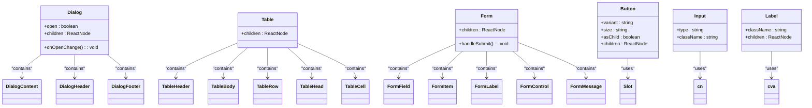

# Component Architecture

<cite>
**Referenced Files in This Document**   
- [sidebar.tsx](file://components/shared/sidebar.tsx)
- [branch-selector.tsx](file://components/shared/branch-selector.tsx)
- [pos-cart.tsx](file://components/pos/pos-cart.tsx)
- [pos-product-grid.tsx](file://components/pos/pos-product-grid.tsx)
- [pos-payment.tsx](file://components/pos/pos-payment.tsx)
- [product-table.tsx](file://components/products/product-table.tsx)
- [product-dialog.tsx](file://components/products/product-dialog.tsx)
- [dialog.tsx](file://components/ui/dialog.tsx)
- [table.tsx](file://components/ui/table.tsx)
- [form.tsx](file://components/ui/form.tsx)
- [button.tsx](file://components/ui/button.tsx)
- [input.tsx](file://components/ui/input.tsx)
- [label.tsx](file://components/ui/label.tsx)
- [page-header.tsx](file://components/shared/page-header.tsx)
- [empty-state.tsx](file://components/shared/empty-state.tsx)
- [loading-skeleton.tsx](file://components/shared/loading-skeleton.tsx)
</cite>

## Table of Contents
1. [Introduction](#introduction)
2. [Project Structure](#project-structure)
3. [Core Components](#core-components)
4. [Architecture Overview](#architecture-overview)
5. [Detailed Component Analysis](#detailed-component-analysis)
6. [Dependency Analysis](#dependency-analysis)
7. [Performance Considerations](#performance-considerations)
8. [Troubleshooting Guide](#troubleshooting-guide)
9. [Conclusion](#conclusion)

## Introduction
This document provides a comprehensive overview of the frontend component architecture for the InventoryPro system. It details the hierarchical organization of components by domain, shared utilities, and the composition patterns used throughout the application. The architecture leverages the shadcn/ui library for consistent UI primitives and implements reusable patterns for dialog forms, data tables, and form controls. Special attention is given to accessibility, responsive design, and theming consistency through Tailwind CSS.

## Project Structure
The project follows a domain-driven structure with components organized by functional areas such as products, inventory, POS, and shared utilities. The component hierarchy is designed to promote reusability and maintainability, with primitive UI components in the `components/ui` directory serving as building blocks for higher-level domain-specific components.

**Diagram sources**
- [components/ui](file://components/ui)
- [components/shared](file://components/shared)
- [components/pos](file://components/pos)
- [components/products](file://components/products)

**Section sources**
- [components](file://components)

## Core Components
The frontend architecture is built around reusable, composable components that follow a consistent design system. Domain-specific components are constructed using primitive UI elements from the shadcn/ui library, ensuring visual and behavioral consistency across the application. Shared components like Sidebar and BranchSelector provide application-wide UI patterns, while domain components implement specific business functionality.

**Section sources**
- [components/shared/sidebar.tsx](file://components/shared/sidebar.tsx)
- [components/shared/branch-selector.tsx](file://components/shared/branch-selector.tsx)
- [components/pos/pos-cart.tsx](file://components/pos/pos-cart.tsx)

## Architecture Overview
The component architecture follows a layered approach with clear separation of concerns. At the foundation are primitive UI components from shadcn/ui, which are composed into shared application components. These shared components are then used to build domain-specific interfaces for products, inventory, POS, and other modules. The architecture supports responsive design, accessibility, and theming through Tailwind CSS.

**Diagram sources**
- [components/ui](file://components/ui)
- [components/shared](file://components/shared)
- [components/pos](file://components/pos)
- [components/products](file://components/products)

## Detailed Component Analysis

### Shared Components Analysis
Shared components provide consistent UI patterns across the application. The Sidebar component implements navigation with active state highlighting, while the BranchSelector enables branch context switching with loading states and empty states.

#### For Object-Oriented Components:

**Diagram sources**
- [components/shared/sidebar.tsx](file://components/shared/sidebar.tsx#L27-L41)
- [components/shared/branch-selector.tsx](file://components/shared/branch-selector.tsx#L14-L35)
- [components/shared/page-header.tsx](file://components/shared/page-header.tsx#L12-L53)
- [components/shared/empty-state.tsx](file://components/shared/empty-state.tsx#L12-L31)
- [components/shared/loading-skeleton.tsx](file://components/shared/loading-skeleton.tsx#L4-L68)

**Section sources**
- [components/shared/sidebar.tsx](file://components/shared/sidebar.tsx)
- [components/shared/branch-selector.tsx](file://components/shared/branch-selector.tsx)
- [components/shared/page-header.tsx](file://components/shared/page-header.tsx)

### Domain Components Analysis
Domain-specific components are built using primitive UI components and shared utilities. Components like pos-cart, product-table, and product-dialog implement business-specific functionality while maintaining design consistency.

#### For Object-Oriented Components:

**Diagram sources**
- [components/pos/pos-cart.tsx](file://components/pos/pos-cart.tsx#L17-L23)
- [components/pos/pos-product-grid.tsx](file://components/pos/pos-product-grid.tsx#L21-L24)
- [components/pos/pos-payment.tsx](file://components/pos/pos-payment.tsx#L14-L21)
- [components/products/product-table.tsx](file://components/products/product-table.tsx#L20-L24)
- [components/products/product-dialog.tsx](file://components/products/product-dialog.tsx#L39-L44)

**Section sources**
- [components/pos/pos-cart.tsx](file://components/pos/pos-cart.tsx)
- [components/pos/pos-product-grid.tsx](file://components/pos/pos-product-grid.tsx)
- [components/pos/pos-payment.tsx](file://components/pos/pos-payment.tsx)
- [components/products/product-table.tsx](file://components/products/product-table.tsx)
- [components/products/product-dialog.tsx](file://components/products/product-dialog.tsx)

### UI Primitive Components Analysis
Primitive UI components from the shadcn/ui library form the foundation of the component architecture. These components are designed to be accessible, responsive, and themeable, providing a consistent base for higher-level components.

#### For Object-Oriented Components:

**Diagram sources**
- [components/ui/dialog.tsx](file://components/ui/dialog.tsx#L8-L121)
- [components/ui/table.tsx](file://components/ui/table.tsx#L5-L117)
- [components/ui/form.tsx](file://components/ui/form.tsx#L18-L178)
- [components/ui/button.tsx](file://components/ui/button.tsx#L43-L57)
- [components/ui/input.tsx](file://components/ui/input.tsx#L5-L22)
- [components/ui/label.tsx](file://components/ui/label.tsx#L13-L26)

**Section sources**
- [components/ui/dialog.tsx](file://components/ui/dialog.tsx)
- [components/ui/table.tsx](file://components/ui/table.tsx)
- [components/ui/form.tsx](file://components/ui/form.tsx)
- [components/ui/button.tsx](file://components/ui/button.tsx)
- [components/ui/input.tsx](file://components/ui/input.tsx)
- [components/ui/label.tsx](file://components/ui/label.tsx)

### Component Composition Example
The POS system demonstrates how multiple components are composed to create a cohesive interface. The POS page combines pos-cart, pos-product-grid, and pos-payment components into a unified point-of-sale experience.

#### For API/Service Components:

**Diagram sources**
- [components/pos/pos-cart.tsx](file://components/pos/pos-cart.tsx#L17-L23)
- [components/pos/pos-product-grid.tsx](file://components/pos/pos-product-grid.tsx#L21-L24)
- [components/pos/pos-payment.tsx](file://components/pos/pos-payment.tsx#L14-L21)
- [app/(dashboard)/pos/page.tsx](file://app/(dashboard)/pos/page.tsx)

**Section sources**
- [components/pos/pos-cart.tsx](file://components/pos/pos-cart.tsx)
- [components/pos/pos-product-grid.tsx](file://components/pos/pos-product-grid.tsx)
- [components/pos/pos-payment.tsx](file://components/pos/pos-payment.tsx)

## Dependency Analysis
The component architecture demonstrates a clear dependency hierarchy with primitive components having no dependencies, shared components depending on primitives, and domain components depending on both primitives and shared components.

**Diagram sources**
- [components/ui](file://components/ui)
- [components/shared](file://components/shared)
- [components/pos](file://components/pos)
- [components/products](file://components/products)

**Section sources**
- [components](file://components)

## Performance Considerations
The component architecture incorporates several performance optimizations:
- Skeleton loaders provide immediate feedback during data loading
- Empty states guide users when no data is available
- Memoization and efficient state management minimize re-renders
- Lazy loading of components and data
- Efficient event handling and DOM updates

The architecture follows the design system requirements for loading states, empty states, and responsive breakpoints, ensuring a smooth user experience across different devices and network conditions.

## Troubleshooting Guide
When troubleshooting component issues, consider the following common patterns:

1. **Loading States**: Ensure skeleton loaders are used during data fetching
2. **Empty States**: Verify empty state components are displayed when appropriate
3. **Form Validation**: Check that form validation messages are properly displayed
4. **Accessibility**: Validate that all interactive elements have proper ARIA attributes
5. **Responsive Design**: Test components at different breakpoints (640px, 768px, 1024px, 1280px)
6. **Theming**: Ensure components respect the application's theme settings

Common issues often relate to state management, event handling, or data flow between components. The use of consistent patterns and reusable components helps minimize these issues.

**Section sources**
- [components/shared/loading-skeleton.tsx](file://components/shared/loading-skeleton.tsx)
- [components/shared/empty-state.tsx](file://components/shared/empty-state.tsx)
- [components/ui/form.tsx](file://components/ui/form.tsx)
- [components/shared/sidebar.tsx](file://components/shared/sidebar.tsx)

## Conclusion
The frontend component architecture for InventoryPro demonstrates a well-structured, maintainable approach to building a complex web application. By leveraging the shadcn/ui library for primitive components and implementing a clear hierarchy of shared and domain-specific components, the architecture ensures consistency, reusability, and scalability. The composition patterns enable the creation of complex interfaces like the POS system while maintaining code quality and developer productivity. The focus on accessibility, responsive design, and theming through Tailwind CSS ensures a high-quality user experience across different devices and user needs.