# Frontend Architecture

<cite>
**Referenced Files in This Document**   
- [app/layout.tsx](file://app/layout.tsx)
- [app/(dashboard)/layout.tsx](file://app/(dashboard)/layout.tsx)
- [contexts/branch-context.tsx](file://contexts/branch-context.tsx)
- [hooks/use-branch.ts](file://hooks/use-branch.ts)
- [components/shared/sidebar.tsx](file://components/shared/sidebar.tsx)
- [components/shared/branch-selector.tsx](file://components/shared/branch-selector.tsx)
- [components/pos/pos-cart.tsx](file://components/pos/pos-cart.tsx)
- [components/pos/pos-payment.tsx](file://components/pos/pos-payment.tsx)
- [components/pos/pos-product-grid.tsx](file://components/pos/pos-product-grid.tsx)
- [components/pos/pos-receipt.tsx](file://components/pos/pos-receipt.tsx)
- [components/ui/button.tsx](file://components/ui/button.tsx)
</cite>

## Table of Contents
1. [Introduction](#introduction)
2. [Project Structure](#project-structure)
3. [Core Components](#core-components)
4. [Architecture Overview](#architecture-overview)
5. [Detailed Component Analysis](#detailed-component-analysis)
6. [Dependency Analysis](#dependency-analysis)
7. [Performance Considerations](#performance-considerations)
8. [Troubleshooting Guide](#troubleshooting-guide)
9. [Conclusion](#conclusion)

## Introduction
This document provides a comprehensive overview of the frontend architecture for an inventory management and POS system built with Next.js App Router and React Server Components. The architecture leverages modern React patterns including React Context for global state management, custom hooks for data fetching, and a component-based design using shadcn/ui primitives. The system is organized around a dashboard layout with authenticated navigation and global providers, supporting multiple business modules including inventory, POS, sales, and procurement.

## Project Structure
The application follows a feature-based organization within the Next.js App Router structure. Key directories include:
- `app/`: Contains route definitions and layout components using the App Router
- `components/`: Houses reusable UI components organized by feature and shared utilities
- `contexts/`: Global state management using React Context
- `hooks/`: Custom hooks for data fetching and state synchronization
- `types/`: TypeScript type definitions for domain entities
- `services/`: Business logic and API service layer
- `repositories/`: Data access layer interfacing with the database

The routing structure uses Next.js App Router with a `(dashboard)` route group for authenticated views, and API routes under `app/api` for server-side endpoints.

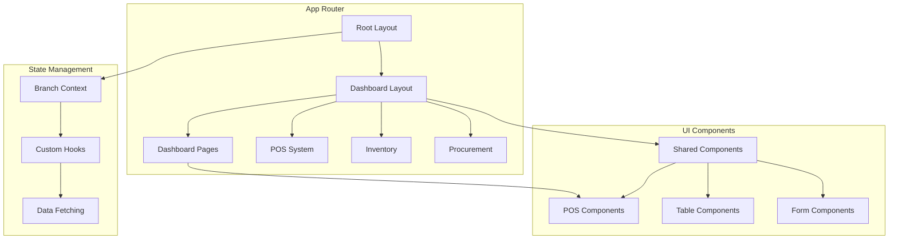

**Diagram sources**
- [app/layout.tsx](file://app/layout.tsx)
- [app/(dashboard)/layout.tsx](file://app/(dashboard)/layout.tsx)
- [components/shared/sidebar.tsx](file://components/shared/sidebar.tsx)

**Section sources**
- [app/layout.tsx](file://app/layout.tsx)
- [app/(dashboard)/layout.tsx](file://app/(dashboard)/layout.tsx)

## Core Components
The frontend architecture is built around several core components that provide the foundation for the application's functionality. The root layout provides global providers and styling, while the dashboard layout handles authenticated navigation and branch selection. Shared components like sidebar, dialogs, and tables are reused across modules, and the POS system integrates multiple components to provide a complete point-of-sale experience.

**Section sources**
- [app/layout.tsx](file://app/layout.tsx)
- [app/(dashboard)/layout.tsx](file://app/(dashboard)/layout.tsx)
- [contexts/branch-context.tsx](file://contexts/branch-context.tsx)

## Architecture Overview
The application architecture is based on Next.js App Router with React Server Components, leveraging server-side rendering for improved performance and SEO. The root layout provides global providers including the BranchProvider and toast notification system, while the dashboard layout handles authenticated navigation with a persistent sidebar and branch selector.

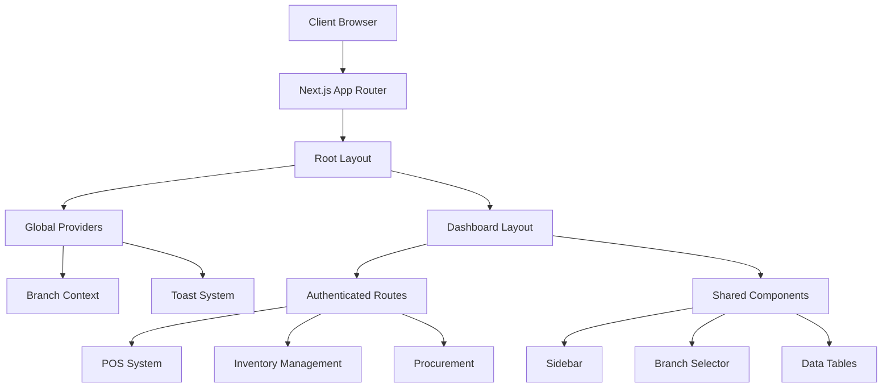

**Diagram sources**
- [app/layout.tsx](file://app/layout.tsx)
- [app/(dashboard)/layout.tsx](file://app/(dashboard)/layout.tsx)
- [contexts/branch-context.tsx](file://contexts/branch-context.tsx)

## Detailed Component Analysis

### Layout Structure
The application uses a hierarchical layout structure with two main layout components. The root layout provides global providers and styling, while the dashboard layout handles authenticated navigation and branch selection.

#### Root Layout Analysis
The root layout in `app/layout.tsx` serves as the entry point for the application, providing global providers and styling. It wraps all pages with the BranchProvider to manage global branch selection state, and includes the toast notification system for user feedback.

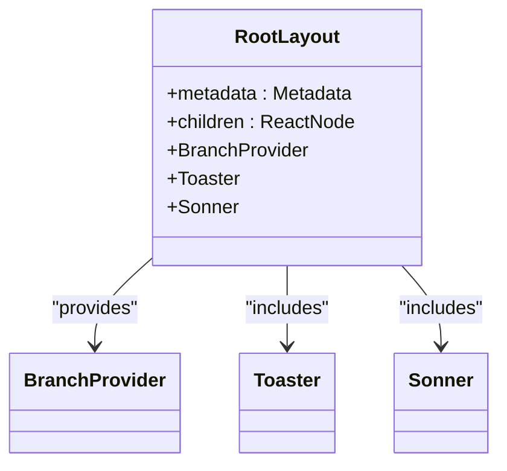

**Diagram sources**
- [app/layout.tsx](file://app/layout.tsx)

#### Dashboard Layout Analysis
The dashboard layout in `app/(dashboard)/layout.tsx` provides authenticated navigation with a persistent sidebar and branch selector. It handles the main content area with responsive padding and includes the header with branch selection.

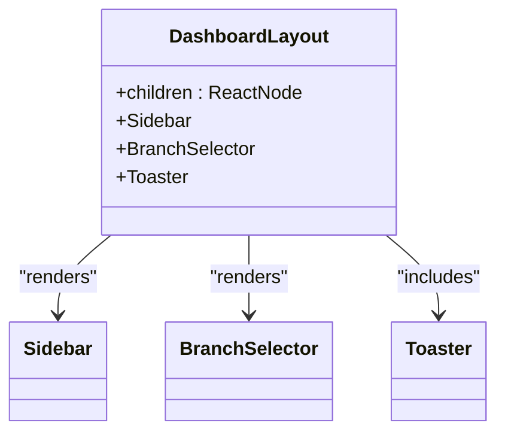

**Diagram sources**
- [app/(dashboard)/layout.tsx](file://app/(dashboard)/layout.tsx)
- [components/shared/sidebar.tsx](file://components/shared/sidebar.tsx)
- [components/shared/branch-selector.tsx](file://components/shared/branch-selector.tsx)

### State Management
The application uses React Context for global state management, with a focus on branch selection across the system. Custom hooks provide a clean API for accessing and updating state.

#### Branch Context Analysis
The BranchContext in `contexts/branch-context.tsx` manages global branch selection state, loading available branches from the API and persisting the selected branch to localStorage. It provides a context provider and hook for consuming components.

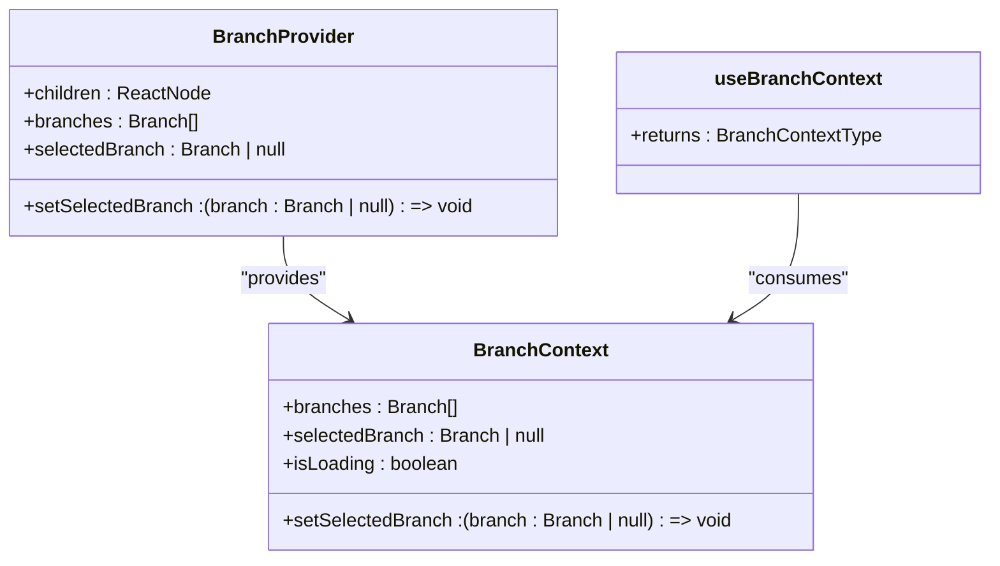

**Diagram sources**
- [contexts/branch-context.tsx](file://contexts/branch-context.tsx)

#### Custom Hooks Analysis
Custom hooks like `use-branch.ts` provide a clean API for accessing branch context state. These hooks abstract the context consumption pattern and can be extended with additional logic as needed.

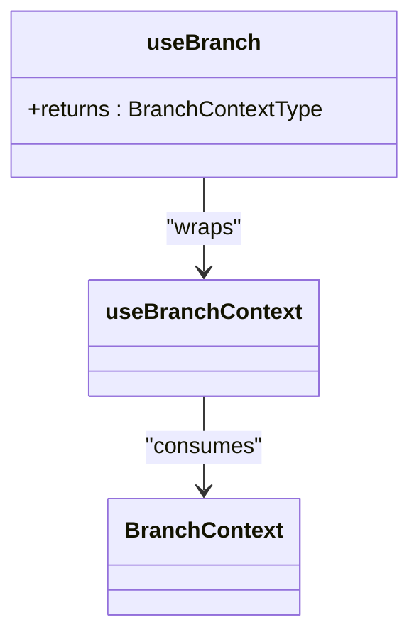

**Diagram sources**
- [hooks/use-branch.ts](file://hooks/use-branch.ts)
- [contexts/branch-context.tsx](file://contexts/branch-context.tsx)

### UI Component Architecture
The UI architecture is built on shadcn/ui primitives with module-specific components in the components directory. Shared components are reused across modules, while feature-specific components provide tailored functionality.

#### Shared Components Analysis
Shared components in `components/shared/` provide reusable UI elements like sidebar, branch selector, and empty states. These components are designed to be used across multiple modules.

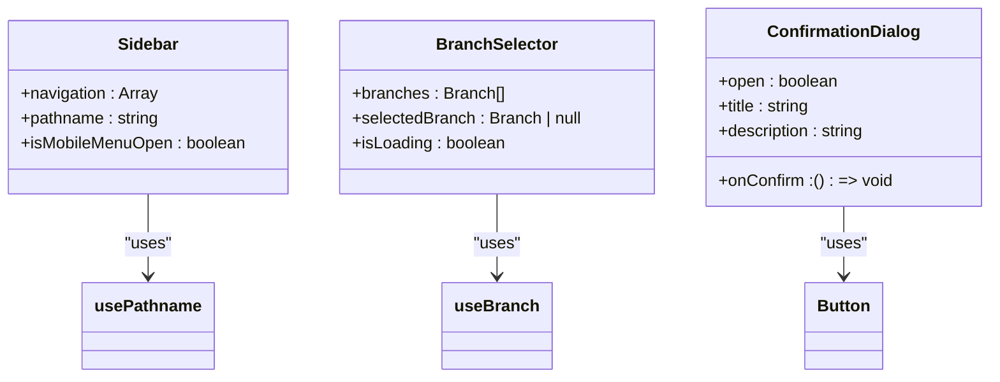

**Diagram sources**
- [components/shared/sidebar.tsx](file://components/shared/sidebar.tsx)
- [components/shared/branch-selector.tsx](file://components/shared/branch-selector.tsx)
- [components/shared/confirmation-dialog.tsx](file://components/shared/confirmation-dialog.tsx)

#### POS System Analysis
The POS system integrates multiple components to provide a complete point-of-sale experience. The main components include pos-cart, pos-payment, and pos-product-grid, which work together to manage the sales process.

##### POS Cart Component
The pos-cart component manages the shopping cart interface, displaying items, quantities, and totals. It provides controls for updating quantities and removing items.

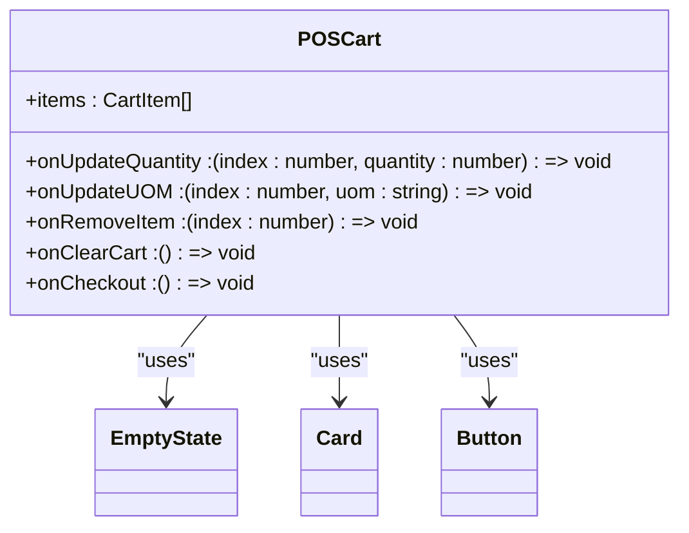

**Diagram sources**
- [components/pos/pos-cart.tsx](file://components/pos/pos-cart.tsx)

##### POS Payment Component
The pos-payment component handles the payment process, allowing selection of payment methods and processing of transactions. It validates cash payments and submits sales data to the API.

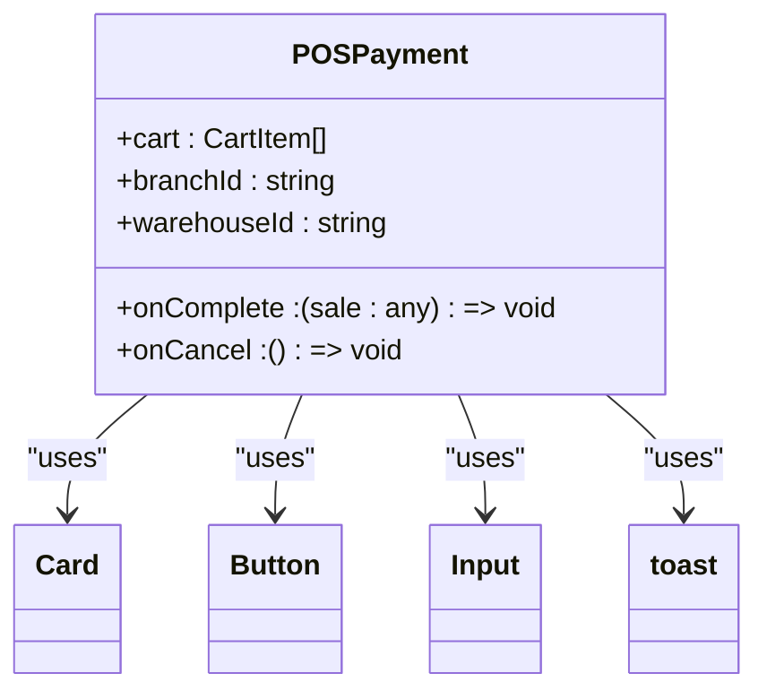

**Diagram sources**
- [components/pos/pos-payment.tsx](file://components/pos/pos-payment.tsx)

##### POS Product Grid Component
The pos-product-grid component displays available products in a grid format, allowing search and filtering. It handles adding products to the cart and displays stock information.

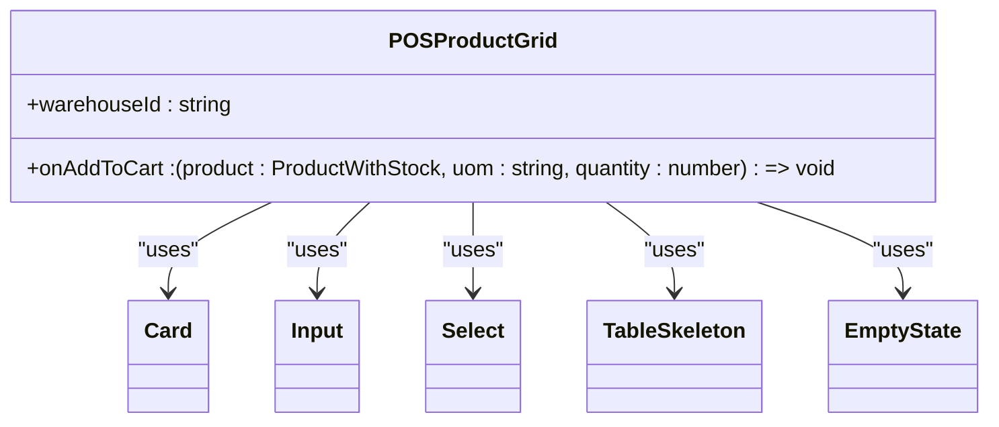

**Diagram sources**
- [components/pos/pos-product-grid.tsx](file://components/pos/pos-product-grid.tsx)

##### POS Receipt Component
The pos-receipt component displays a printable receipt after a sale is completed. It formats the receipt for printing and provides a print button.

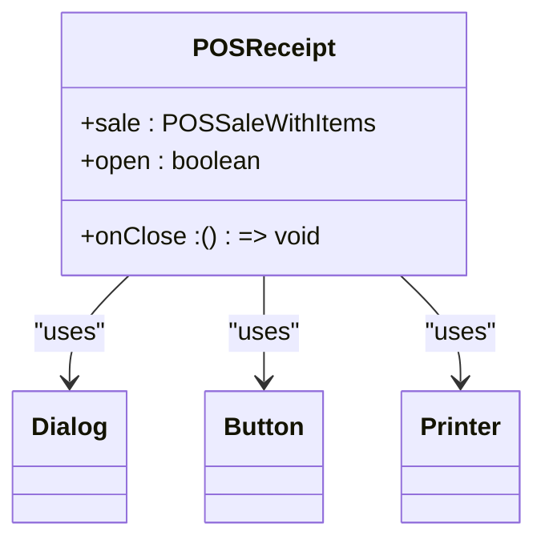

**Diagram sources**
- [components/pos/pos-receipt.tsx](file://components/pos/pos-receipt.tsx)

**Section sources**
- [components/pos/pos-cart.tsx](file://components/pos/pos-cart.tsx)
- [components/pos/pos-payment.tsx](file://components/pos/pos-payment.tsx)
- [components/pos/pos-product-grid.tsx](file://components/pos/pos-product-grid.tsx)
- [components/pos/pos-receipt.tsx](file://components/pos/pos-receipt.tsx)

## Dependency Analysis
The application has a well-defined dependency structure with clear separation of concerns. The root layout provides global providers that are consumed by all pages, while the dashboard layout provides navigation and branch selection for authenticated routes.

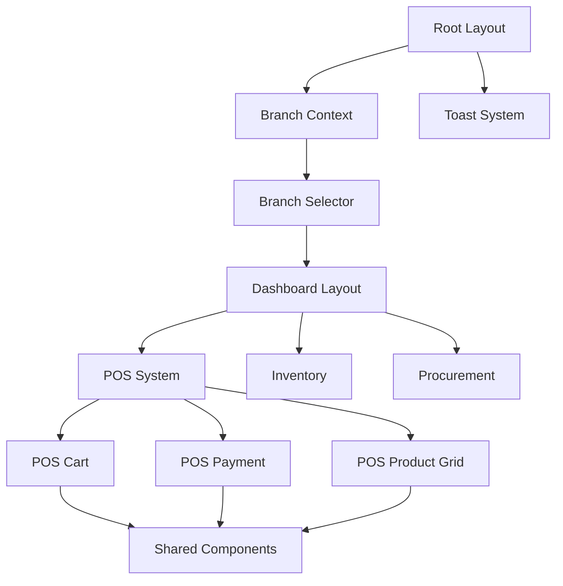

**Diagram sources**
- [app/layout.tsx](file://app/layout.tsx)
- [app/(dashboard)/layout.tsx](file://app/(dashboard)/layout.tsx)
- [contexts/branch-context.tsx](file://contexts/branch-context.tsx)
- [components/pos/pos-cart.tsx](file://components/pos/pos-cart.tsx)
- [components/pos/pos-payment.tsx](file://components/pos/pos-payment.tsx)
- [components/pos/pos-product-grid.tsx](file://components/pos/pos-product-grid.tsx)

**Section sources**
- [app/layout.tsx](file://app/layout.tsx)
- [app/(dashboard)/layout.tsx](file://app/(dashboard)/layout.tsx)
- [contexts/branch-context.tsx](file://contexts/branch-context.tsx)

## Performance Considerations
The application leverages Next.js App Router and React Server Components to optimize performance through server-side rendering. Data fetching is performed on the server where possible, reducing client-side JavaScript bundle size and improving initial load times. The use of React Context for global state management minimizes unnecessary re-renders through proper state scoping. Component-level loading states and skeletons provide feedback during data fetching operations.

## Troubleshooting Guide
When encountering issues with the frontend architecture, consider the following common problems and solutions:
- **Branch selection not persisting**: Verify localStorage is working and the STORAGE_KEY in branch-context.tsx matches across instances
- **POS components not updating**: Check that the cart state is being properly updated and passed between components
- **Layout rendering issues**: Ensure the Next.js App Router structure is correct and layout components are properly nested
- **Data fetching errors**: Verify API routes are correctly implemented and CORS settings are configured

**Section sources**
- [contexts/branch-context.tsx](file://contexts/branch-context.tsx)
- [components/pos/pos-cart.tsx](file://components/pos/pos-cart.tsx)
- [app/layout.tsx](file://app/layout.tsx)
- [app/(dashboard)/layout.tsx](file://app/(dashboard)/layout.tsx)

## Conclusion
The frontend architecture effectively leverages Next.js App Router and React Server Components to create a performant and maintainable application. The use of React Context for global state management, custom hooks for data fetching, and a component-based design with shadcn/ui primitives provides a solid foundation for the inventory management and POS system. The hierarchical layout structure with root and dashboard layouts enables consistent global providers and authenticated navigation, while shared components promote reusability across modules.