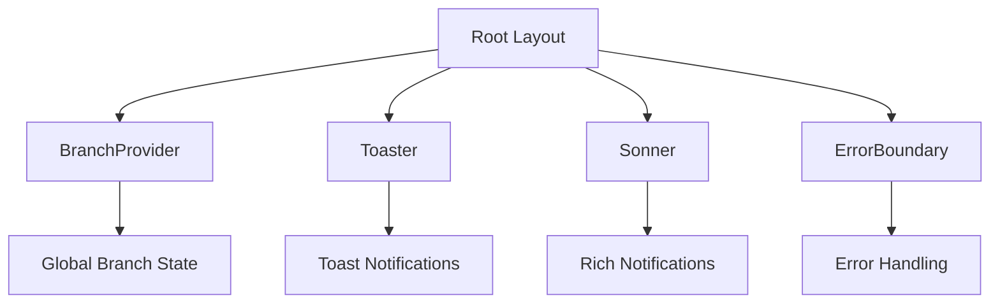
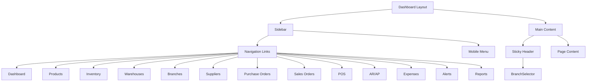
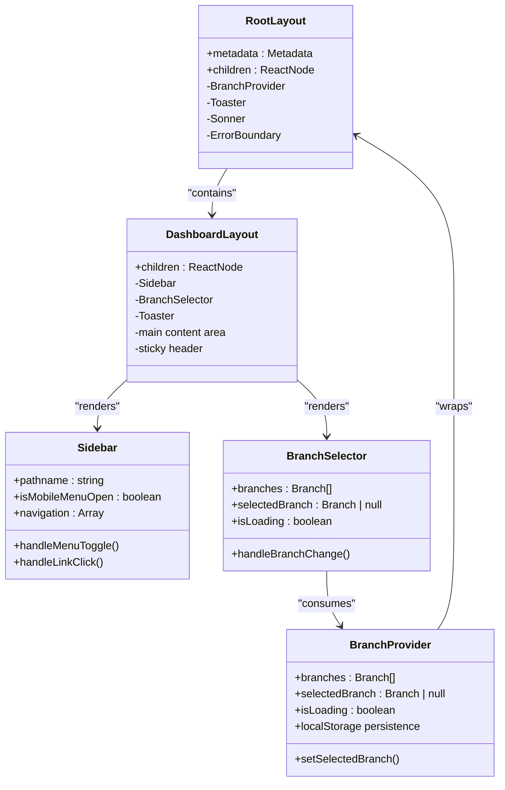
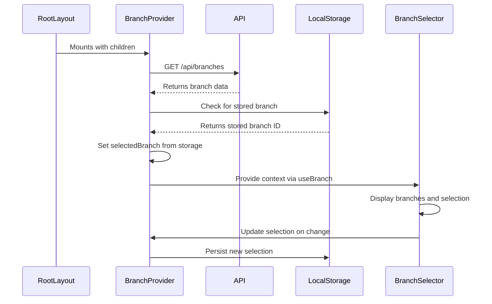
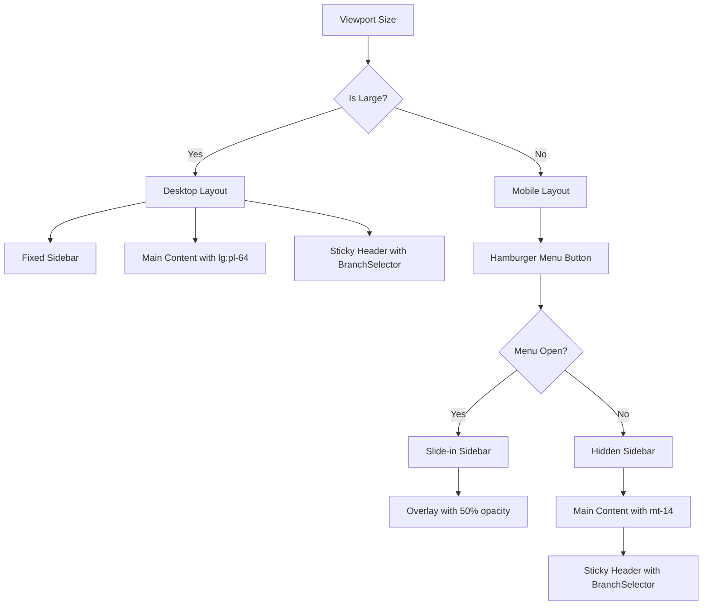
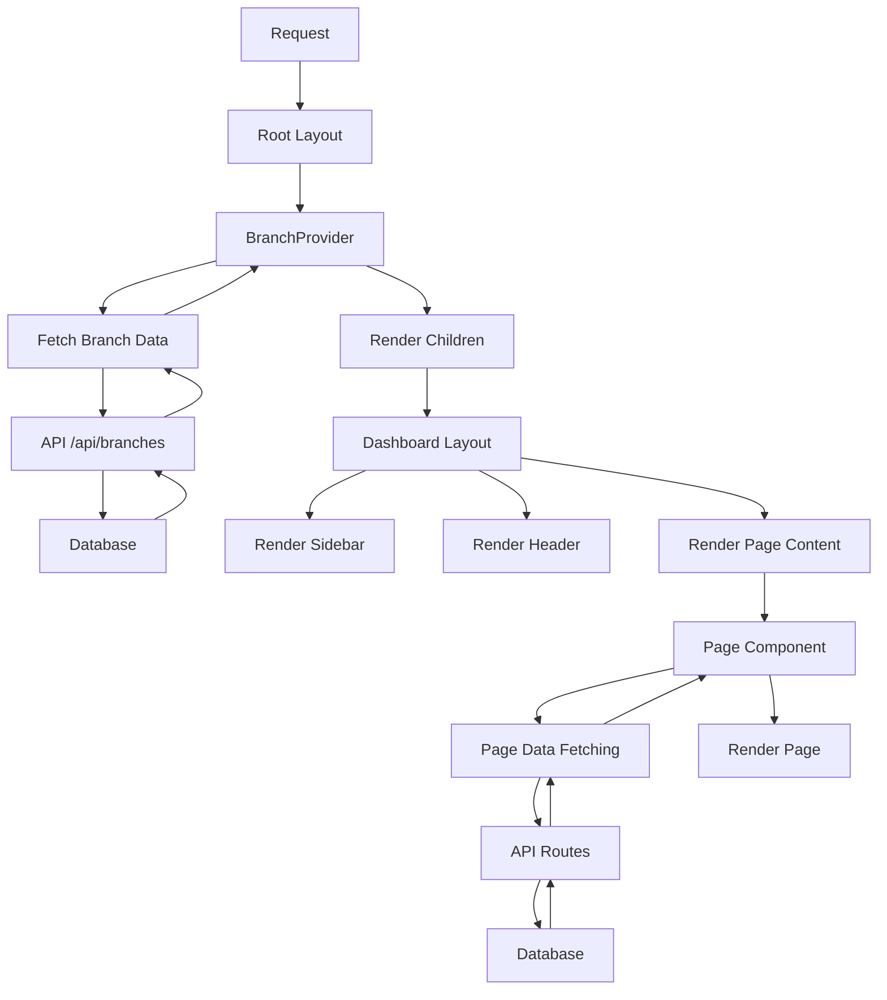

# Layout Structure

<cite>
**Referenced Files in This Document**   
- [app/layout.tsx](file://app/layout.tsx)
- [app/(dashboard)/layout.tsx](file://app/(dashboard)/layout.tsx)
- [components/shared/sidebar.tsx](file://components/shared/sidebar.tsx)
- [components/shared/branch-selector.tsx](file://components/shared/branch-selector.tsx)
- [contexts/branch-context.tsx](file://contexts/branch-context.tsx)
- [components/ui/toaster.tsx](file://components/ui/toaster.tsx)
- [hooks/use-branch.ts](file://hooks/use-branch.ts)
</cite>

## Table of Contents
1. [Introduction](#introduction)
2. [Root Layout Structure](#root-layout-structure)
3. [Dashboard Layout Structure](#dashboard-layout-structure)
4. [Component Hierarchy](#component-hierarchy)
5. [State Management](#state-management)
6. [Responsive Design](#responsive-design)
7. [Rendering Flow](#rendering-flow)
8. [Conclusion](#conclusion)

## Introduction
The InventoryPro application implements a multi-layered layout structure using Next.js App Router conventions. The system features a root layout that provides global context providers and notification services, and a dashboard-specific layout that implements authenticated user interface scaffolding with navigation components. This documentation details the architectural implementation of these layouts, focusing on component hierarchy, state management, responsive design patterns, and rendering flow.

## Root Layout Structure

The root layout (`app/layout.tsx`) serves as the foundation for the entire application, providing global providers and consistent UI elements across all routes. It wraps the application with essential context providers that manage global state and user notifications.

The layout implements a server component that wraps all client components with the `BranchProvider` context, which manages branch selection state across the application. This provider loads branch data from the API and persists the selected branch to localStorage for session continuity. Additionally, the layout includes the `Toaster` component from shadcn/ui to display toast notifications throughout the application.

The root layout also incorporates error boundary handling to gracefully manage component-level errors and ensure application stability. The structure follows Next.js conventions by defining metadata for SEO and social sharing, and uses the Inter font for consistent typography.

**Diagram sources**
- [app/layout.tsx](file://app/layout.tsx#L1-L35)
- [contexts/branch-context.tsx](file://contexts/branch-context.tsx#L26-L81)
- [components/ui/toaster.tsx](file://components/ui/toaster.tsx#L13-L34)

**Section sources**
- [app/layout.tsx](file://app/layout.tsx#L1-L35)
- [contexts/branch-context.tsx](file://contexts/branch-context.tsx#L1-L91)

## Dashboard Layout Structure

The dashboard layout (`app/(dashboard)/layout.tsx`) implements the authenticated user interface scaffolding, providing navigation and header components for all dashboard routes. This layout is specifically designed for the authenticated dashboard experience and is wrapped by the root layout.

The layout features a two-column structure with a fixed sidebar navigation on the left and a main content area on the right. The sidebar is implemented as a client component that maintains its own state for mobile menu visibility and active route highlighting. The main content area uses Tailwind CSS classes to create proper spacing, with `lg:pl-64` ensuring content does not overlap with the 64px wide sidebar on large screens.

A sticky header is implemented at the top of the main content area, positioned with `sticky top-0 z-30` to ensure it remains visible during scrolling. This header contains the `BranchSelector` component, allowing users to switch between branches without navigating away from their current page. The header is offset with `mt-14` on mobile views to account for the mobile navigation bar, while using `mt-0` on desktop views.

**Diagram sources**
- [app/(dashboard)/layout.tsx](file://app/(dashboard)/layout.tsx#L1-L40)
- [components/shared/sidebar.tsx](file://components/shared/sidebar.tsx#L42-L136)
- [components/shared/branch-selector.tsx](file://components/shared/branch-selector.tsx#L13-L86)

**Section sources**
- [app/(dashboard)/layout.tsx](file://app/(dashboard)/layout.tsx#L1-L40)
- [components/shared/sidebar.tsx](file://components/shared/sidebar.tsx#L1-L138)
- [components/shared/branch-selector.tsx](file://components/shared/branch-selector.tsx#L1-L88)

## Component Hierarchy

The layout structure implements a clear component hierarchy that separates concerns and promotes reusability. The root layout serves as the outermost container, followed by the dashboard layout for authenticated routes, and then individual page components.

The `Sidebar` component is a client component that manages navigation state and provides responsive behavior for both desktop and mobile views. On desktop, it appears as a fixed left sidebar, while on mobile it transforms into a collapsible hamburger menu with an overlay. The component uses Next.js navigation hooks to highlight the active route and provides smooth transitions for mobile menu interactions.

The `BranchSelector` component is integrated into the dashboard header and provides a dropdown interface for branch selection. It consumes the `BranchContext` through the `useBranch` hook and displays loading states when branch data is being fetched. The component handles both individual branch selection and the "All Branches" option, persisting the selection to localStorage through the context provider.

**Diagram sources**
- [app/layout.tsx](file://app/layout.tsx#L16-L34)
- [app/(dashboard)/layout.tsx](file://app/(dashboard)/layout.tsx#L5-L39)
- [components/shared/sidebar.tsx](file://components/shared/sidebar.tsx#L43-L136)
- [components/shared/branch-selector.tsx](file://components/shared/branch-selector.tsx#L14-L86)
- [contexts/branch-context.tsx](file://contexts/branch-context.tsx#L26-L81)

**Section sources**
- [components/shared/sidebar.tsx](file://components/shared/sidebar.tsx#L1-L138)
- [components/shared/branch-selector.tsx](file://components/shared/branch-selector.tsx#L1-L88)
- [contexts/branch-context.tsx](file://contexts/branch-context.tsx#L1-L91)

## State Management

The layout structure implements a robust state management system using React Context for global state and localStorage for persistence. The `BranchProvider` context serves as the single source of truth for branch-related state across the application.

The context provider manages several key pieces of state: the list of available branches, the currently selected branch, and a loading state indicator. Branch data is loaded from the API endpoint `/api/branches` when the provider mounts, ensuring fresh data is available throughout the application lifecycle. The selected branch is persisted to localStorage using the key `inventoryPro_selectedBranch`, allowing users to maintain their branch selection across sessions.

The `useBranch` custom hook provides a type-safe interface for components to access the branch context. This hook abstracts the context consumption pattern and ensures consistent access to branch state throughout the application. Components like `BranchSelector` use this hook to display available branches and update the selection state.

**Diagram sources**
- [contexts/branch-context.tsx](file://contexts/branch-context.tsx#L26-L81)
- [hooks/use-branch.ts](file://hooks/use-branch.ts#L3-L5)
- [components/shared/branch-selector.tsx](file://components/shared/branch-selector.tsx#L15-L86)

**Section sources**
- [contexts/branch-context.tsx](file://contexts/branch-context.tsx#L1-L91)
- [hooks/use-branch.ts](file://hooks/use-branch.ts#L1-L6)

## Responsive Design

The layout structure implements comprehensive responsive design patterns to ensure optimal user experience across device sizes. The system uses Tailwind CSS's responsive prefixes to adapt the interface for mobile, tablet, and desktop viewports.

On desktop viewports (large and above), the sidebar appears as a fixed 64px wide column on the left side of the screen. The main content area uses `lg:pl-64` to create proper left padding, ensuring content does not overlap with the sidebar. The branch selector appears in a sticky header at the top of the main content area.

On mobile viewports, the sidebar transforms into a collapsible hamburger menu. The mobile navigation button appears at the top of the screen with a z-index of 50 to ensure it remains visible above other content. When opened, the sidebar slides in from the left with a smooth transition, and an overlay with 50% black opacity appears to dim the background content.

The branch selector maintains consistent styling across device sizes, with appropriate spacing and touch target sizes. The mobile menu includes a minimum touch target size of 44px for navigation links, ensuring accessibility and ease of use on touch devices.

**Diagram sources**
- [app/(dashboard)/layout.tsx](file://app/(dashboard)/layout.tsx#L11-L37)
- [components/shared/sidebar.tsx](file://components/shared/sidebar.tsx#L49-L87)
- [components/shared/sidebar.tsx](file://components/shared/sidebar.tsx#L80-L87)

**Section sources**
- [components/shared/sidebar.tsx](file://components/shared/sidebar.tsx#L1-L138)
- [app/(dashboard)/layout.tsx](file://app/(dashboard)/layout.tsx#L1-L40)

## Rendering Flow

The layout structure follows Next.js App Router conventions for server and client component rendering. The root layout is a server component that can perform data fetching and metadata definition, while nested layouts and pages can be either server or client components based on their requirements.

Server components are used by default for better performance, with client components explicitly marked using the `'use client'` directive when interactivity is required. The `Sidebar` and `BranchSelector` components are client components due to their state management and event handling requirements.

The rendering flow begins with the root layout, which wraps all content with the `BranchProvider` context. This ensures that branch state is available to all subsequent components. The dashboard layout then renders the sidebar and main content area, with the main content area receiving the page-specific content through the `children` prop.

Data fetching occurs at multiple levels: the `BranchProvider` fetches branch data when it mounts, while individual pages fetch their specific data. This layered approach to data fetching ensures that global data is available application-wide, while page-specific data is loaded only when needed.

**Diagram sources**
- [app/layout.tsx](file://app/layout.tsx#L16-L34)
- [contexts/branch-context.tsx](file://contexts/branch-context.tsx#L32-L58)
- [app/(dashboard)/layout.tsx](file://app/(dashboard)/layout.tsx#L5-L39)

**Section sources**
- [app/layout.tsx](file://app/layout.tsx#L1-L35)
- [contexts/branch-context.tsx](file://contexts/branch-context.tsx#L1-L91)
- [app/(dashboard)/layout.tsx](file://app/(dashboard)/layout.tsx#L1-L40)

## Conclusion
The InventoryPro application implements a sophisticated layout structure that balances global consistency with module-specific requirements. The root layout provides essential context providers and notification services, while the dashboard layout implements a responsive navigation scaffold with persistent UI chrome.

The system demonstrates effective use of Next.js App Router features, including nested layouts, server and client component boundaries, and context providers for global state management. The responsive design patterns ensure optimal user experience across device sizes, with thoughtful consideration for mobile interactions and accessibility.

The component hierarchy promotes reusability and maintainability, with shared components like `Sidebar` and `BranchSelector` providing consistent behavior throughout the application. The state management system using React Context and localStorage persistence ensures that user preferences are maintained across sessions while providing real-time updates to the interface.

This layout foundation provides a solid base for the implementation of additional modules and features, with clear patterns for navigation, state management, and responsive design that can be extended throughout the application.