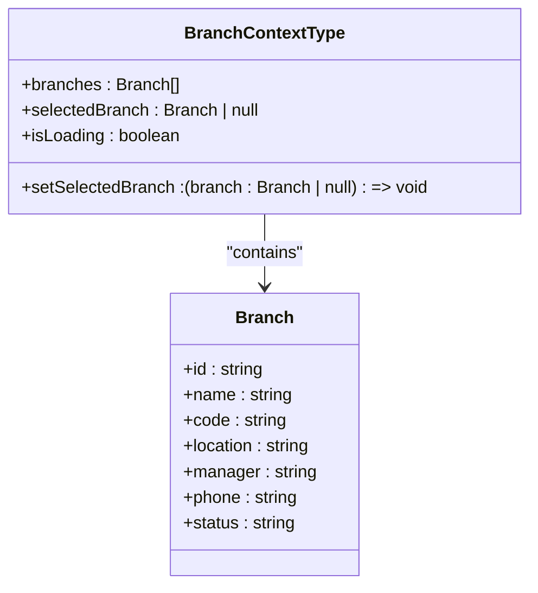
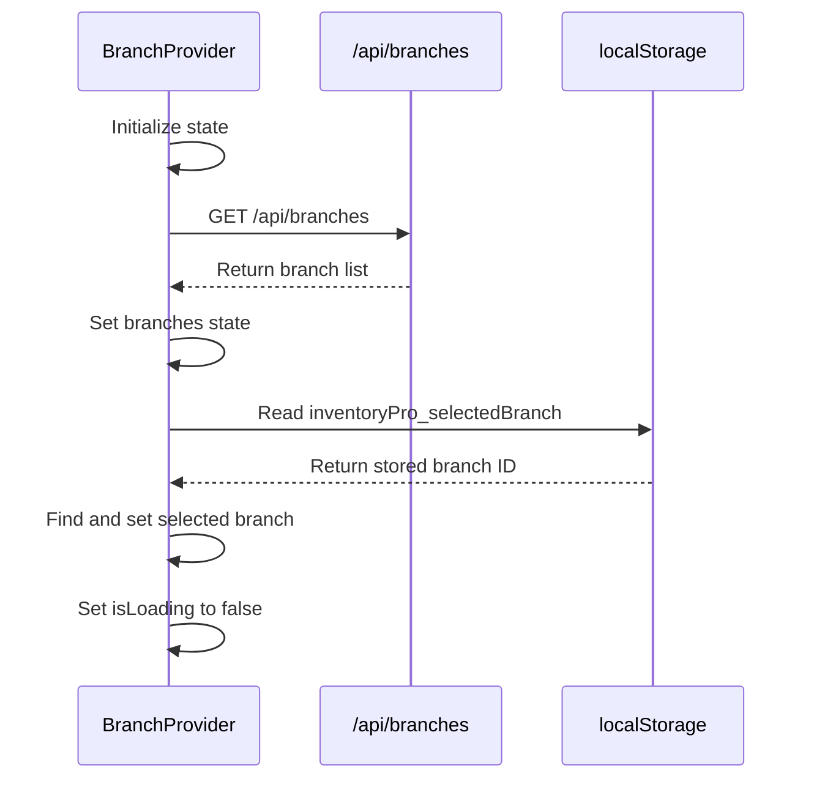
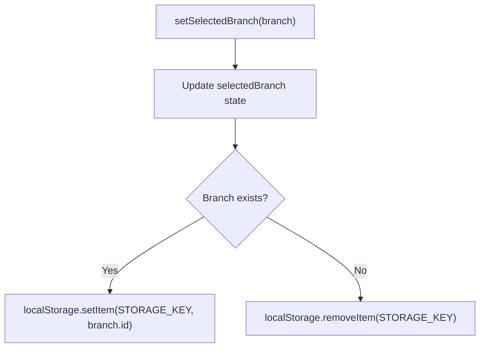
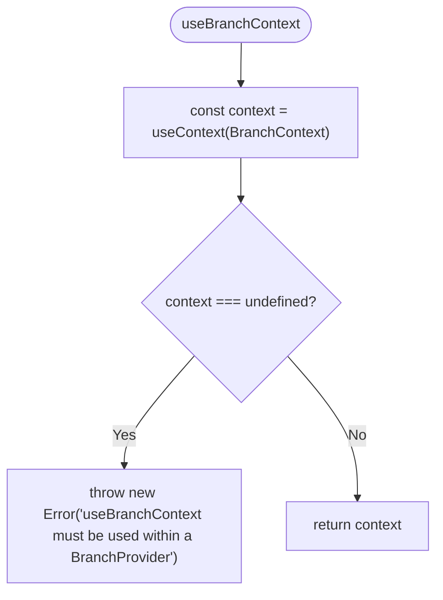
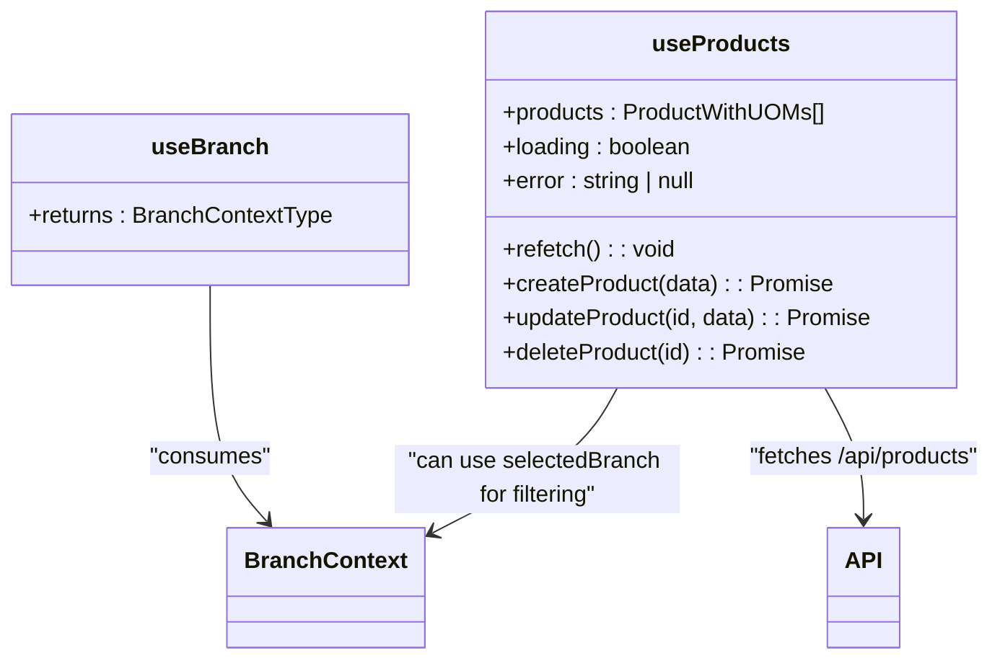
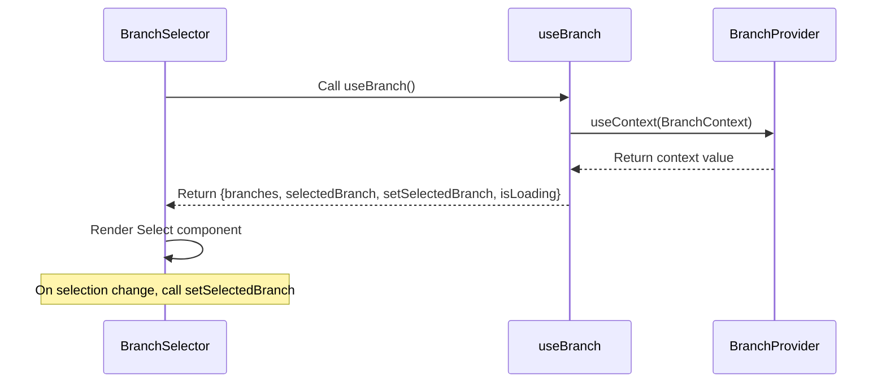

# State Management

<cite>
**Referenced Files in This Document**   
- [branch-context.tsx](file://contexts/branch-context.tsx)
- [use-branch.ts](file://hooks/use-branch.ts)
- [use-products.ts](file://hooks/use-products.ts)
- [branch-selector.tsx](file://components/shared/branch-selector.tsx)
- [layout.tsx](file://app/(dashboard)/layout.tsx)
- [branch.types.ts](file://types/branch.types.ts)
</cite>

## Table of Contents
1. [Introduction](#introduction)
2. [BranchContext Implementation](#branchcontext-implementation)
3. [BranchProvider and Context Initialization](#branchprovider-and-context-initialization)
4. [State Persistence with localStorage](#state-persistence-with-localstorage)
5. [useBranchContext Hook and Error Handling](#usebranchcontext-hook-and-error-handling)
6. [Custom Hooks Integration](#custom-hooks-integration)
7. [BranchSelector Component Usage](#branchselector-component-usage)
8. [Performance Considerations](#performance-considerations)
9. [Common Issues and Solutions](#common-issues-and-solutions)

## Introduction
This document provides a comprehensive overview of the state management system in the InventoryPro application, focusing on React Context and custom hooks. It details the implementation of the `BranchContext`, which manages the selected branch state across the application, persists it using `localStorage`, and integrates with data-fetching logic. The document also covers how custom hooks like `use-branch` and `use-products` abstract state logic and interact with context, ensuring a scalable and maintainable architecture.

## BranchContext Implementation

The `BranchContext` is implemented using React's Context API to provide global access to branch-related state. It defines a `BranchContextType` interface that specifies the structure of the context value, including the list of all branches, the currently selected branch, a setter function, and a loading state.

**Diagram sources**
- [branch-context.tsx](file://contexts/branch-context.tsx#L15-L20)
- [branch.types.ts](file://types/branch.types.ts#L5-L12)

**Section sources**
- [branch-context.tsx](file://contexts/branch-context.tsx#L15-L20)

## BranchProvider and Context Initialization

The `BranchProvider` component initializes the context state and fetches the list of branches from the `/api/branches` endpoint on mount using `useEffect`. It manages three internal states: `branches`, `selectedBranch`, and `isLoading`. Once the branches are loaded, it attempts to restore the previously selected branch from `localStorage`.

**Diagram sources**
- [branch-context.tsx](file://contexts/branch-context.tsx#L26-L58)

**Section sources**
- [branch-context.tsx](file://contexts/branch-context.tsx#L26-L58)

## State Persistence with localStorage

The selected branch is persisted across sessions using `localStorage` via the `STORAGE_KEY` constant (`'inventoryPro_selectedBranch'`). When a user selects a branch, the `setSelectedBranch` function updates both the React state and `localStorage`. If no branch is selected, the key is removed.

**Diagram sources**
- [branch-context.tsx](file://contexts/branch-context.tsx#L60-L67)

**Section sources**
- [branch-context.tsx](file://contexts/branch-context.tsx#L24)
- [branch-context.tsx](file://contexts/branch-context.tsx#L60-L68)

## useBranchContext Hook and Error Handling

The `useBranchContext` hook provides a safe way to consume the `BranchContext`. It uses `useContext` internally and throws a descriptive error if used outside of a `BranchProvider`, preventing runtime issues due to context unavailability.

**Diagram sources**
- [branch-context.tsx](file://contexts/branch-context.tsx#L84-L89)

**Section sources**
- [branch-context.tsx](file://contexts/branch-context.tsx#L84-L89)

## Custom Hooks Integration

Custom hooks like `use-branch` and `use-products` abstract data-fetching and state logic. The `use-branch` hook is a simple wrapper around `useBranchContext`, promoting consistency and reducing import complexity. Other hooks like `use-products` can leverage the selected branch from context to filter or scope data requests.

**Diagram sources**
- [use-branch.ts](file://hooks/use-branch.ts#L3-L5)
- [use-products.ts](file://hooks/use-products.ts#L6-L100)

**Section sources**
- [use-branch.ts](file://hooks/use-branch.ts#L3-L5)
- [use-products.ts](file://hooks/use-products.ts#L6-L100)

## BranchSelector Component Usage

The `BranchSelector` component renders a dropdown UI for selecting a branch and is integrated into the dashboard layout. It uses `useBranch` to access context values and updates the selected branch via `setSelectedBranch`. It handles loading states with a skeleton loader and displays a fallback message if no branches exist.

**Diagram sources**
- [branch-selector.tsx](file://components/shared/branch-selector.tsx#L14-L87)
- [layout.tsx](file://app/(dashboard)/layout.tsx#L2-L40)

**Section sources**
- [branch-selector.tsx](file://components/shared/branch-selector.tsx#L14-L87)
- [layout.tsx](file://app/(dashboard)/layout.tsx#L2-L40)

## Performance Considerations

To minimize unnecessary re-renders:
- The `BranchProvider` only updates when `branches`, `selectedBranch`, or `isLoading` changes.
- The `setSelectedBranch` function is stable (wrapped in `useCallback` implicitly via closure) and does not cause re-renders unless the branch actually changes.
- Components consuming the context should be mindful of deep equality checks, especially when using derived state.
- Consider memoizing expensive computations based on context values using `useMemo`.

**Section sources**
- [branch-context.tsx](file://contexts/branch-context.tsx#L70-L81)

## Common Issues and Solutions

### Context Not Found Error
**Issue**: `useBranchContext must be used within a BranchProvider`  
**Cause**: The hook is called outside the `BranchProvider` component tree.  
**Solution**: Ensure `BranchProvider` wraps the component tree, typically at the root layout level.

### Selected Branch Not Persisting
**Issue**: Branch selection resets on page reload.  
**Cause**: `localStorage` item not being set or cleared incorrectly.  
**Solution**: Verify `STORAGE_KEY` is correct and `localStorage` permissions are enabled.

### Loading State Not Updating
**Issue**: Spinner remains visible indefinitely.  
**Cause**: API fetch fails silently or `setIsLoading(false)` not called.  
**Solution**: Ensure `finally` block in `loadBranches` executes regardless of fetch outcome.

### Branch List Out of Sync
**Issue**: UI shows stale branch data.  
**Solution**: Use `useBranches` hook in admin pages for real-time updates after CRUD operations.

**Section sources**
- [branch-context.tsx](file://contexts/branch-context.tsx#L84-L89)
- [branch-context.tsx](file://contexts/branch-context.tsx#L50-L54)
- [use-branches.ts](file://hooks/use-branches.ts#L5-L89)