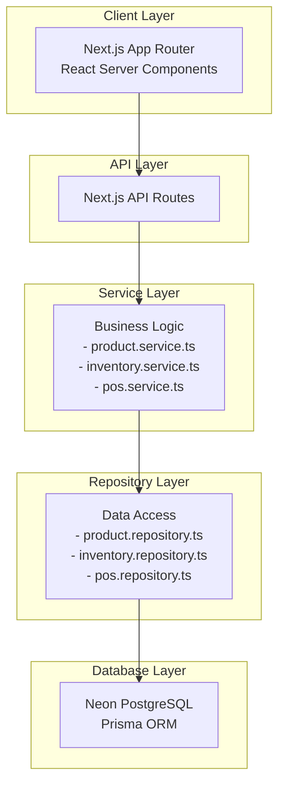
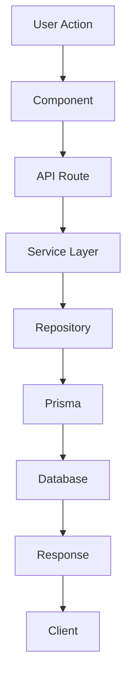

# System Overview

<cite>
**Referenced Files in This Document**   
- [README.md](file://README.md)
- [PROJECT-STATUS-SUMMARY.md](file://PROJECT-STATUS-SUMMARY.md)
- [IMPLEMENTATION-GUIDE.md](file://IMPLEMENTATION-GUIDE.md)
- [design.md](file://specs/inventory-pro-system/design.md)
- [structure.md](file://steer/structure.md)
</cite>

## Table of Contents
1. [Introduction](#introduction)
2. [Application Purpose and Target Industry](#application-purpose-and-target-industry)
3. [Core Value Proposition](#core-value-proposition)
4. [High-Level Architecture](#high-level-architecture)
5. [Primary User Workflows](#primary-user-workflows)
6. [Integration with Financial Modules](#integration-with-financial-modules)
7. [Multi-Branch and Warehouse Capacity Management](#multi-branch-and-warehouse-capacity-management)
8. [Current Development Status](#current-development-status)
9. [Key Business Problems Solved](#key-business-problems-solved)
10. [Architectural Diagrams](#architectural-diagrams)

## Introduction
InventoryPro is a comprehensive inventory management and Point of Sale (POS) system specifically designed for soft drinks wholesale delivery companies in the Philippines. Built on modern web technologies including Next.js 15, React 19, TypeScript, Prisma, and Neon PostgreSQL, the system addresses the complex operational needs of beverage distributors managing multiple branches, warehouses, and product variants.

The application leverages the Next.js App Router architecture with React Server Components to deliver a fast, secure, and scalable solution for inventory tracking, sales processing, and financial management. This document provides a comprehensive overview of the system's purpose, architecture, workflows, and current development status.

**Section sources**
- [README.md](file://README.md#L3-L130)
- [PROJECT-STATUS-SUMMARY.md](file://PROJECT-STATUS-SUMMARY.md#L6-L348)

## Application Purpose and Target Industry
InventoryPro serves soft drink wholesale distributors who face challenges in managing high-volume inventory movements, multiple units of measure (UOM), batch tracking with expiration dates, and multi-location operations. The system is tailored to address the specific needs of Philippine beverage distributors who must manage:

- Complex product hierarchies with various packaging sizes (cases, bottles, crates)
- Temperature-sensitive products requiring batch tracking
- Multiple delivery routes across different branches
- Cash-intensive POS operations with diverse payment methods
- Supplier relationships with varying payment terms

The application supports the complete business lifecycle from procurement through inventory management to point-of-sale transactions and financial reconciliation.

**Section sources**
- [README.md](file://README.md#L3-L130)
- [PROJECT-STATUS-SUMMARY.md](file://PROJECT-STATUS-SUMMARY.md#L6-L348)

## Core Value Proposition
InventoryPro delivers significant value to soft drink wholesale operations through:

- **Accurate Inventory Tracking**: Implements batch tracking with average costing to maintain precise inventory valuation and prevent expired product sales
- **Efficient POS Operations**: Streamlined point-of-sale interface with support for multiple payment methods (Cash, Card, GCash, Online Transfer) and automatic receipt generation
- **Multi-Location Management**: Robust support for multiple branches and warehouses with centralized control and branch-specific reporting
- **Operational Efficiency**: Integrated workflows that connect purchase orders, sales orders, and POS transactions with automatic inventory updates
- **Financial Integration**: Seamless connection between inventory movements and accounts receivable/payable for accurate financial reporting
- **Proactive Alerts**: Automated detection of low stock levels and expiring batches to prevent stockouts and product waste

The system's implementation of UOM conversion and average costing ensures accurate inventory valuation and cost of goods sold calculations, which is critical for profitability analysis in the beverage distribution industry.

**Section sources**
- [README.md](file://README.md#L106-L113)
- [PROJECT-STATUS-SUMMARY.md](file://PROJECT-STATUS-SUMMARY.md#L27-L34)

## High-Level Architecture
InventoryPro follows a clean, layered architecture that separates concerns between presentation, business logic, and data access layers. The system leverages the Next.js App Router with React Server Components to optimize performance and security.

### Frontend Architecture
The frontend is built using Next.js 15 with the App Router pattern, organizing routes as filesystem paths under the `app/` directory. React Server Components are used extensively to:
- Fetch data directly in server components, reducing client-side JavaScript bundle size
- Implement server-side rendering for improved performance and SEO
- Handle sensitive operations securely on the server
- Reduce waterfall requests by co-locating data fetching with component rendering

The UI layer uses shadcn/ui components built on Radix UI and Tailwind CSS, ensuring consistent design patterns and responsive behavior across devices.

### Backend Architecture
The backend architecture follows a service-oriented pattern with clear separation between layers:

**Diagram sources**
- [design.md](file://specs/inventory-pro-system/design.md#L40-L81)
- [structure.md](file://steer/structure.md#L100-L107)

The data flow follows a consistent pattern: User Action → Component → API Route → Service Layer → Repository → Prisma → Database, with responses flowing back through the same layers.

**Section sources**
- [README.md](file://README.md#L7-L13)
- [design.md](file://specs/inventory-pro-system/design.md#L40-L81)
- [structure.md](file://steer/structure.md#L100-L107)

## Primary User Workflows
InventoryPro supports several key workflows that mirror the daily operations of soft drink wholesale businesses.

### Product Management
Users can manage products with multiple units of measure (UOM), where each UOM has independent pricing and conversion factors. The system supports:
- Product creation with category classification
- Image upload for product catalog
- Multi-UOM configuration (e.g., case, pack, bottle)
- Batch tracking with expiration dates
- Minimum stock level settings for reorder alerts

### POS Transactions
The point-of-sale workflow is optimized for speed and accuracy:
1. Cashier selects products from a grid view showing current stock levels
2. Items are added to cart with UOM selection
3. Multiple payment methods are supported with change calculation for cash
4. Receipt is automatically generated upon completion
5. Inventory is immediately deducted using FIFO (First-In, First-Out) logic
6. Cost of Goods Sold (COGS) is calculated using weighted average costing

### Inventory Tracking
The inventory system provides comprehensive tracking capabilities:
- Real-time stock level monitoring across warehouses
- Stock movements (additions, deductions, transfers)
- Batch-level tracking with expiration date management
- Weighted average cost calculation for inventory valuation
- UOM conversion during inventory transactions

### Order Processing
The system supports both purchase orders (from suppliers) and sales orders (to customers):
- **Purchase Orders**: Creation, approval, receiving, and automatic AP creation
- **Sales Orders**: Customer details, delivery scheduling, and POS conversion
- **POS Conversion**: Both single and bulk conversion of sales orders to POS transactions with customer information pre-population

**Section sources**
- [README.md](file://README.md#L106-L109)
- [PROJECT-STATUS-SUMMARY.md](file://PROJECT-STATUS-SUMMARY.md#L19-L82)

## Integration with Financial Modules
InventoryPro integrates inventory operations with financial management through several key modules:

### Accounts Receivable (AR)
The AR module tracks customer invoices and payments:
- Aging reports categorized by 0-30, 31-60, 61-90, and 90+ days
- Payment recording with automatic balance updates
- Customer credit management
- Integration with sales orders and POS transactions

### Accounts Payable (AP)
The AP module manages supplier obligations:
- Automatic creation of AP records when purchase orders are received
- Payment term tracking (Net 15/30/60, COD)
- Aging reports for supplier payments
- Due date calculation based on invoice date and payment terms

### Expense Management
The system tracks operational expenses with:
- Categorization of expenses (fuel, maintenance, salaries, etc.)
- Vendor-based expense reporting
- Monthly expense summaries
- Integration with financial statements

These financial modules are designed to provide a complete picture of the business's financial health, with data flowing from operational transactions to financial records.

**Section sources**
- [README.md](file://README.md#L110-L111)
- [PROJECT-STATUS-SUMMARY.md](file://PROJECT-STATUS-SUMMARY.md#L94-L119)
- [IMPLEMENTATION-GUIDE.md](file://IMPLEMENTATION-GUIDE.md#L14-L37)

## Multi-Branch and Warehouse Capacity Management
InventoryPro provides robust support for multi-location operations, which is essential for soft drink distributors serving different regions.

### Multi-Branch Support
The system enables:
- Management of multiple business locations with independent operations
- Branch context provider for filtering data by location
- Centralized reporting with branch comparison capabilities
- Branch-specific inventory tracking and POS operations
- User access control by branch

### Warehouse Capacity Management
Warehouse operations are optimized through:
- Warehouse creation with capacity specifications
- Real-time utilization monitoring (percentage of capacity used)
- Visual alerts for warehouse utilization (yellow at 60%, red at 80%)
- Assignment of warehouses to specific branches
- Stock level monitoring by warehouse

This multi-branch and warehouse capacity management allows distributors to optimize their logistics network, prevent overstocking at individual locations, and ensure product availability across their service area.

**Section sources**
- [README.md](file://README.md#L109-L110)
- [PROJECT-STATUS-SUMMARY.md](file://PROJECT-STATUS-SUMMARY.md#L41-L45)
- [PROJECT-STATUS-SUMMARY.md](file://PROJECT-STATUS-SUMMARY.md#L36-L40)

## Current Development Status
As of the latest assessment, InventoryPro is approximately 70% complete, with core operational modules fully implemented and financial modules in progress.

### Completed Modules (~70%)
The following modules are fully functional:
- **Core Infrastructure**: Next.js 15 setup, Prisma schema, database migrations, and seed data
- **Product Management**: Multi-UOM support, CRUD operations, category management, and image upload
- **Inventory Management**: Batch tracking, average costing, UOM conversion, FIFO stock deduction, and stock movements
- **Warehouse Management**: CRUD operations, capacity tracking, and utilization alerts
- **Branch Management**: Multi-branch support with context provider and branch selector
- **Supplier Management**: CRUD operations with payment terms and contact information
- **Purchase Orders**: Full workflow from draft to received with automatic inventory and AP creation
- **Sales Orders**: Customer details, multi-item orders, stock validation, and delivery scheduling
- **Point of Sale**: Product grid, shopping cart, multiple payment methods, receipt generation, and sales order conversion
- **Navigation & UI**: Responsive sidebar, loading skeletons, toast notifications, and consistent design system

### Pending Implementations
Several critical modules remain to be completed:

#### Alerts System (0% Complete)
Required components:
- Alert types and interfaces for low stock, expiring soon (30 days), and expired batches
- Alert service for generating and counting alerts
- API routes for fetching alerts and counts
- Alerts page with filtering and action buttons
- Alert count badges in navigation

#### Dashboard & Analytics (0% Complete)
Required components:
- Dashboard service for KPIs (total products, stock units, inventory value, today's sales, outstanding AR/AP, monthly expenses)
- API routes for dashboard data
- KPI cards and visualization components
- Top selling products widget
- Warehouse utilization chart
- Branch comparison widget
- Alert summary widget

#### Reporting Module (0% Complete)
Required components:
- Report service for inventory, sales, procurement, and financial statements
- API routes for various reports
- Report components with filtering and export capabilities
- Reports page with tabbed interface and date range filters
- Export to CSV functionality

The AR backend is complete (100%), but the frontend is not started. AP and Expense modules have complete backend services but lack API routes and frontend components.

**Section sources**
- [PROJECT-STATUS-SUMMARY.md](file://PROJECT-STATUS-SUMMARY.md#L3-L348)
- [IMPLEMENTATION-GUIDE.md](file://IMPLEMENTATION-GUIDE.md#L53-L135)

## Key Business Problems Solved
InventoryPro addresses several critical challenges faced by soft drink wholesale distributors:

### Inventory Inaccuracy
By implementing batch tracking with average costing and FIFO stock deduction, the system eliminates common inventory inaccuracies that occur with manual tracking or simple inventory systems. This ensures accurate COGS calculation and prevents expired products from being sold.

### Multi-UOM Complexity
The system handles the complexity of products sold in multiple units (cases, packs, bottles) with independent pricing and conversion factors, which is common in beverage distribution but challenging for standard inventory systems.

### Stockout Prevention
While the alert system is not yet implemented, the foundation is in place to automatically detect low stock levels and trigger reorder processes, preventing lost sales due to stockouts.

### Warehouse Overutilization
Real-time warehouse utilization monitoring helps prevent overstocking, which is critical for temperature-sensitive beverages that require proper storage conditions.

### Financial Discrepancies
By integrating inventory movements with AR/AP records, the system ensures that financial statements accurately reflect operational activities, eliminating the reconciliation challenges that occur when inventory and financial systems are separate.

### Operational Inefficiency
The integration between sales orders and POS transactions, including bulk conversion capabilities, streamlines the sales process and reduces data entry errors.

**Section sources**
- [README.md](file://README.md#L106-L113)
- [PROJECT-STATUS-SUMMARY.md](file://PROJECT-STATUS-SUMMARY.md#L27-L82)

## Architectural Diagrams
The following diagrams illustrate the system architecture based on design documentation.

**Diagram sources**
- [design.md](file://specs/inventory-pro-system/design.md#L40-L81)

**Diagram sources**
- [structure.md](file://steer/structure.md#L100-L107)