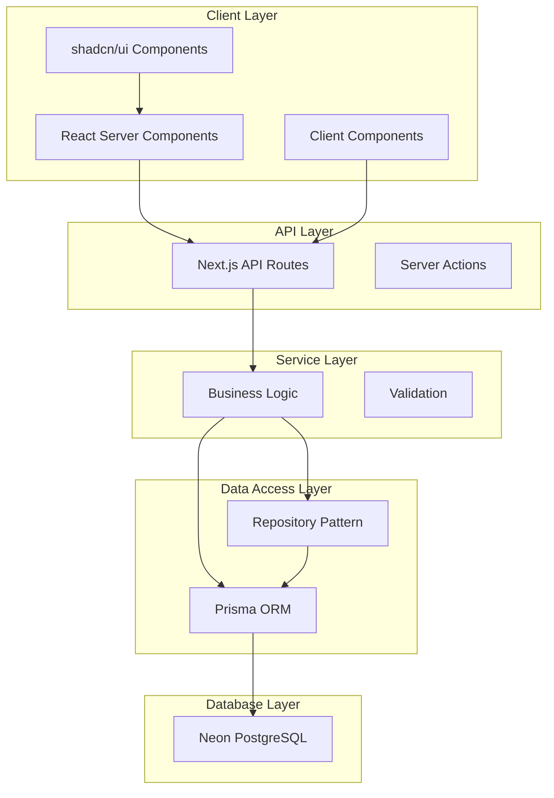
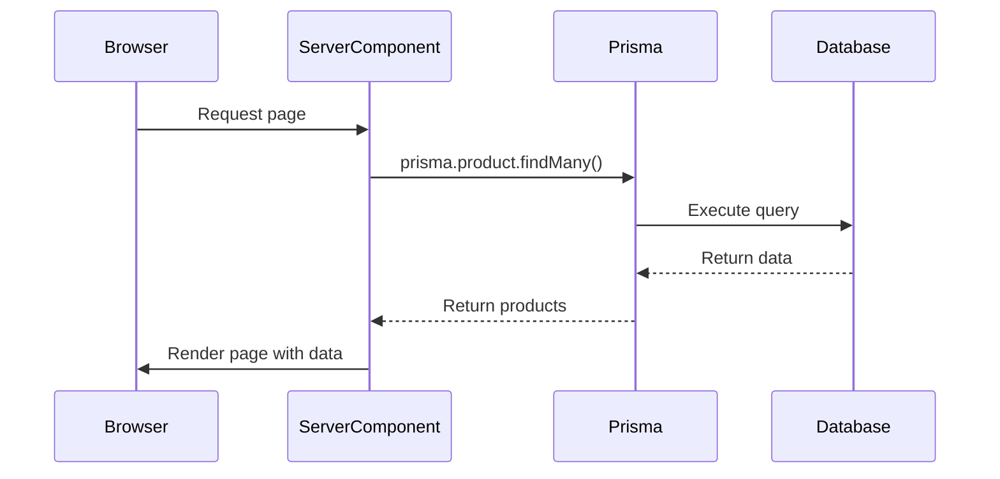
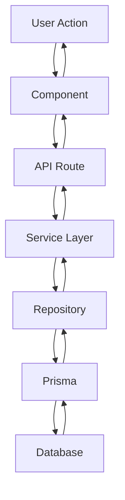
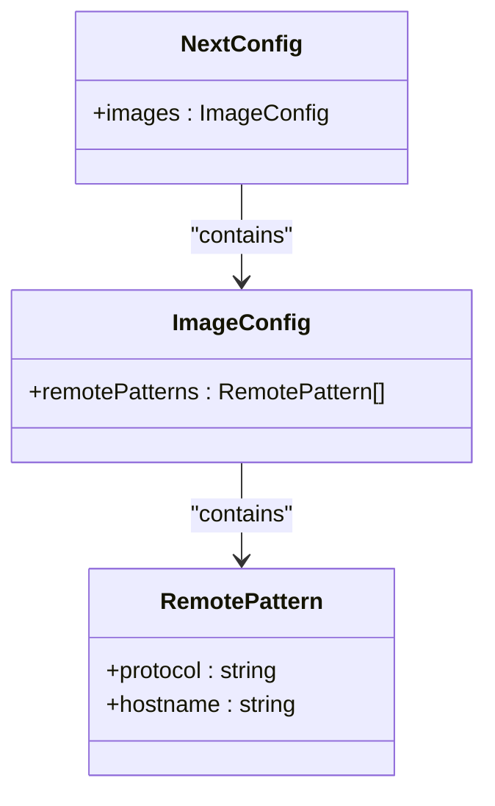
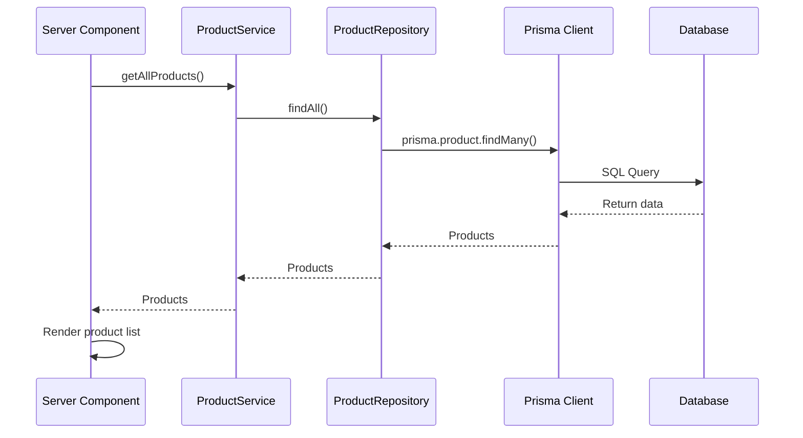
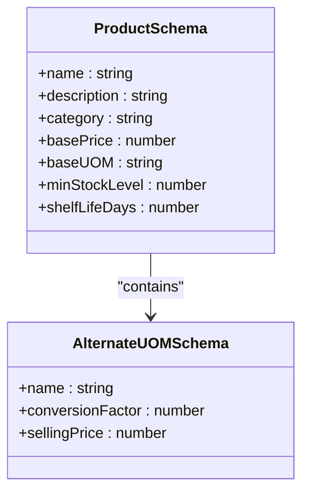

# Technology Stack

<cite>
**Referenced Files in This Document**   
- [package.json](file://package.json)
- [README.md](file://README.md)
- [SETUP.md](file://SETUP.md)
- [QUICK-START-GUIDE.md](file://QUICK-START-GUIDE.md)
- [IMPLEMENTATION-GUIDE.md](file://IMPLEMENTATION-GUIDE.md)
- [steer/tech.md](file://steer/tech.md)
- [specs/inventory-pro-system/design.md](file://specs/inventory-pro-system/design.md)
- [next.config.ts](file://next.config.ts)
- [tailwind.config.ts](file://tailwind.config.ts)
- [tsconfig.json](file://tsconfig.json)
- [lib/prisma.ts](file://lib/prisma.ts)
- [components/shared/README.md](file://components/shared/README.md)
- [components/shared/examples.tsx](file://components/shared/examples.tsx)
- [services/purchase-order.service.ts](file://services/purchase-order.service.ts)
- [services/supplier.service.ts](file://services/supplier.service.ts)
- [services/warehouse.service.ts](file://services/warehouse.service.ts)
- [lib/validations/product.validation.ts](file://lib/validations/product.validation.ts)
- [lib/validations/sales-order.validation.ts](file://lib/validations/sales-order.validation.ts)
</cite>

## Table of Contents
1. [Introduction](#introduction)
2. [Core Technologies](#core-technologies)
3. [Architecture Overview](#architecture-overview)
4. [Data Flow and Component Interaction](#data-flow-and-component-interaction)
5. [Configuration Files](#configuration-files)
6. [Development Tooling](#development-tooling)
7. [Practical Implementation Example](#practical-implementation-example)
8. [Version Compatibility and Dependency Management](#version-compatibility-and-dependency-management)
9. [Conclusion](#conclusion)

## Introduction
The InventoryPro application is a comprehensive inventory management and Point of Sale (POS) system built with modern web technologies. This document details the technology stack used in the application, focusing on the integration of Next.js 15 (App Router), React 19, Prisma ORM with Neon PostgreSQL, TypeScript, Tailwind CSS v4, shadcn/ui component library, and Zod for validation. The system leverages React Server Components by default for performance optimization and follows a structured architecture with clear separation of concerns between presentation, business logic, and data access layers.

**Section sources**
- [README.md](file://README.md#L1-L130)
- [SETUP.md](file://SETUP.md#L1-L175)

## Core Technologies

### React 19 for UI Rendering
React 19 serves as the foundation for UI rendering in the InventoryPro application. The framework enables the creation of dynamic, interactive user interfaces through a component-based architecture. React's concurrent rendering capabilities and improved server-side rendering performance in version 19 enhance the overall user experience, particularly for data-intensive operations common in inventory management systems.

### Next.js 15 for Server-Side Rendering and API Routes
Next.js 15 with App Router provides the framework for server-side rendering and API routes. The App Router architecture enables server components by default, allowing direct database access from server components without requiring API calls. This approach significantly improves performance by reducing network overhead and enabling efficient data fetching. API routes are implemented within the `app/api` directory, following the Next.js convention for creating RESTful endpoints.

### Prisma ORM with Neon PostgreSQL
Prisma ORM serves as the database abstraction layer, providing type-safe operations with Neon PostgreSQL as the serverless database provider. The Prisma schema defines all data models with proper relationships, indexes, and constraints. This combination offers several advantages:
- Type safety through generated Prisma Client
- Connection pooling for optimal performance
- Migration system for schema management
- Automatic backups via Neon's built-in system

The application uses Prisma transactions for multi-step operations to ensure data consistency, particularly in inventory management workflows where stock levels must be accurately maintained.

### TypeScript for Type Safety
TypeScript is used throughout the codebase to ensure type safety and improve developer experience. The configuration in `tsconfig.json` enables strict type checking, which helps catch errors at compile time rather than runtime. TypeScript interfaces are defined in the `types` directory, providing a single source of truth for data structures across the application.

### Tailwind CSS v4 for Utility-First Styling
Tailwind CSS v4 is used for utility-first styling, enabling rapid UI development with a consistent design system. The configuration in `tailwind.config.ts` extends the default theme with custom colors, spacing, and animations. The application leverages CSS variables for theming, allowing for easy customization of the visual appearance.

### shadcn/ui Component Library
The shadcn/ui component library provides consistent, accessible UI components built on top of Radix UI and Tailwind CSS. This library ensures a cohesive user experience across all modules of the application. Components from shadcn/ui are used for buttons, cards, dialogs, forms, tables, and other UI elements, maintaining visual consistency and accessibility standards.

### Zod for Runtime Validation
Zod is used for runtime validation of data, particularly in forms and API inputs. Validation schemas are defined in the `lib/validations` directory and used with react-hook-form for form validation. This approach ensures that data entered by users meets the required criteria before being processed by the application.

**Section sources**
- [README.md](file://README.md#L5-L14)
- [SETUP.md](file://SETUP.md#L9-L47)
- [steer/tech.md](file://steer/tech.md#L3-L12)
- [package.json](file://package.json#L13-L42)

## Architecture Overview

The InventoryPro application follows a layered architecture with clear separation of concerns. The system is organized into several key layers:

**Diagram sources **
- [specs/inventory-pro-system/design.md](file://specs/inventory-pro-system/design.md#L40-L80)
- [steer/tech.md](file://steer/tech.md#L46-L53)

The architecture follows the repository pattern, with data access logic separated from business logic. Service classes contain the business logic and validation, while repository classes handle direct database operations through Prisma. This separation allows for easier testing and maintenance of the codebase.

**Section sources**
- [steer/tech.md](file://steer/tech.md#L46-L53)
- [specs/inventory-pro-system/design.md](file://specs/inventory-pro-system/design.md#L40-L80)
- [IMPLEMENTATION-GUIDE.md](file://IMPLEMENTATION-GUIDE.md#L307-L383)

## Data Flow and Component Interaction

### React Server Components Usage
React Server Components are used by default throughout the application for performance optimization. Server components can directly access the database, eliminating the need for API calls in many scenarios. For example, a server component can fetch product data directly using Prisma:

**Diagram sources **
- [specs/inventory-pro-system/design.md](file://specs/inventory-pro-system/design.md#L1578-L1590)
- [steer/tech.md](file://steer/tech.md#L48-L49)

### Client Components
Client components are used when interactivity is required, such as form inputs, buttons, and other interactive elements. These components are marked with the `'use client'` directive and can use React hooks like `useState` and `useEffect`. Client components communicate with the server through API routes or server actions.

### Data Flow Pattern
The application follows a consistent data flow pattern from user interaction to database persistence:

**Diagram sources **
- [steer/structure.md](file://steer/structure.md#L100-L107)

This pattern ensures that all data modifications go through proper validation and business logic processing before being persisted to the database.

**Section sources**
- [steer/tech.md](file://steer/tech.md#L48-L53)
- [steer/structure.md](file://steer/structure.md#L100-L107)
- [specs/inventory-pro-system/design.md](file://specs/inventory-pro-system/design.md#L1578-L1590)

## Configuration Files

### next.config.ts
The Next.js configuration file enables image optimization for remote URLs, which is essential for displaying product images from external sources. The configuration includes:

**Diagram sources **
- [next.config.ts](file://next.config.ts#L1-L15)

### tailwind.config.ts
The Tailwind configuration extends the default theme with custom colors, border radii, keyframes, and animations. It also integrates the `tailwindcss-animate` plugin for consistent animations across the application. The configuration uses CSS variables for theming, allowing for easy customization of the color palette.

### tsconfig.json
The TypeScript configuration enables strict type checking, module resolution for bundlers, and incremental compilation for faster builds. Key settings include:
- Strict type checking
- ES2017 target
- ES module syntax
- Path aliases for easier imports (`@/*` maps to the root directory)

**Section sources**
- [next.config.ts](file://next.config.ts#L1-L15)
- [tailwind.config.ts](file://tailwind.config.ts#L1-L100)
- [tsconfig.json](file://tsconfig.json#L1-L28)

## Development Tooling

### ESLint and Prettier
The application uses ESLint for code quality and Prettier for code formatting. These tools ensure consistent code style across the codebase and help catch potential issues early in the development process. The ESLint configuration extends the Next.js recommended rules, providing additional guidance specific to the framework.

### Git
Git is used for version control, with a branching strategy that supports collaborative development. The repository includes a `.gitignore` file to exclude sensitive information and build artifacts from version control.

### Prisma Commands
The application leverages several Prisma commands for database management:
- `prisma generate`: Generate Prisma Client
- `prisma migrate dev`: Run migrations in development
- `prisma migrate deploy`: Run migrations in production
- `prisma studio`: Open Prisma Studio GUI for database exploration
- `prisma db seed`: Run seed script to populate the database with sample data

### npm Scripts
The `package.json` file defines several npm scripts for common development tasks:
- `dev`: Start development server
- `build`: Build for production
- `start`: Start production server
- `lint`: Run ESLint
- `type-check`: Run TypeScript compiler check

**Section sources**
- [package.json](file://package.json#L5-L11)
- [steer/tech.md](file://steer/tech.md#L22-L44)
- [SETUP.md](file://SETUP.md#L78-L81)

## Practical Implementation Example

### Server Component with Data Fetching
A practical example of how these technologies work together can be seen in a server component that fetches data through a service layer using Prisma:

**Diagram sources **
- [services/purchase-order.service.ts](file://services/purchase-order.service.ts#L169-L207)
- [services/supplier.service.ts](file://services/supplier.service.ts#L38-L70)
- [services/warehouse.service.ts](file://services/warehouse.service.ts#L115-L152)

### Form Validation with Zod
Form validation is implemented using Zod schemas that are defined in the `lib/validations` directory. These schemas are used with react-hook-form to provide real-time validation feedback to users. For example, the product validation schema ensures that all required fields are present and meet specific criteria:

**Diagram sources **
- [lib/validations/product.validation.ts](file://lib/validations/product.validation.ts#L1-L23)
- [lib/validations/sales-order.validation.ts](file://lib/validations/sales-order.validation.ts#L1-L35)

**Section sources**
- [lib/validations/product.validation.ts](file://lib/validations/product.validation.ts#L1-L23)
- [lib/validations/sales-order.validation.ts](file://lib/validations/sales-order.validation.ts#L1-L35)
- [services/purchase-order.service.ts](file://services/purchase-order.service.ts#L169-L207)

## Version Compatibility and Dependency Management

The application maintains careful version compatibility between its dependencies. The `package.json` file specifies exact versions for critical dependencies to ensure stability:

- Next.js 15.1.3
- React 19.0.0
- TypeScript 5
- Prisma 5.22.0
- Tailwind CSS 3.4.18

This approach prevents unexpected breaking changes from dependency updates. The application uses npm for dependency management, with `package-lock.json` ensuring consistent installations across different environments.

The dependency tree is carefully managed to avoid conflicts between packages. For example, the application uses compatible versions of Radix UI components that work with React 19 and Next.js 15. The `devDependencies` section includes tools for development, testing, and code quality, while `dependencies` contains only packages required for production.

**Section sources**
- [package.json](file://package.json#L13-L57)
- [README.md](file://README.md#L7-L14)

## Conclusion
The InventoryPro application leverages a modern technology stack that combines the strengths of Next.js 15, React 19, Prisma ORM, TypeScript, Tailwind CSS, shadcn/ui, and Zod. This combination enables the development of a high-performance, type-safe, and maintainable inventory management system. The architecture follows best practices with clear separation of concerns, consistent data flow patterns, and comprehensive validation. The use of React Server Components by default optimizes performance by reducing network overhead, while the service and repository layers ensure business logic is properly encapsulated and testable. This technology stack provides a solid foundation for building a scalable and reliable inventory management solution.