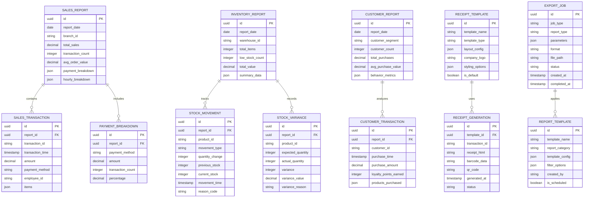

## 1. Architecture Design


## 2. Technology Description

- **Frontend**: React Native@0.72 + Redux Toolkit@1.9 + TypeScript@5.0
- **Backend**: Supabase (PostgreSQL@15, Edge Functions, Storage)
- **State Management**: Redux Toolkit with RTK Query
- **Print Services**: React Native Print@0.11 + Thermal Printer SDK
- **Export Services**: react-native-pdf@6.7 + xlsx@0.18
- **Barcode Generation**: react-native-barcode-builder@2.0
- **Charts/Visualization**: react-native-chart-kit@6.12 + victory-native@36.6

## 3. Route Definitions

| Route | Purpose |
|-------|---------|
| /reports/dashboard | Main reporting dashboard with KPI widgets and quick access menu |
| /reports/sales | Sales analytics with transaction history and performance metrics |
| /reports/inventory | Inventory reports including stock levels and movement tracking |
| /reports/customers | Customer analytics and purchase history reports |
| /reports/receipts | Receipt generation and management interface |
| /reports/export | Data export center with format selection and scheduling |
| /reports/templates | Report template configuration and customization |
| /reports/print | Print preview and printer configuration |

## 4. API Definitions

### 4.1 Core Reporting APIs

#### Sales Reports
```
GET /api/reports/sales/summary
```
Request Parameters:
| Param Name | Param Type | isRequired | Description |
|------------|-------------|-------------|-------------|
| start_date | string | true | Start date in ISO format |
| end_date | string | true | End date in ISO format |
| branch_id | string | false | Filter by branch |
| employee_id | string | false | Filter by employee |
| payment_method | string | false | Filter by payment method |

Response:
```json
{
  "total_sales": 125000.50,
  "transaction_count": 342,
  "average_order_value": 365.50,
  "payment_breakdown": {
    "cash": 45000.00,
    "credit_card": 65000.50,
    "debit_card": 15000.00
  },
  "hourly_breakdown": [
    {"hour": 9, "sales": 12500.00, "transactions": 28},
    {"hour": 10, "sales": 18500.00, "transactions": 42}
  ]
}
```

#### Inventory Reports
```
GET /api/reports/inventory/stock-levels
```
Request Parameters:
| Param Name | Param Type | isRequired | Description |
|------------|-------------|-------------|-------------|
| warehouse_id | string | false | Filter by warehouse |
| low_stock_only | boolean | false | Show only low stock items |
| category_id | string | false | Filter by category |

Response:
```json
{
  "items": [
    {
      "product_id": "prod_123",
      "product_name": "Wireless Headphones",
      "current_stock": 45,
      "reorder_point": 20,
      "reorder_quantity": 100,
      "last_movement": "2024-01-15T10:30:00Z",
      "stock_value": 2250.00
    }
  ],
  "summary": {
    "total_items": 156,
    "low_stock_count": 12,
    "out_of_stock_count": 3,
    "total_value": 89500.00
  }
}
```

#### Receipt Generation
```
POST /api/reports/receipts/generate
```
Request Body:
| Param Name | Param Type | isRequired | Description |
|------------|-------------|-------------|-------------|
| transaction_id | string | true | Sale transaction ID |
| template_id | string | false | Receipt template ID |
| include_barcode | boolean | false | Include transaction barcode |

Request:
```json
{
  "transaction_id": "sale_456",
  "template_id": "template_retail",
  "include_barcode": true
}
```

Response:
```json
{
  "receipt_id": "rcp_789",
  "receipt_html": "<html>...</html>",
  "barcode_data": "SALE45620240115",
  "qr_code": "base64_encoded_qr",
  "print_ready": true
}
```

#### Export Reports
```
POST /api/reports/export
```
Request Body:
| Param Name | Param Type | isRequired | Description |
|------------|-------------|-------------|-------------|
| report_type | string | true | Type of report (sales, inventory, customer) |
| format | string | true | Export format (pdf, excel, csv) |
| date_range | object | true | Date range for export |
| filters | object | false | Additional filters |

Request:
```json
{
  "report_type": "sales",
  "format": "pdf",
  "date_range": {
    "start": "2024-01-01",
    "end": "2024-01-31"
  },
  "filters": {
    "branch_id": "branch_123",
    "payment_method": "cash"
  }
}
```

## 5. Server Architecture Diagram


## 6. Data Model

### 6.1 Data Model Definition



### 6.2 Data Definition Language

#### Sales Reports Table
```sql
-- Create sales_reports table
CREATE TABLE sales_reports (
    id UUID PRIMARY KEY DEFAULT gen_random_uuid(),
    report_date DATE NOT NULL,
    branch_id VARCHAR(100),
    total_sales DECIMAL(12,2) DEFAULT 0,
    transaction_count INTEGER DEFAULT 0,
    avg_order_value DECIMAL(10,2) DEFAULT 0,
    payment_breakdown JSONB,
    hourly_breakdown JSONB,
    created_at TIMESTAMP WITH TIME ZONE DEFAULT NOW(),
    updated_at TIMESTAMP WITH TIME ZONE DEFAULT NOW()
);

-- Create indexes
CREATE INDEX idx_sales_reports_date ON sales_reports(report_date);
CREATE INDEX idx_sales_reports_branch ON sales_reports(branch_id);
```

#### Inventory Reports Table
```sql
-- Create inventory_reports table
CREATE TABLE inventory_reports (
    id UUID PRIMARY KEY DEFAULT gen_random_uuid(),
    report_date DATE NOT NULL,
    warehouse_id VARCHAR(100),
    total_items INTEGER DEFAULT 0,
    low_stock_count INTEGER DEFAULT 0,
    out_of_stock_count INTEGER DEFAULT 0,
    total_value DECIMAL(12,2) DEFAULT 0,
    summary_data JSONB,
    created_at TIMESTAMP WITH TIME ZONE DEFAULT NOW()
);

-- Create indexes
CREATE INDEX idx_inventory_reports_date ON inventory_reports(report_date);
CREATE INDEX idx_inventory_reports_warehouse ON inventory_reports(warehouse_id);
```

#### Receipt Templates Table
```sql
-- Create receipt_templates table
CREATE TABLE receipt_templates (
    id UUID PRIMARY KEY DEFAULT gen_random_uuid(),
    template_name VARCHAR(200) NOT NULL,
    template_type VARCHAR(50) NOT NULL,
    layout_config JSONB,
    company_logo VARCHAR(500),
    styling_options JSONB,
    is_default BOOLEAN DEFAULT false,
    created_by VARCHAR(100),
    created_at TIMESTAMP WITH TIME ZONE DEFAULT NOW(),
    updated_at TIMESTAMP WITH TIME ZONE DEFAULT NOW()
);

-- Create indexes
CREATE INDEX idx_receipt_templates_type ON receipt_templates(template_type);
CREATE INDEX idx_receipt_templates_default ON receipt_templates(is_default);
```

#### Export Jobs Table
```sql
-- Create export_jobs table
CREATE TABLE export_jobs (
    id UUID PRIMARY KEY DEFAULT gen_random_uuid(),
    job_type VARCHAR(50) NOT NULL,
    report_type VARCHAR(50) NOT NULL,
    parameters JSONB,
    format VARCHAR(20) NOT NULL,
    file_path VARCHAR(500),
    status VARCHAR(50) DEFAULT 'pending',
    created_at TIMESTAMP WITH TIME ZONE DEFAULT NOW(),
    started_at TIMESTAMP WITH TIME ZONE,
    completed_at TIMESTAMP WITH TIME ZONE,
    error_message TEXT
);

-- Create indexes
CREATE INDEX idx_export_jobs_status ON export_jobs(status);
CREATE INDEX idx_export_jobs_created ON export_jobs(created_at);
```

### 6.3 Security and Access Control

#### Row Level Security (RLS) Policies
```sql
-- Enable RLS on sales_reports
ALTER TABLE sales_reports ENABLE ROW LEVEL SECURITY;

-- Allow authenticated users to read their branch reports
CREATE POLICY "Users can view branch sales reports" ON sales_reports
    FOR SELECT USING (
        auth.uid() IN (
            SELECT id FROM users WHERE branch_id = sales_reports.branch_id
        ) OR 
        EXISTS (
            SELECT 1 FROM user_roles 
            WHERE user_id = auth.uid() AND role IN ('admin', 'manager')
        )
    );

-- Grant permissions
GRANT SELECT ON sales_reports TO authenticated;
GRANT INSERT ON sales_reports TO authenticated;
GRANT UPDATE ON sales_reports TO authenticated;

-- Grant basic read access to anon role for public reports
GRANT SELECT ON sales_reports TO anon;
```

### 6.4 Performance Optimization

#### Materialized Views for Common Reports
```sql
-- Create materialized view for daily sales summary
CREATE MATERIALIZED VIEW daily_sales_summary AS
SELECT 
    DATE(created_at) as sales_date,
    branch_id,
    COUNT(*) as transaction_count,
    SUM(total_amount) as total_sales,
    AVG(total_amount) as avg_order_value,
    JSONB_OBJECT_AGG(payment_method, payment_total) as payment_breakdown
FROM sales_transactions
WHERE created_at >= CURRENT_DATE - INTERVAL '90 days'
GROUP BY DATE(created_at), branch_id;

-- Create index on materialized view
CREATE INDEX idx_daily_sales_summary_date ON daily_sales_summary(sales_date);

-- Refresh strategy
CREATE OR REPLACE FUNCTION refresh_daily_sales_summary()
RETURNS void AS $$
BEGIN
    REFRESH MATERIALIZED VIEW CONCURRENTLY daily_sales_summary;
END;
$$ LANGUAGE plpgsql;
```

#### Partitioning for Large Tables
```sql
-- Partition sales_transactions by month
CREATE TABLE sales_transactions_partitioned (
    LIKE sales_transactions INCLUDING ALL
) PARTITION BY RANGE (created_at);

-- Create monthly partitions
CREATE TABLE sales_transactions_2024_01 PARTITION OF sales_transactions_partitioned
    FOR VALUES FROM ('2024-01-01') TO ('2024-02-01');

CREATE TABLE sales_transactions_2024_02 PARTITION OF sales_transactions_partitioned
    FOR VALUES FROM ('2024-02-01') TO ('2024-03-01');
```