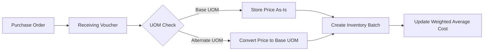
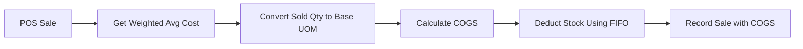

# System Overview

## Introduction

InventoryPro uses a **Weighted Average Costing** method to track inventory costs and calculate Cost of Goods Sold (COGS). This document provides an overview of how the system works.

---

## Core Concepts

### 1. Base Unit of Measure (UOM)

Every product has a **base UOM** which is the fundamental unit used for:
- Storing inventory quantities
- Tracking costs
- Calculating averages
- Reporting values

**Examples:**
- Bottled drinks → Base UOM: `bottles`
- Canned goods → Base UOM: `cans`
- Packaged snacks → Base UOM: `pieces`

### 2. Alternate Units of Measure

Products can have **alternate UOMs** for purchasing and selling:
- Cases (e.g., 12 bottles per case)
- Packs (e.g., 6 cans per pack)
- Boxes (e.g., 24 pieces per box)

Each alternate UOM has a **conversion factor** that defines how many base units it contains.

### 3. Weighted Average Cost

The system maintains a **weighted average cost** for each product:
```
Average Cost = Total Value of All Active Batches / Total Quantity
```

This average cost is:
- Always in base UOM
- Updated with each receipt
- Used for COGS calculation
- Stored in `Product.averageCostPrice`

---

## Data Flow

### When Receiving Products



1. Create Purchase Order with items in any UOM
2. Receive items via Receiving Voucher
3. System checks if received UOM matches base UOM
4. If alternate UOM, price is divided by conversion factor
5. Batch created with cost in base UOM
6. Product's average cost is recalculated

### When Selling Products (POS)



1. Customer purchases items in any UOM
2. System retrieves current weighted average cost
3. Sold quantity converted to base UOM
4. COGS = Average Cost × Base Quantity
5. Stock deducted from oldest batches (FIFO)
6. Sale recorded with calculated COGS

---

## Key Components

### Database Tables

| Table | Purpose |
|-------|---------|
| `Product` | Stores `averageCostPrice` in base UOM |
| `ProductUOM` | Defines alternate UOMs and conversion factors |
| `InventoryBatch` | Tracks each receipt with `unitCost` in base UOM |
| `PurchaseOrder` | Orders can specify any UOM per item |
| `ReceivingVoucher` | Converts prices during receipt |
| `POSSale` | Calculates COGS using weighted average |
| `POSSaleItem` | Stores `costOfGoodsSold` for each item |

### Services

| Service | Responsibility |
|---------|----------------|
| `inventory.service.ts` | Calculate weighted average, convert UOMs |
| `receiving-voucher.service.ts` | Process receipts, update average costs |
| `pos.service.ts` | Calculate COGS, process sales |
| `product.service.ts` | Manage products and UOMs |

---

## Example: End-to-End Flow

### Product Setup
```
Product: Coca-Cola 500ml
Base UOM: bottles
Base Price: ₱15/bottle

Alternate UOM: cases
Conversion Factor: 12 bottles/case
Selling Price: ₱180/case (₱15 × 12)
```

### First Receipt
```
Purchase Order: 10 cases @ ₱120/case
Receiving Voucher: Receive 10 cases @ ₱120/case

Conversion:
  ₱120 per case ÷ 12 bottles = ₱10 per bottle

Batch Created:
  Quantity: 120 bottles (10 × 12)
  Unit Cost: ₱10.0000/bottle

Average Cost Updated:
  Current: ₱0 (no stock)
  New: ₱10/bottle
```

### Second Receipt (Different Price)
```
Purchase Order: 5 cases @ ₱140/case
Receiving Voucher: Receive 5 cases @ ₱140/case

Conversion:
  ₱140 per case ÷ 12 bottles = ₱11.6667 per bottle

Batch Created:
  Quantity: 60 bottles (5 × 12)
  Unit Cost: ₱11.6667/bottle

Average Cost Updated:
  Current: ₱10 × 120 bottles = ₱1,200
  New: ₱11.6667 × 60 bottles = ₱700
  Total: ₱1,900 / 180 bottles = ₱10.56/bottle
```

### POS Sale
```
Customer buys: 2 cases (24 bottles) @ ₱15/bottle

COGS Calculation:
  Average Cost: ₱10.56/bottle
  Sold: 24 bottles
  COGS: ₱10.56 × 24 = ₱253.44

Revenue:
  Selling Price: ₱15 × 24 = ₱360

Gross Profit:
  ₱360 - ₱253.44 = ₱106.56

Stock Deduction (FIFO):
  - Deduct 24 bottles from oldest batch (first receipt)
  - Remaining: 96 bottles in first batch, 60 in second
```

---

## System Advantages

### 1. Accuracy
- Precise cost tracking with 4 decimal places
- Automatic UOM conversions prevent errors
- Real-time average cost updates

### 2. Flexibility
- Buy in any UOM
- Sell in any UOM
- Track in base UOM
- Mix UOMs in same transaction

### 3. Simplicity
- No manual calculations needed
- System handles all conversions
- Users work with familiar units

### 4. Financial Reporting
- Accurate COGS for profit analysis
- Correct inventory valuations
- Real-time margin calculations

---

## Next Steps

- [Weighted Average Costing](./02-weighted-average-costing.md) - Detailed costing method
- [Multi-UOM System](./03-multi-uom-system.md) - UOM conversion mechanics
- [Receiving Products](./04-receiving-products.md) - Receipt processing

---

**Related Topics:**
- Database Schema
- Service Layer Architecture
- API Endpoints
