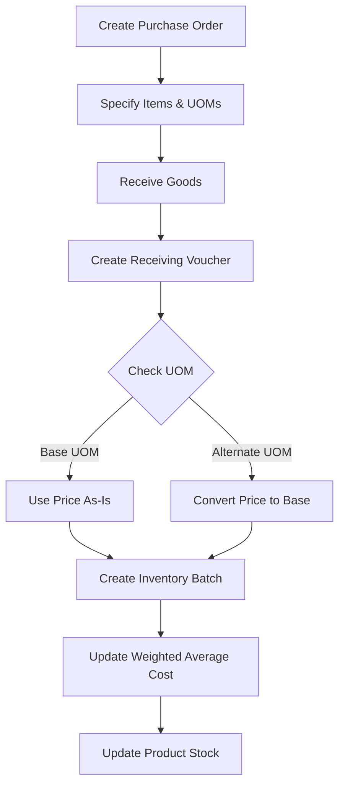

# Receiving Products and Price Conversion

## Overview

When products are received into inventory, the system:
1. Converts quantities to base UOM
2. **Converts prices to base UOM** (Critical Fix - 2025-11-21)
3. Creates inventory batches
4. Updates weighted average cost

---

## The Price Conversion Fix

### Problem (Before Fix)

Previously, when receiving products in alternate UOMs, the unit price was stored without conversion:

```
Receive: 1 case @ ₱140/case (12 bottles/case)
❌ Stored: 12 bottles @ ₱140/bottle (WRONG!)

Result:
  Average cost calculation used ₱140 instead of ₱11.67
  COGS was massively inflated
  Profit margins appeared incorrectly low
```

### Solution (After Fix)

Now, the system automatically converts prices to base UOM:

```
Receive: 1 case @ ₱140/case (12 bottles/case)
✅ Converted: ₱140 ÷ 12 = ₱11.67/bottle
✅ Stored: 12 bottles @ ₱11.6667/bottle (CORRECT!)

Result:
  Average cost calculation uses correct ₱11.67
  COGS is accurate
  Profit margins are correct
```

---

## Receiving Process Flow



---

## Step-by-Step Example

### Setup

```
Product: Coca-Cola 500ml
├── Base UOM: bottles
├── Base Price: ₱15/bottle
├── Current Stock: 0 bottles
└── Alternate UOM: cases (12 bottles/case)
```

### Step 1: Create Purchase Order

```
PO-001
Supplier: ABC Distributors
Items:
  - Product: Coca-Cola 500ml
  - Quantity: 10 cases
  - UOM: cases
  - Unit Price: ₱140/case
  - Total: ₱1,400
```

### Step 2: Create Receiving Voucher

```
RV-001
Reference: PO-001
Items:
  - Product: Coca-Cola 500ml
  - Ordered: 10 cases
  - Received: 10 cases
  - UOM: cases (from PO)
  - Unit Price: ₱140/case (from PO or edited)
```

### Step 3: System Processes Receipt

```typescript
// 1. Get PO item UOM
const poItem = po.PurchaseOrderItem.find(p => p.productId === item.productId);
// poItem.uom = "cases"

// 2. Check if conversion needed
if (poItem.uom !== product.baseUOM) {
  // "cases" !== "bottles" → Conversion needed!

  // 3. Find conversion factor
  const alternateUOM = product.ProductUOM.find(u => u.name === "cases");
  // alternateUOM.conversionFactor = 12

  // 4. Convert price
  unitCostInBaseUOM = ₱140 ÷ 12 = ₱11.6667/bottle
}

// 5. Create batch
await tx.inventoryBatch.create({
  data: {
    productId: "coca-cola-500ml",
    warehouseId: "warehouse-1",
    quantity: 120,  // 10 cases × 12 bottles
    unitCost: 11.6667,  // ✅ In base UOM (bottles)
    batchNumber: "BATCH-000001",
    status: "active",
  },
});
```

### Step 4: Update Average Cost

```typescript
// Get current stock
const currentBatches = await tx.inventoryBatch.findMany({
  where: { productId: "coca-cola-500ml", status: "active" }
});

// Current: 0 bottles (first receipt)
const currentTotalStock = 0;
const currentAvgCost = 0;

// New: 120 bottles @ ₱11.6667/bottle
const newCost = 11.6667;
const newQty = 120;

// Calculate weighted average
const totalValue = (0 × 0) + (11.6667 × 120);  // ₱1,400
const totalQty = 0 + 120;  // 120 bottles
const newAvgCost = ₱1,400 / 120 = ₱11.67/bottle;

// Update product
await tx.product.update({
  where: { id: "coca-cola-500ml" },
  data: { averageCostPrice: 11.67 },
});
```

---

## Conversion Logic (Code)

### File: `services/receiving-voucher.service.ts`

```typescript
// Create inventory batches for received quantities
for (const item of processedItems) {
  if (item.receivedQuantity > 0) {
    const product = po.PurchaseOrderItem.find(
      (p) => p.productId === item.productId
    )?.Product;

    // Get the UOM from the purchase order item
    const poItem = po.PurchaseOrderItem.find(
      (p) => p.productId === item.productId
    );

    // Convert unit price to base UOM if necessary
    let unitCostInBaseUOM = item.unitPrice;

    // Check if the PO item UOM is different from base UOM
    if (poItem.uom.toLowerCase() !== product.baseUOM.toLowerCase()) {
      // Find the conversion factor for this UOM
      const productWithUOMs = await tx.product.findUnique({
        where: { id: item.productId },
        include: { ProductUOM: true },
      });

      if (productWithUOMs) {
        const alternateUOM = productWithUOMs.ProductUOM.find(
          (u) => u.name.toLowerCase() === poItem.uom.toLowerCase()
        );

        if (alternateUOM) {
          // Convert: unit price ÷ conversion factor = price per base unit
          // Example: ₱140 per case ÷ 12 bottles per case = ₱11.67 per bottle
          unitCostInBaseUOM = item.unitPrice / Number(alternateUOM.conversionFactor);
        }
      }
    }

    // Create inventory batch with converted price
    const batch = await tx.inventoryBatch.create({
      data: {
        id: randomUUID(),
        batchNumber,
        productId: item.productId,
        warehouseId: po.warehouseId,
        quantity: item.receivedQuantity,
        unitCost: Number(unitCostInBaseUOM.toFixed(4)), // 4 decimal precision
        receivedDate,
        expiryDate,
        status: 'active',
      },
    });
  }
}
```

---

## Precision and Rounding

### Why 4 Decimal Places?

The system stores unit costs with **4 decimal precision**:

```
₱140 ÷ 12 = 11.666666...
Stored as: 11.6667 (4 decimals)
```

**Reasons:**
1. Prevents accumulated rounding errors
2. Maintains accuracy across multiple transactions
3. Handles fractional conversions better
4. Standard accounting practice

### Example: Precision Matters

```
Without precision (2 decimals):
  ₱140 ÷ 12 = ₱11.67/bottle
  Receive 120 bottles: 120 × ₱11.67 = ₱1,400.40 (off by ₱0.40!)

With precision (4 decimals):
  ₱140 ÷ 12 = ₱11.6667/bottle
  Receive 120 bottles: 120 × ₱11.6667 = ₱1,400.00 (exact!)
```

---

## Receiving Scenarios

### Scenario 1: Partial Receipt

```
Ordered: 10 cases @ ₱140/case
Received: 8 cases @ ₱140/case

Conversion:
  ₱140 ÷ 12 = ₱11.6667/bottle

Batch Created:
  Quantity: 96 bottles (8 × 12)
  Unit Cost: ₱11.6667/bottle
  Total Value: ₱1,120

PO Status: Partially Received
Remaining: 2 cases (24 bottles)
```

### Scenario 2: Price Adjustment During Receipt

```
Ordered: 5 cases @ ₱140/case
Received: 5 cases @ ₱135/case (supplier discount!)

Conversion:
  ₱135 ÷ 12 = ₱11.25/bottle

Batch Created:
  Quantity: 60 bottles (5 × 12)
  Unit Cost: ₱11.25/bottle ✅ (uses actual received price)
  Total Value: ₱675
```

### Scenario 3: Mixed UOM Receipt

```
PO has:
  - Item 1: 10 cases @ ₱140/case (cases)
  - Item 2: 50 bottles @ ₱12/bottle (bottles)

Receipt processes:
  - Item 1: ₱140 ÷ 12 = ₱11.67/bottle → 120 bottles @ ₱11.67
  - Item 2: ₱12 (no conversion) → 50 bottles @ ₱12.00

Average Cost Update:
  Total Value: (120 × ₱11.67) + (50 × ₱12) = ₱2,000.40
  Total Qty: 120 + 50 = 170 bottles
  Average: ₱2,000.40 / 170 = ₱11.77/bottle
```

---

## Variance Handling

### Over-Receipt

```
Ordered: 10 cases (120 bottles)
Received: 11 cases (132 bottles)

Variance: +12 bottles (+10%)
Reason: "Supplier bonus"

Processing:
  ✅ All 132 bottles accepted
  ✅ Price converted: ₱140 ÷ 12 = ₱11.67/bottle
  ✅ Batch created for 132 bottles
  ✅ Average cost updated
```

### Under-Receipt

```
Ordered: 10 cases (120 bottles)
Received: 9 cases (108 bottles)

Variance: -12 bottles (-10%)
Reason: "Damaged in transit"

Processing:
  ✅ Only 108 bottles accepted
  ✅ Price converted: ₱140 ÷ 12 = ₱11.67/bottle
  ✅ Batch created for 108 bottles
  ✅ PO marked as partially received
```

---

## Quality Checks

Before finalizing receipt, verify:

✅ **UOM matches PO** or is valid alternate
✅ **Quantities are correct** (count physical stock)
✅ **Prices are reasonable** (not 10x or 0.1x expected)
✅ **Conversion factors are accurate** (check packaging)
✅ **Product expiry dates** are acceptable

---

## Impact on Financial Reports

### Inventory Valuation

```
After receiving 10 cases @ ₱140/case:

Correct (with fix):
  120 bottles × ₱11.67/bottle = ₱1,400.40
  Inventory Value: ₱1,400.40 ✅

Wrong (before fix):
  120 bottles × ₱140/bottle = ₱16,800
  Inventory Value: ₱16,800 ❌ (inflated by 12x!)
```

### Cost of Goods Sold

```
Sell 24 bottles:

Correct (with fix):
  COGS = 24 × ₱11.67 = ₱280.08
  Revenue = 24 × ₱15 = ₱360
  Gross Profit = ₱79.92 (22.2%) ✅

Wrong (before fix):
  COGS = 24 × ₱140 = ₱3,360
  Revenue = 24 × ₱15 = ₱360
  Gross Loss = -₱3,000 ❌ (impossible!)
```

---

## Best Practices

1. **Always verify UOM** before creating PO
2. **Double-check prices** during receiving
3. **Count physical stock** accurately
4. **Document variances** with reasons
5. **Review average costs** after large receipts
6. **Train staff** on UOM conversions
7. **Audit receipts** regularly

---

## Next Steps

- [COGS Calculation](./05-cogs-calculation.md) - How costs are used in sales
- [Inventory Valuation](./06-inventory-valuation.md) - Stock value calculations
- [Troubleshooting](./08-troubleshooting.md) - Common issues

---

**Related Topics:**
- Purchase Order Management
- Supplier Management
- Warehouse Operations
