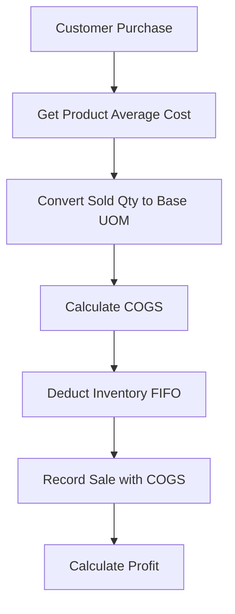

# Cost of Goods Sold (COGS) Calculation

## Overview

Cost of Goods Sold (COGS) represents the direct cost of products sold during a period. In InventoryPro, COGS is calculated at the time of sale using the **weighted average cost** method.

---

## COGS Formula

```
COGS = Weighted Average Cost per Base Unit × Quantity Sold in Base Units
```

**Key Points:**
- Uses current weighted average cost at time of sale
- Quantity is converted to base UOM before calculation
- COGS is stored with each sale item for reporting

---

## POS Sale Process

### Step-by-Step Flow



### Detailed Steps

1. **Customer selects items** (in any UOM)
2. **System retrieves** weighted average cost (base UOM)
3. **Quantity converted** to base UOM
4. **COGS calculated** = Average Cost × Base Quantity
5. **Inventory deducted** using FIFO (oldest batches first)
6. **Sale recorded** with COGS for each item
7. **Gross profit** calculated automatically

---

## Code Implementation

### File: `services/pos.service.ts`

```typescript
async processSale(data: CreatePOSSaleInput): Promise<POSSaleWithItems> {
  return await prisma.$transaction(async (tx) => {
    // Process each item: calculate COGS and deduct inventory
    const itemsWithCOGS = await Promise.all(
      data.items.map(async (item) => {
        // Step 1: Get weighted average cost
        const avgCost = await inventoryService.calculateWeightedAverageCost(
          item.productId,
          data.warehouseId
        );

        // Step 2: Convert quantity to base UOM for COGS calculation
        const baseQuantity = await inventoryService.convertToBaseUOM(
          item.productId,
          item.quantity,
          item.uom
        );

        // Step 3: Calculate COGS
        const costOfGoodsSold = avgCost * baseQuantity;

        // Step 4: Deduct inventory (FIFO for expiry dates)
        await inventoryService.deductStock({
          productId: item.productId,
          warehouseId: data.warehouseId,
          quantity: item.quantity,
          uom: item.uom,
          reason: `POS Sale ${data.receiptNumber}`,
          referenceId: data.receiptNumber!,
          referenceType: 'POS',
        });

        return {
          ...item,
          costOfGoodsSold,
        };
      })
    );

    // Create POS sale with COGS
    const sale = await posRepository.create({
      ...data,
      items: itemsWithCOGS,
    });

    return sale;
  });
}
```

---

## Example Calculations

### Example 1: Sale in Base UOM

```
Product: Coca-Cola 500ml
Base UOM: bottles
Current Average Cost: ₱11.50/bottle
Current Stock: 150 bottles

Customer buys: 10 bottles @ ₱15/bottle

COGS Calculation:
  Average Cost: ₱11.50/bottle
  Quantity: 10 bottles (already in base UOM)
  COGS = ₱11.50 × 10 = ₱115.00

Financial Impact:
  Revenue: ₱15 × 10 = ₱150.00
  COGS: ₱115.00
  Gross Profit: ₱35.00
  Margin: 23.3%
```

### Example 2: Sale in Alternate UOM

```
Product: Coca-Cola 500ml
Base UOM: bottles
Alternate UOM: cases (12 bottles/case)
Current Average Cost: ₱11.50/bottle
Current Stock: 150 bottles

Customer buys: 2 cases @ ₱180/case

COGS Calculation:
  Step 1 - Convert to base UOM:
    2 cases × 12 bottles/case = 24 bottles

  Step 2 - Calculate COGS:
    Average Cost: ₱11.50/bottle
    Quantity: 24 bottles
    COGS = ₱11.50 × 24 = ₱276.00

Financial Impact:
  Revenue: ₱180 × 2 = ₱360.00
  COGS: ₱276.00
  Gross Profit: ₱84.00
  Margin: 23.3%
```

### Example 3: Mixed UOM Sale

```
Product: Pepsi 1L
Base UOM: bottles
Alternate UOM: 6-pack (6 bottles)
Current Average Cost: ₱12.00/bottle

Sale Items:
  1. 12 bottles @ ₱15/bottle
  2. 3 six-packs @ ₱85/pack

COGS Calculation:

Item 1 (bottles):
  Quantity: 12 bottles (base UOM)
  COGS = ₱12 × 12 = ₱144.00

Item 2 (six-packs):
  Convert: 3 packs × 6 bottles/pack = 18 bottles
  COGS = ₱12 × 18 = ₱216.00

Total:
  Revenue: (12 × ₱15) + (3 × ₱85) = ₱435.00
  COGS: ₱144 + ₱216 = ₱360.00
  Gross Profit: ₱75.00
  Margin: 17.2%
```

---

## COGS and Inventory Deduction

### Important: Two Separate Operations

**COGS Calculation:**
- Uses **weighted average cost**
- Calculated **before** deduction
- Same for all units sold

**Inventory Deduction:**
- Uses **FIFO** (First In, First Out)
- Deducts from **oldest batches** first
- Based on **expiry dates**

### Why This Separation?

```
Current Batches:
  Batch 1: 50 bottles @ ₱10/bottle (expires 2025-01-15)
  Batch 2: 50 bottles @ ₱12/bottle (expires 2025-02-20)
  Batch 3: 50 bottles @ ₱11/bottle (expires 2025-03-10)

Weighted Average: ₱11/bottle

Sale: 75 bottles

COGS Calculation:
  Uses average: ₱11 × 75 = ₱825 ✅

Inventory Deduction (FIFO by expiry):
  1. Deduct 50 from Batch 1 (expires first)
  2. Deduct 25 from Batch 2

Remaining:
  Batch 2: 25 bottles @ ₱12/bottle
  Batch 3: 50 bottles @ ₱11/bottle
```

**Result**: COGS uses average (₱11), but physical stock follows FIFO to minimize waste from expiry.

---

## Gross Profit Calculation

### Per Item

```
Item Gross Profit = Revenue - COGS
Item Margin % = (Gross Profit / Revenue) × 100
```

### Per Sale

```
Sale Gross Profit = Total Revenue - Total COGS
Sale Margin % = (Gross Profit / Total Revenue) × 100
```

### Example: Multi-Item Sale

```
Sale #RCP-20251121-0001

Item 1: Coca-Cola
  Qty: 24 bottles
  Price: ₱15/bottle
  Revenue: ₱360
  COGS: ₱11.50 × 24 = ₱276
  Profit: ₱84 (23.3%)

Item 2: Pepsi
  Qty: 12 bottles
  Price: ₱14/bottle
  Revenue: ₱168
  COGS: ₱12 × 12 = ₱144
  Profit: ₱24 (14.3%)

Item 3: Sprite
  Qty: 18 bottles
  Price: ₱13/bottle
  Revenue: ₱234
  COGS: ₱10 × 18 = ₱180
  Profit: ₱54 (23.1%)

Sale Totals:
  Revenue: ₱762
  COGS: ₱600
  Gross Profit: ₱162
  Margin: 21.3%
```

---

## COGS in Different Payment Methods

### Cash Sales

```
Sale Amount: ₱500
COGS: ₱380
Gross Profit: ₱120

Cash received immediately
Full profit recognized
```

### Credit Sales

```
Sale Amount: ₱500
COGS: ₱380
Gross Profit: ₱120

Payment pending (AR created)
Profit recognized at sale time
COGS same as cash
```

### AR Credit Sales (Partial Payment)

```
Sale Amount: ₱500
Partial Payment: ₱200
Outstanding: ₱300
COGS: ₱380
Gross Profit: ₱120

Full COGS recognized immediately
Profit recognized at sale time
Collection tracked separately
```

**Key Point**: COGS is **always** calculated at time of sale, regardless of payment method.

---

## COGS Reports

### Daily COGS Summary

```
Date: 2025-11-21
Sales: 50 transactions

Total Revenue: ₱45,000
Total COGS: ₱32,500
Gross Profit: ₱12,500
Average Margin: 27.8%
```

### Product-Level COGS

```
Product: Coca-Cola 500ml
Period: November 2025

Total Sold: 500 bottles
Average Cost: ₱11.50/bottle
Total COGS: ₱5,750
Average Selling Price: ₱15/bottle
Total Revenue: ₱7,500
Gross Profit: ₱1,750
Margin: 23.3%
```

### Category COGS Analysis

```
Category: Soft Drinks
Period: November 2025

Products: 15
Total Revenue: ₱125,000
Total COGS: ₱95,000
Gross Profit: ₱30,000
Margin: 24%

Top Performers:
  1. Coca-Cola: 30% margin
  2. Pepsi: 25% margin
  3. Sprite: 28% margin
```

---

## Impact of Average Cost Changes

### Scenario: Cost Increase

```
Week 1:
  Average Cost: ₱10/bottle
  Selling Price: ₱15/bottle
  COGS: ₱10
  Profit: ₱5 (33% margin)

[Receive new stock @ ₱12/bottle]

Week 2:
  Average Cost: ₱11/bottle (weighted average)
  Selling Price: ₱15/bottle (unchanged)
  COGS: ₱11
  Profit: ₱4 (27% margin)

Impact: Margin decreased by 6 points
Action: Consider increasing selling price
```

### Scenario: Cost Decrease

```
Month 1:
  Average Cost: ₱12/bottle
  Selling Price: ₱15/bottle
  COGS: ₱12
  Profit: ₱3 (20% margin)

[Receive new stock @ ₱10/bottle]

Month 2:
  Average Cost: ₱11/bottle (weighted average)
  Selling Price: ₱15/bottle (unchanged)
  COGS: ₱11
  Profit: ₱4 (27% margin)

Impact: Margin increased by 7 points
Action: Competitive advantage or price reduction opportunity
```

---

## Verification and Auditing

### Daily COGS Reconciliation

```sql
-- Check if COGS matches average costs
SELECT
  ps.receiptNumber,
  psi.productName,
  psi.quantity,
  psi.unitPrice,
  psi.costOfGoodsSold,
  p.averageCostPrice,
  -- Verify COGS calculation
  (psi.quantity * p.averageCostPrice) as expected_cogs,
  -- Difference (should be close to 0)
  (psi.costOfGoodsSold - (psi.quantity * p.averageCostPrice)) as variance
FROM POSSale ps
JOIN POSSaleItem psi ON ps.id = psi.saleId
JOIN Product p ON psi.productId = p.id
WHERE ps.createdAt >= '2025-11-21'
ORDER BY variance DESC;
```

### Monthly Gross Profit Report

```sql
-- Aggregate gross profit by product
SELECT
  p.name,
  COUNT(psi.id) as items_sold,
  SUM(psi.quantity) as total_quantity,
  SUM(psi.lineTotal) as total_revenue,
  SUM(psi.costOfGoodsSold) as total_cogs,
  SUM(psi.lineTotal - psi.costOfGoodsSold) as gross_profit,
  ROUND(AVG((psi.lineTotal - psi.costOfGoodsSold) / psi.lineTotal * 100), 2) as avg_margin_pct
FROM Product p
JOIN POSSaleItem psi ON p.id = psi.productId
JOIN POSSale ps ON psi.saleId = ps.id
WHERE ps.createdAt >= '2025-11-01'
  AND ps.createdAt < '2025-12-01'
GROUP BY p.id, p.name
ORDER BY gross_profit DESC;
```

---

## Best Practices

### 1. Pricing Strategy

✅ **Monitor average costs weekly**
✅ **Set selling prices** based on target margins
✅ **Adjust prices** when average costs change significantly
✅ **Use cost-plus pricing**: Average Cost × (1 + Markup %)

**Example:**
```
Target Margin: 25%
Average Cost: ₱11.50
Selling Price = ₱11.50 / (1 - 0.25) = ₱15.33
Rounded: ₱15.00
```

### 2. Margin Monitoring

✅ **Set minimum acceptable margins** per category
✅ **Alert on low-margin products**
✅ **Review margin trends** monthly
✅ **Identify margin erosion** early

### 3. Cost Management

✅ **Negotiate supplier prices** regularly
✅ **Track cost trends** by product
✅ **Consider bulk purchasing** to lower average costs
✅ **Review slow-moving stock** with high costs

### 4. Reporting

✅ **Daily COGS summary** for operations
✅ **Weekly margin analysis** for management
✅ **Monthly profit review** by category
✅ **Quarterly cost trend** analysis

---

## Common Questions

### Q: Does selling affect average cost?

**A**: No. Average cost only changes when:
- New stock is received
- Stock is transferred between warehouses
- Stock adjustments are made

Sales **use** the average cost but don't change it.

### Q: Why use weighted average instead of actual batch costs?

**A**: Weighted average provides:
- Simpler calculations
- Consistent costing across all sales
- Smoothed cost fluctuations
- Easier reporting and analysis

### Q: What if average cost is zero?

**A**: This happens when:
- Product has no stock
- All batches are depleted

**Solution**: System should prevent sales when stock is zero.

### Q: How accurate is COGS with 4 decimal precision?

**A**: Very accurate. 4 decimals handle:
- Complex UOM conversions
- Large quantity sales
- Fractional unit costs
- Accumulated transactions

---

## Next Steps

- [Inventory Valuation](./06-inventory-valuation.md) - Stock value calculations
- [FIFO vs Weighted Average](./07-fifo-vs-weighted-average.md) - Hybrid approach
- [Troubleshooting](./08-troubleshooting.md) - Common COGS issues

---

**Related Topics:**
- Financial Reporting
- Profit Analysis
- Pricing Strategies
- Sales Analytics
